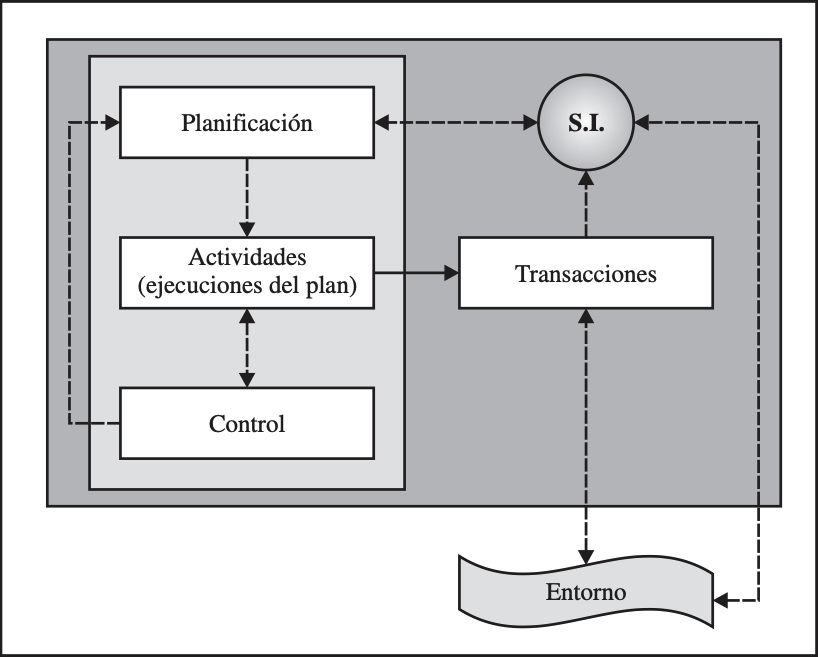
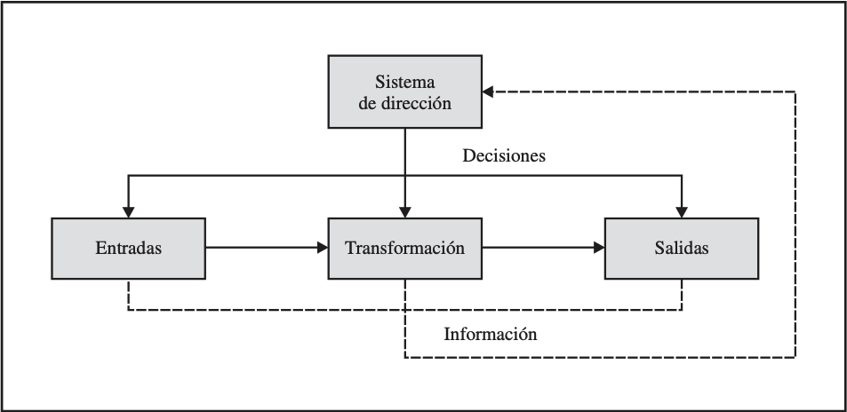
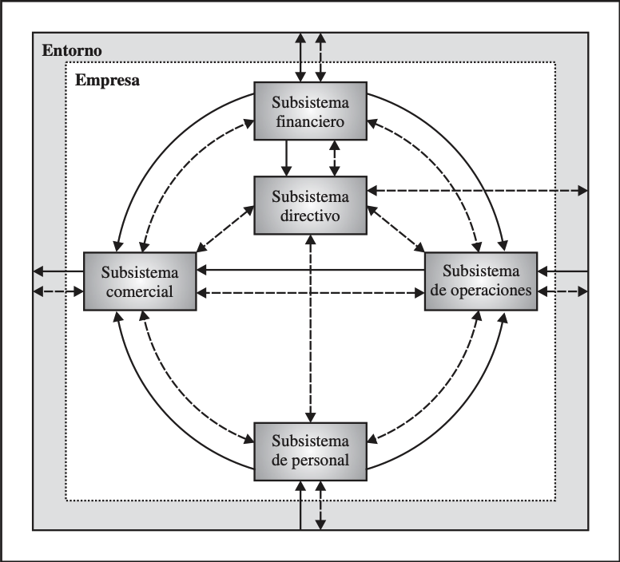
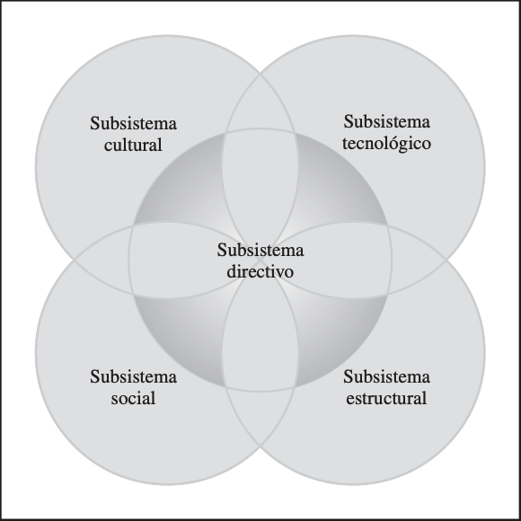
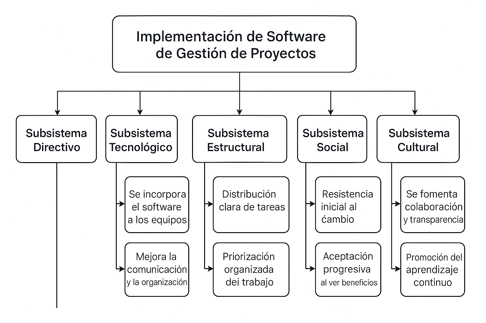
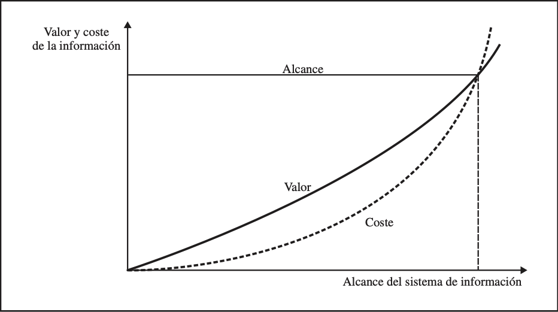
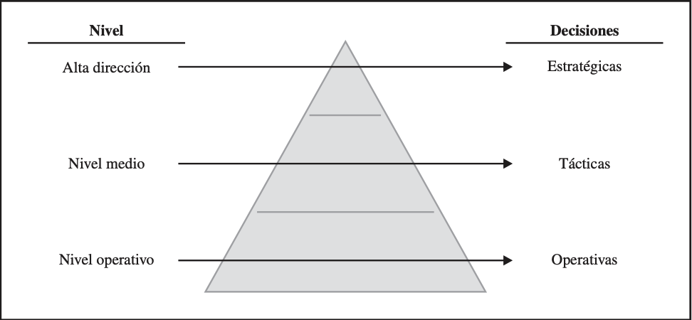
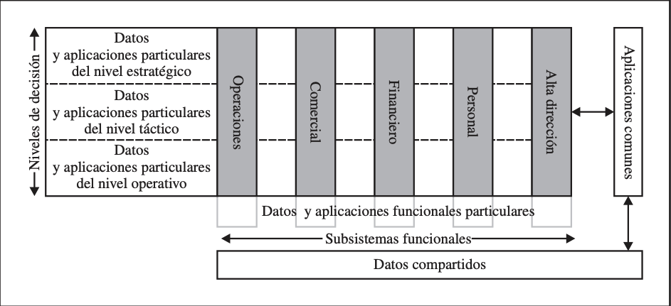
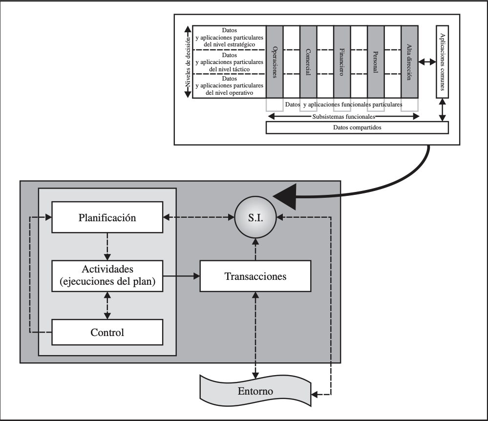

# 🌟 **Semana 1: Introducción a la Gestión de Tecnologías de la Información**

**Curso:** Gestión de Tecnologías de la Información  
**Docente:** Dr. Oscar Jimenez Flores  
**Perfil:** [CTI - Perfil del Docente](https://www.google.com/url?sa=t&source=web&rct=j&opi=89978449&url=https://ctivitae.concytec.gob.pe/appDirectorioCTI/VerDatosInvestigador.do%3Fid_investigador%3D33398&ved=2ahUKEwi7_KSu8s2MAxWwIbkGHfcFN3EQFnoECA0QAQ&usg=AOvVaw1VPrJTyH8Dl3P6q-qEHKEY)

---

## 🔑 **Introducción**

De forma sistémica se analiza cómo el sistema de información apoya la planificación, la realización de actividades, el control, la toma de decisiones y las comunicaciones en las relaciones inter-organizativas.

#### 🔸 **Componentes Fundamentales**
- ***Planificación:*** El arte de definir objetivos y diseñar estrategias.
- ***Actividades:*** Ejecución efectiva de los planes diseñados.
- ***Control:*** Herramientas para verificar y ajustar el cumplimiento.

#### 🔸 **Sistema de Información (SI) como Eje Central**
- Áreas clave:
  - Planificación estratégica
  - Toma de decisiones
  - Comunicación interorganizativa
  
- Relación con:
  - Transacciones diarias (operaciones cotidianas)
  - Entorno empresarial (factores externos)
  
  
*Figura 1. Relación entre planificación, actividades y control*



---

## 📊 **1.1. La Importancia de la Información en la Empresa**

La información, como concepto general, se considera hoy en día un recurso estratégico. De hecho, la información se ha convertido en uno de los recursos más importantes con el que cuentan muchas empresas.

Es un recurso capaz de producir movimientos bursátiles, originar reestructuraciones sectoriales e incluso variar las políticas de los estados. Un recurso que ha
hecho mermar la importancia de la mano de obra y del capital como motor económico, sentando las bases de una nueva forma de hacer negocios fundamentada
en la aplicación masiva de las tecnologías de la información en las empresas, instituciones de todo tipo y en la sociedad en general, y cuyo símbolo más representativo es el fenómeno de Internet.

#### 🔸 **Naturaleza Única de la Información**
- Características distintivas:
  - No se agota al usarse.
  - Puede compartirse sin perder valor.
  - Ejemplo: Estudio de mercado vs. bien físico.

#### 🔸 **Valor Estratégico**
- Impacto económico de la información:
  - Movimientos en mercados bursátiles.
  - Factor clave en reestructuraciones sectoriales.
  - Influencia significativa en políticas gubernamentales.

- Nueva economía:
  - Menor dependencia de mano de obra y capital tradicional.
  - Base fundamental para los negocios digitales (ej. Internet).

#### 🔸 **Gestión de la Información:**
- La información como recurso valioso que debe ser gestionado con un enfoque estratégico, similar a la gestión de recursos humanos y financieros.

---


## 🧠 **1.2. Enfoques del Sistema de Información**

El papel desempeñado por el sistema de información en la organización es visto de forma muy diferente según el enfoque utilizado para su estudio. Dichos enfo-
ques han evolucionado en el tiempo, conjuntamente con el avance experimentado por las tecnologías y los servicios que podían prestar a la gestión empresarial. La
primera consideración del sistema de información en la empresa fue meramente mecanicista, para posteriormente aceptar el importante papel que realmente tenía en la empresa desde una perspectiva de sistema.

#### 🔹 **1. Perspectiva Tradicional Mecanicista:**

El enfoque clásico de dirección considera la organización como una máquina en la que lo importante es la gestión de los flujos reales (materia prima, productos, etc.) y que, de manera determinista, es controlable por la dirección. En la figura 2 se observa que la actividad de la organización se desarrolla a través de un proceso de entradas, transformaciones y salidas. En este modelo, el sistema de información es utilizado como simple herramienta de control. De la eficacia de dicho sistema depende el que la dirección pueda desarrollar una gestión ade cuada. Esta instrumentalización de la visión del sistema de información es, por tanto, básicamente técnica y pasiva.

- Concepto clave:
  - La organización vista como una máquina determinista.
  - El sistema de información, una herramienta de control pasiva.

*Figura 2. Sistema de información en el enfoque clásico*



---

#### 🔹 **2. Enfoque Sistémico:**

La teoría general de sistemas define un sistema como un conjunto de elementos interrelacionados según las normas de cierta estructura y que persiguen un fin
común. Todo sistema se puede dividir en subsistemas, los cuales son igualmente sistemas, ya que también cumplen sus propiedades.

Dado que la empresa se comporta como un sistema, es posible fragmentar sus partes en subsistemas interrelacionados. La teoría de la organización suele dividir la empresa en los seis subsistemas principales representados en la figura 3: comercial, de operaciones, financiero, de personal, directivo y de información. 

>Es habitual establecer una analogía entre la función desempeñada por el «sistema de información» de la empresa y el «sistema nervioso» humano.

>Basándose en dicha analogía, el sistema de información se representa, tal como aparece en la figura, por medio de flechas discontinuas que relacionan al resto de los subsistemas entre sí y con el entorno. 

>De otro lado, del mismo modo que el «sistema circulatorio» humano proporciona nutrientes al resto de subsistemas del
organismo, en la empresa es necesario que existan flujos físicos de recursos humanos, físicos y financieros. Estos flujos físicos se representan de forma agregada mediante flechas continuas.

- Principios fundamentales
  - La empresa como un sistema de subsistemas interrelacionados.
  - Seis subsistemas clave: Comercial, Operaciones, Financiero, Personal, Directivo, Información.

- Analogía biológica
  - El SI es como el "sistema nervioso" de la empresa.
  - Los flujos físicos, como el "sistema circulatorio".

*Figura 3. La empresa como sistema*



OJO: Este enfoque sistémico de la gestión de la información en la empresa supone, sin duda, un avance respecto de la visión reduccionista del enfoque tradicional mecanicista de la organización. No obstante, la visión del sistema de información reflejada en la *Figura 3. La empresa como sistema*, no permite detectar las interacciones que se producen con el resto de subsistemas ni la necesidad de gestión de dicho subsistema como un elemento fundamental en la empresa, así como tampoco permite ver el impacto del sistema de información en el diseño organizativo.


---

#### 🔹 **3. Enfoque Socio-Técnico:**
Se considera que el papel del sistema de información en la empresa se recoge mejor en el enfoque socio-técnico, que también considera el carácter sistémico de la empresa. Este enfoque representa la organización como un sistema compuesto por cinco subsistemas: directivo, tecnológico, social, estructural y cultural. En la figura 4 se representa cómo todos los subsistemas se influyen entre sí. Un cambio en uno de los subsistemas influencia al resto y provoca cambios en los mismos para buscar una nueva situación de equilibrio. 

El sistema de información puede ubicarse en el subsistema técnico que, aunque es gestionado por la dirección, también se ve influenciado e influye al resto de los subsistemas.

- Modelo integrado de cinco subsistemas
  - Tecnológico, Social, Estructural, Cultural, Directivo.

*Figura 4. El enfoque socio-técnico*



Entonces en este enfoque, al sistema de información se le da tanta importancia como al resto de los subsistemas que constituyen la organización. Además, no se produce un funcionamiento determinista de la empresa como en el enfoque clásico de dirección.

- Aplicación práctica. Ejemplo Sencillo, la Implementación de Software de Gestión en una Pequeña Oficina

  - Subsistema Directivo: En una pequeña oficina, los directivos deciden implementar un software de gestión de proyectos para mejorar la organización y seguimiento de las tareas. Se elige un software fácil de usar y accesible para todo el personal.
  - Subsistema Tecnológico: cambia al incorporar este software en los equipos de trabajo. Los empleados deben aprender a usarlo, pero mejora la comunicación y la organización del trabajo, permitiendo que las tareas se asignen y sigan de manera eficiente.
  - Subsistema Estructural: cambia en cuanto a cómo se distribuyen las tareas. Las personas ahora tienen un sistema claro para asignar y priorizar tareas, lo que hace que el trabajo sea más organizado.
  - Subsistema Social: Los empleados pueden resistirse inicialmente a usar el nuevo software, ya que prefieren los métodos tradicionales. Sin embargo, con el tiempo, al ver los beneficios, comienzan a aceptar la nueva herramienta.
  - Subsistema Cultural: también experimenta un cambio. Se fomenta una cultura de colaboración y transparencia en el seguimiento de proyectos. Además, se promueve el aprendizaje continuo para mejorar el uso del software y la productividad.

*Figura 5. Implementación del Software de Gestión de Proyectos*




Este ejemplo práctico muestra cómo la implementación de una tecnología, aunque pequeña, también afecta a los diferentes subsistemas de la organización, creando una transformación en la manera de trabajar y en la cultura organizacional.

---

## 📚 **1.3. Conceptos Fundamentales del SI**

#### 🔸 **Definición Operativa**
Un sistema integrado de usuario-máquina para gestionar datos, con el fin de generar la información adecuada en el momento y lugar correcto.

#### 🔸 **Triángulo Conceptual: Dato → Información → Conocimiento**
1. **Dato:** Hechos crudos (ej. saldo negativo en cuenta bancaria).
2. **Información:** Datos contextualizados (ej. cuenta pertenece a una empresa en quiebra).
3. **Conocimiento:** Aplicación práctica del dato con experiencia (ej. acción legal como acreedor).

#### 🔸 **Objetivos del SI:**
1. **Soporte decisional** en todos los niveles jerárquicos.
2. **Coordinación operativa** para actividades diarias.
3. **Ventaja competitiva** mediante la diferenciación en el mercado.

#### 🔸 **Características Esenciales del SI**
| Característica | Descripción | Ejemplo Aplicado |
|----------------|-------------|------------------|
| **Fiabilidad** | Sin errores | Coincidencia inventario físico-digital |
| **Relevancia** | Importancia para el receptor | Detalle adecuado en gestión de almacén |
| **Oportunidad** | Disponibilidad cuando se necesita | Consulta en tiempo real de stock |
| **Flexibilidad** | Capacidad de adaptación | Cambio de método FIFO (First In, First Out) a precio medio en la gestión de inventarios |

#### 🔸 **Alcance del SI:**

Hay que ser consciente de que los sistemas de información sólo serán de utilidad mientras no se supere su alcance, el cual se define en función de diversos elementos: 
- de los datos que se puedan obtener; 
- del coste de obtenerlos, depurarlos, almacenarlos, procesarlos y recuperarlos;
- y del valor que tenga para el usuario la información de salida generada. 

Es decir, el sistema de información será de utilidad siempre que el valor de la información de salida proporcionada por el sistema supere al coste de obtenerla. Según se representa en la figura 6, el sistema de información supera su alcance, y deja de ser interesante para la empresa, a partir del punto de corte de las dos curvas representadas.

*Figura 6. Alcance de un sistema de información*



La relación entre el valor de la información y el coste de obtenerla puede ser analizada utilizando ratios conocidos como el ROI (Return on Investment), que compara los beneficios (valor) con la inversión y costes en los que se incurren para lograr tales beneficios. De este modo, en el caso de que el valor de la información obtenida por el sistema de información se pueda cuantificar monetariamente, se podría valorar el alcance del sistema. 

> ***ROI = (Beneficio Neto / Inversión) × 100***

 Donde:
- Beneficio Neto = Ingresos generados − Costos totales
- Inversión = Monto total invertido

(*) El resultado se expresa como un porcentaje (**%**).

#### Ejemplo:

- ROI = ((Ganancia obtenida - Inversión inicial) / Inversión inicial) × 100

| Elemento              | Valor / Fórmula                          | Explicación                                                                 |
|-----------------------|------------------------------------------|-----------------------------------------------------------------------------|
| Inversión Inicial     | $50,000                                   | Costo total para desarrollar e implementar el sistema.                      |
| Ganancia Obtenida     | $75,000                                   | Ahorros y/o ingresos adicionales generados gracias al sistema.             |
| Beneficio Neto        | $75,000 − $50,000 = $25,000               | Es la diferencia entre lo ganado y lo invertido.                           |
| Fórmula del ROI       | (Beneficio Neto / Inversión Inicial) × 100| ROI = (25,000 / 50,000) × 100                                               |
| Resultado del ROI     | **50%**                                   | El retorno de inversión es del 50%, lo que indica que la inversión fue buena. |


#### Pautas generales para evaluar el ROI

    - ROI > 0%: Si el ROI es positivo, significa que la inversión generó un retorno superior a lo invertido, es decir, hubo una ganancia. 

    - ROI = 0%: Si el ROI es cero, la inversión solo permitió recuperar lo invertido, sin ganancias adicionales.  

    - ROI < 0%: Si el ROI es negativo, significa que la inversión ha generado una pérdida, es decir, no se ha recuperado todo lo invertido.  


---

## 🔎 **1.4. Niveles de Decisión en la Empresa**

El primer gran objetivo de todo sistema de información consiste en suministrar a los distintos niveles de la dirección la información necesaria para la planificación, el control y la toma de decisiones. De esto se extrae que el sistema de información debe jugar un importante papel en todos y cada uno de los niveles de
decisión de la empresa. 

Estos niveles de decisión, representados en la figura 7,se relacionan con los niveles jerárquicos de la empresa (alta dirección o nivel estratégico, nivel medio o táctico y nivel operativo), correspondiéndole a cada nivel tomar decisiones de distinta naturaleza.

#### 🔸 **Pirámide Jerárquica:**
1. Nivel Estratégico:
   - Decisiones no estructuradas, de largo plazo y alto riesgo.
   - Ejemplo: expansión internacional.
2. Nivel Táctico:
   - Decisiones semiestructuradas, de medio plazo.
   - Ejemplo: ajustes presupuestarios.
1. Nivel Operativo:
   - Decisiones estructuradas, de corto plazo y bajo riesgo.
   - Ejemplo: reposición de inventario.


*Figura 7. Pirámide de decisiones*



#### 🔸 **Tipos de Decisiones:**
| Tipo | Características | Ejemplos por Nivel |
|------|-----------------|--------------------|
| Estructuradas | Reglas claras, repetitivas | Operativo: Pedido automático |
| Semiestructuradas | Parcialmente programables | Táctico: Control de rendimiento |
| No estructuradas | Creativas, únicas | Estratégico: Fusión de empresas |

#### 🔸 **Requerimientos de Información:**
| Característica | Operativo | Estratégico |
|-----------------|-----------|-------------|
| **Fuente** | Interna | Externa |
| **Definición** | Alta | Baja |
| **Agregación** | Detallada | Resumida |
| **Temporalidad** | Histórica | Prospectiva |
| **Exactitud requerida** | Alta | Media/Baja |

---

## 🌐 **1.4. Integración del Sistema de Información**

La estructura conceptual, representada en la figura 8, visualiza al sistema de información como una federación de subsistemas de información que proveen soporte a los requerimientos de información del nivel operativo, táctico y estratégico, para cada una de las funciones organizativas de la empresa. 

Para ello, la estructura conceptual cuenta con datos y aplicaciones particulares para cada subsistema funcional y nivel de decisión, por un lado, y con datos y aplicaciones compartidos que actúan como elementos de integración, facilitando el intercambio de información a través de los diferentes niveles de decisión y de las distintas funciones organizativas, por el otro lado.

#### 🔸 **Estructura Conceptual:**
- Subsistemas interconectados que apoyan todos los niveles y funciones organizacionales.

*Figura 8. Estructura conceptual del S.I.*



Esto hace posible que el sistema de información pueda cumplir con la función que le ha sido encomendada, esto es: 

1) proporcionar apoyo a las tareas de gestión y suministrar a los distintos niveles de la dirección la información interna o externa que precisen para planificar; 
2) ejecutar el plan (realización de las actividades planificadas), y 
3) controlar su desempeño. 

Para realizar esta labor el sistema de información se alimenta de inputs de datos e información tanto de las acciones o transacciones internas como de las transacciones externas, así como del entorno. Este papel del sistema de información en la empresa se representa de forma esquemática en la figura 9.


*Figura 9. El papel del sistema de información en la organización*



---

#### 🔸 **Taxonomía del Sistema de Información:**
1. **Sistema Público Formal:** Documentado y accesible (ej. contabilidad).
2. **Sistema Público Informal:** No formalizado (ej. correos electrónicos).
3. **Sistema Privado Formal:** Datos organizados (ej. agenda de contactos).
4. **Sistema Privado Informal:** Conocimiento tácito (ej. redes personales).

*Figura 10. Taxonomía del sistema de información*


   - El sistema **público formal** está formado por los datos y aplicaciones que se encuentran debidamente documentados, disponibles y accesibles a todos los que deban hacer uso de ellos. Sería el caso de una aplicación de contabilidad y de los datos contables.
   - El sistema **público informal** está formado por aquellos datos y aplicaciones que están igualmente disponibles y accesibles para todos los miembros de la organización, pero cuyo uso no está tan formalizado. Sería el caso del intercambio de información realizado a través del correo electrónico. La estructura conceptual del sistema de información describe precisamente al sistema público (ya sea formal o informal).
   - El sistema **privado formal** lo componen aquellos datos y aplicaciones que, al ser de carácter privado, no forman parte de la estructura conceptual del sistema de información. Sería el caso de un directivo que mantiene a título personal un fichero con los datos de sus contactos. La empresa puede beneficiarse de esta información, pudiendo incluso ser fundamental para adoptar cierto tipo de decisiones. Sin embargo, el directivo se llevará consigo este fichero cuando deje la empresa.
   - El sistema **privado informal** lo componen las actividades informativas de carácter privado que no pueden formalizarse de ningún modo; es el caso de los contactos personales.

---

## 📚 **1.5. Conclusiones**

1. **El SI como activo estratégico** más allá de la tecnología.
2. **Enfoque sistémico** es necesario para un impacto transversal en la organización.
3. **Definir la gestión por niveles:** Diferenciación y alineación operativa/táctica/estratégica.
4. **Es necesario conocer instrumentos financieros** como el Balance coste-beneficio (ROI), que permite evaluar la rentabilidad de una inversión. 


---
### Caso de Estudio. 
## Implementación de un Sistema de Gestión de Proyectos en una Empresa de Tecnología

### Descripción del Proyecto

La empresa **TechSolutions S.A.** ha decidido implementar un sistema de gestión de proyectos para mejorar la planificación, ejecución y monitoreo de sus proyectos tecnológicos. Este sistema se diseñará para automatizar la asignación de tareas, la comunicación interna, el seguimiento del avance y la gestión de recursos.

El costo de implementación del sistema es de **$100,000** y se espera que genere ahorros en el tiempo de gestión, mejora en la asignación de recursos y una mayor eficiencia operativa, resultando en un incremento de ingresos proyectados de **$150,000** durante el primer año.

### Objetivo del Caso de Estudio

1. **Calcular el ROI** de la implementación del sistema.
2. **Gestionar el proyecto** utilizando un sistema de tareas con tiempos estimados y recursos asignados.
3. **Visualizar los resultados** de la duración de cada fase del proyecto y la distribución de recursos.

## Detalles del Proyecto

- **Costo de Implementación**: $100,000
- **Ingresos Proyectados (Ahorros y Mejora en Eficiencia)**: $150,000
- **Duración del Proyecto**: 6 meses
- **Tareas del Proyecto**: 5 tareas principales
  - Planificación (10 días)
  - Desarrollo (30 días)
  - Pruebas (15 días)
  - Implementación (5 días)
  - Monitoreo (20 días)

## Datos del Proyecto

Para este caso de estudio, se utiliza el siguiente script python en google colab (https://colab.google):

```python
import pandas as pd
import numpy as np
import matplotlib.pyplot as plt

# Función para calcular el ROI
def calcular_roi(inversion_inicial, ganancia_obtenida):
    beneficio_neto = ganancia_obtenida - inversion_inicial
    roi = (beneficio_neto / inversion_inicial) * 100
    return roi

# Datos del caso de estudio
inversion_inicial = 100000  # Costo de implementación del sistema
ganancia_obtenida = 150000  # Ahorros e ingresos generados por el sistema

# Calcular el ROI
roi = calcular_roi(inversion_inicial, ganancia_obtenida)

# Datos de las tareas del proyecto
data = {
    'Tarea': ['Planificación', 'Desarrollo', 'Pruebas', 'Implementación', 'Monitoreo'],
    'Duración (días)': [10, 30, 15, 5, 20],
    'Recursos Asignados (personas)': [2, 5, 3, 2, 4],
    'Estado': ['Completada', 'En progreso', 'Pendiente', 'Pendiente', 'Pendiente'],
    'Costo Estimado ($)': [5000, 30000, 15000, 5000, 10000]
}

# Crear un DataFrame con los datos del proyecto
df_proyecto = pd.DataFrame(data)

# Visualización de las tareas del proyecto
plt.figure(figsize=(10, 6))
plt.bar(df_proyecto['Tarea'], df_proyecto['Duración (días)'], color=['green', 'blue', 'orange', 'red', 'purple'])
plt.title('Duración de las Tareas del Proyecto de Gestión')
plt.xlabel('Tareas')
plt.ylabel('Duración (días)')
plt.show()

# Mostrar el ROI calculado
print(f"El ROI de la inversión en el sistema de gestión de proyectos es: {roi:.2f}%")

# Mostrar el DataFrame con detalles del proyecto
print("\nDetalles del Proyecto de Gestión:")
print(df_proyecto)

# Análisis adicional: Distribución del costo estimado por tarea
plt.figure(figsize=(10, 6))
plt.pie(df_proyecto['Costo Estimado ($)'], labels=df_proyecto['Tarea'], autopct='%1.1f%%', startangle=90)
plt.title('Distribución del Costo Estimado por Tarea')
plt.show()

# Análisis adicional: Recursos asignados por tarea
plt.figure(figsize=(10, 6))
plt.bar(df_proyecto['Tarea'], df_proyecto['Recursos Asignados (personas)'], color=['green', 'blue', 'orange', 'red', 'purple'])
plt.title('Recursos Asignados por Tarea del Proyecto')
plt.xlabel('Tareas')
plt.ylabel('Recursos Asignados (personas)')
plt.show()

