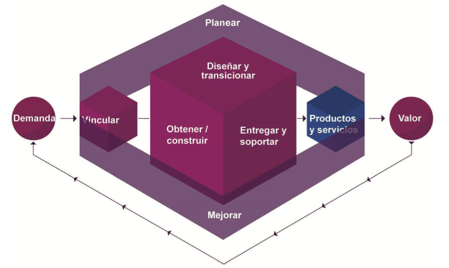
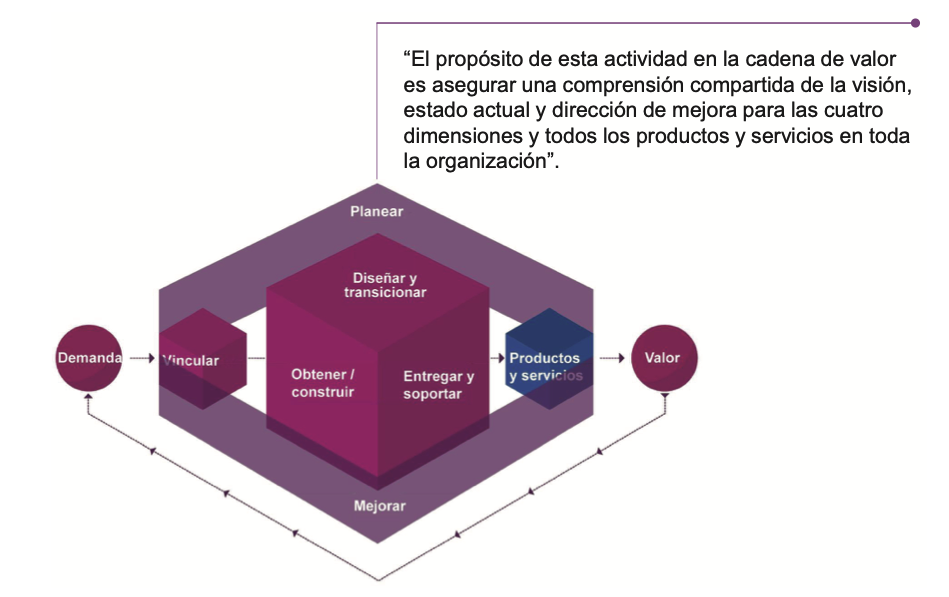
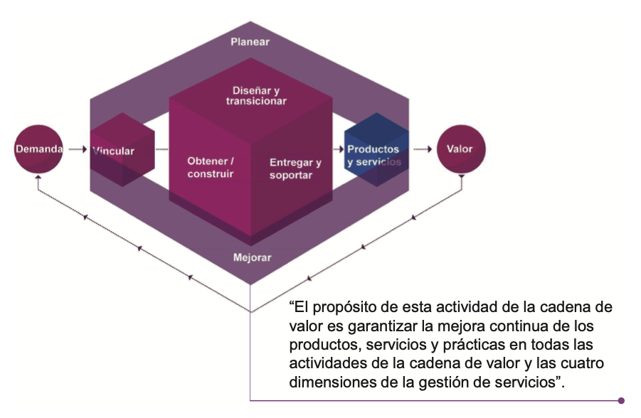
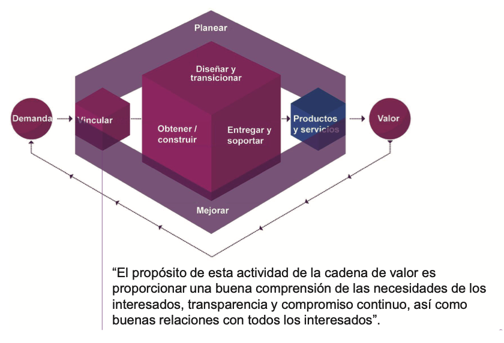
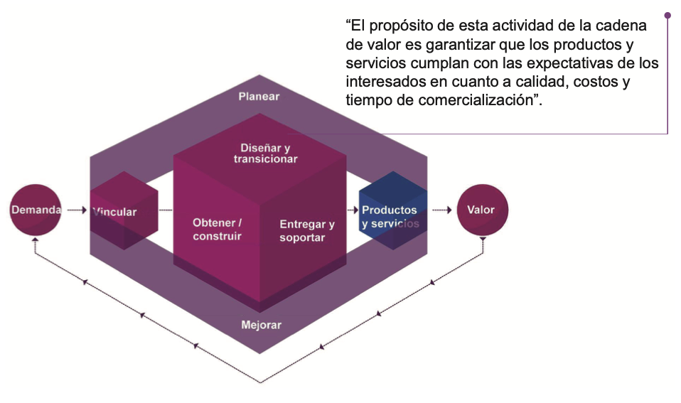
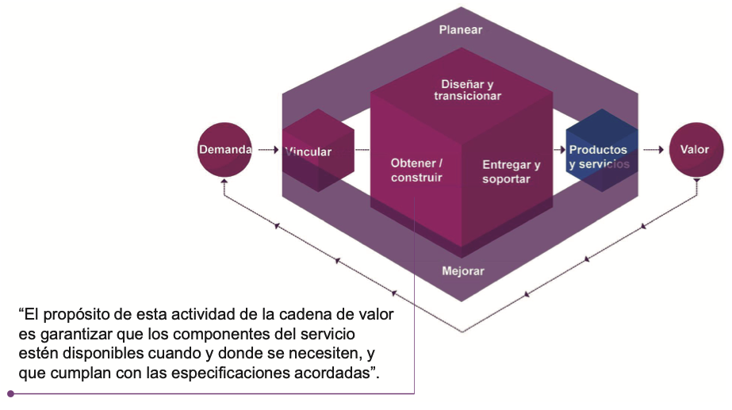
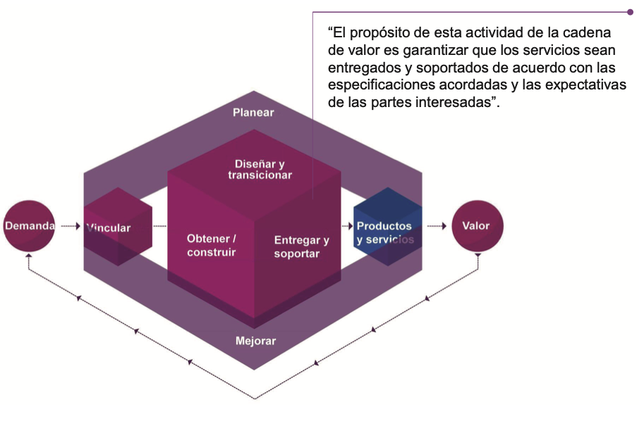

# 🧩 **Semana 11: Cadena de Valor del Servicio (CVS)**

**Curso:** Gestión de Tecnologías de la Información  
**Docente:** Dr. Oscar Jimenez Flores  
[CTI Vitae Concytec](https://www.google.com/url?sa=t&source=web&rct=j&opi=89978449&url=https://ctivitae.concytec.gob.pe/appDirectorioCTI/VerDatosInvestigador.do%3Fid_investigador%3D33398&ved=2ahUKEwi7_KSu8s2MAxWwIbkGHfcFN3EQFnoECA0QAQ&usg=AOvVaw1VPrJTyH8Dl3P6q-qEHKEY)  
[LinkedIn](https://www.linkedin.com/in/oscar-jimenez-flores/)

---

## 🎯 Objetivos del módulo

- Explicar la Cadena de Valor del Servicio (CVS) y el propósito de sus actividades.

---
## 🔗 Cadena de Valor del Servicio (CVS)

La Cadena de Valor del Servicio es el elemento central del SVS de ITIL. Define las actividades clave requeridas para responder a la demanda y crear valor.

### 🔄 Actividades de la CVS

1. 🧠 **Planear**
2. 📈 **Mejorar**
3. 🤝 **Vincular (Involucrar)**
4. 🛠️ **Diseñar y Transicionar**
5. 🧩 **Obtener/Construir**
6. 📦 **Entregar y Soportar**

 
  
 

---

### 🧠 1. Actividad: Planear

📌 **Propósito**: Asegurar una comprensión compartida de la visión, estado actual y dirección de mejora para toda la organización.

 
  
 

#### 📤 Salidas de "Planear"

| Salida                                       | Destinatario                |
|---------------------------------------------|-----------------------------|
| Planes estratégicos, tácticos, operacionales| Todas las actividades       |
| Decisiones del portafolio                   | Diseñar y Transicionar      |
| Oportunidades de mejora                     | Mejorar                     |
| Requisitos para contratos y acuerdos        | Vincular                    |

---

### 📈 2. Actividad: Mejorar

📌 **Propósito**: Garantizar la mejora continua de productos, servicios y prácticas en toda la cadena de valor.

 
  
 

#### 📤 Salidas de "Mejorar"

| Salida                                  | Destinatario                  |
|----------------------------------------|-------------------------------|
| Iniciativas y planes de mejora         | Todas                         |
| Reportes de avance                     | Todas las actividades         |
| Información de desempeño               | Planear, Gobierno, Vincular   |
| Retroalimentación de desempeño         | Diseñar y Transicionar        |

---

### 🤝 3. Actividad: Vincular (Involucrar)

📌 **Propósito**: Entender necesidades, garantizar transparencia y mantener relaciones efectivas con los stakeholders.

 
  
 

#### 📤 Salidas de "Vincular"

| Salida                                        | Destinatario                         |
|----------------------------------------------|--------------------------------------|
| Reportes de desempeño del servicio           | Clientes                              |
| Oportunidades y demandas consolidadas        | Planear                               |
| Contratos con proveedores                    | Obtener/Construir, Diseñar y Trans.   |
| Requisitos de productos y tareas de soporte  | Diseñar y Transicionar                |
| Retroalimentación                            | Mejorar                               |

---

### 🛠️ 4. Actividad: Diseñar y Transicionar

📌 **Propósito**: Asegurar que productos y servicios cumplan expectativas en calidad, costo y tiempo de entrega.

 
  
 

#### 📤 Salidas de "Diseñar y Transicionar"

| Salida                                       | Destinatario                  |
|---------------------------------------------|-------------------------------|
| Contratos y acuerdos                        | Vincular                      |
| Requisitos para desarrollo                  | Obtener/Construir             |
| Productos y servicios nuevos/modificados    | Entregar y Soportar           |
| Retroalimentación y conocimiento            | Todas las actividades         |

---

### 🧩 5. Actividad: Obtener/Construir

📌 **Propósito**: Asegurar que los componentes del servicio estén disponibles según especificaciones.

 
  
 

#### 📤 Salidas de "Obtener/Construir"

| Salida                                         | Destinatario                    |
|-----------------------------------------------|---------------------------------|
| Componentes de servicio                       | Diseñar/Transicionar, Entregar  |
| Información de componentes nuevos/modificados | Todas las actividades           |
| Datos de desempeño                            | Mejorar                         |

---

### 📦 6. Actividad: Entregar y Soportar

📌 **Propósito**: Asegurar la entrega y soporte de servicios conforme a acuerdos y expectativas.

 
  
 

#### 📤 Salidas de "Entregar y Soportar"

| Salida                                         | Destinatario                    |
|-----------------------------------------------|---------------------------------|
| Servicios entregados                          | Clientes y usuarios             |
| Información de desempeño                      | Vincular, Diseñar, Mejorar      |
| Solicitudes de cambio                         | Obtener/Construir               |
| Requisitos de soporte                         | Vincular                        |

---

