# 🧩 **Semana 12: Mejora Continua**

**Curso:** Gestión de Tecnologías de la Información  
**Docente:** Dr. Oscar Jimenez Flores  
[CTI Vitae Concytec](https://www.google.com/url?sa=t&source=web&rct=j&opi=89978449&url=https://ctivitae.concytec.gob.pe/appDirectorioCTI/VerDatosInvestigador.do%3Fid_investigador%3D33398&ved=2ahUKEwi7_KSu8s2MAxWwIbkGHfcFN3EQFnoECA0QAQ&usg=AOvVaw1VPrJTyH8Dl3P6q-qEHKEY)  
[LinkedIn](https://www.linkedin.com/in/oscar-jimenez-flores/)

---

## 🎯 Objetivos del módulo

- Explicar la mejora continua y los diversos modelos aplicables a ITIL 4.

## 📌 **Introducción a la Mejora Continua**
La mejora continua es una actividad recurrente que asegura que el desempeño de la organización cumpla con las expectativas de los interesados. Según ITIL 4:
- Se aplica en **todos los niveles** (estratégico, táctico, operativo).
- Es esencial para adaptarse a cambios en el entorno empresarial, tecnología y preferencias del cliente.
- Debe estar integrada en la **cadena de valor del servicio** (SVS) y alineada con la visión organizacional.

> **Cita clave del material**:  
> *"La mejora continua es necesaria para que una organización evolucione y se mantenga relevante en el mercado"*.

 
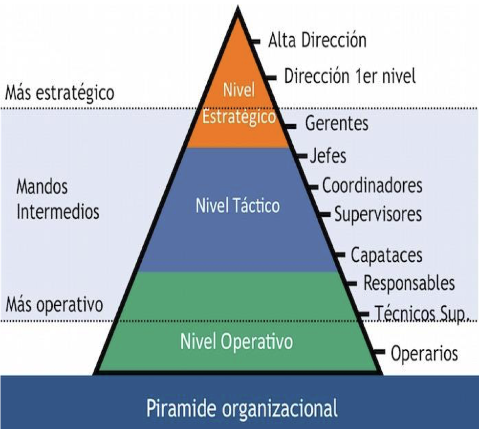  
 

---

## 🔍 **Modelos de Mejora Continua en ITIL 4**

La mejora continua tiene lugar en todas las áreas de la organización y en todos los niveles, desde el estratégico hasta el operativo. Para maximizar la eficacia de los servicios, cada persona que contribuya a la prestación de un servicio debe tener presente la mejora continua y siempre debe buscar oportunidades para mejorar.

El modelo de mejora continua se aplica a la SVS en su totalidad, así como a todos los productos, servicios, componentes de servicio y relaciones de la organización. Para apoyar la mejora continua en todos los niveles, ITIL SVS incluye:

- el modelo de mejora continua de ITIL, que proporciona a las organizaciones un enfoque estructurado para implementar mejoras
- la mejora de la actividad de la cadena de valor del servicio, que integra la mejora continua en la cadena de valor
- la práctica de mejora continua, apoyando a las organizaciones en sus esfuerzos de mejora del día a día

 
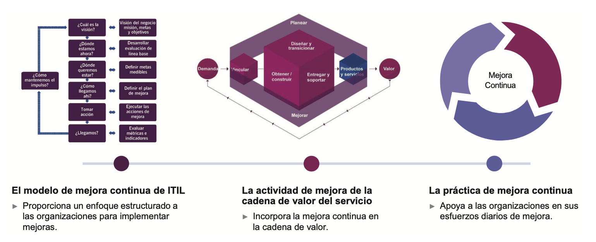  
 

## ⚙️ 1. El modelo de mejora continua de ITIL

El modelo de mejora continua de ITIL se puede utilizar como una guía de alto nivel para respaldar las iniciativas de mejora. El uso del modelo aumenta la probabilidad de que las iniciativas de ITSM tengan éxito, pone un fuerte enfoque en el valor del cliente y asegura que los esfuerzos de mejora puedan vincularse con la visión de la organización El modelo admite un enfoque iterativo de mejora, dividiendo el trabajo en partes manejables con objetivos separados que se pueden lograr de forma incremental.

 
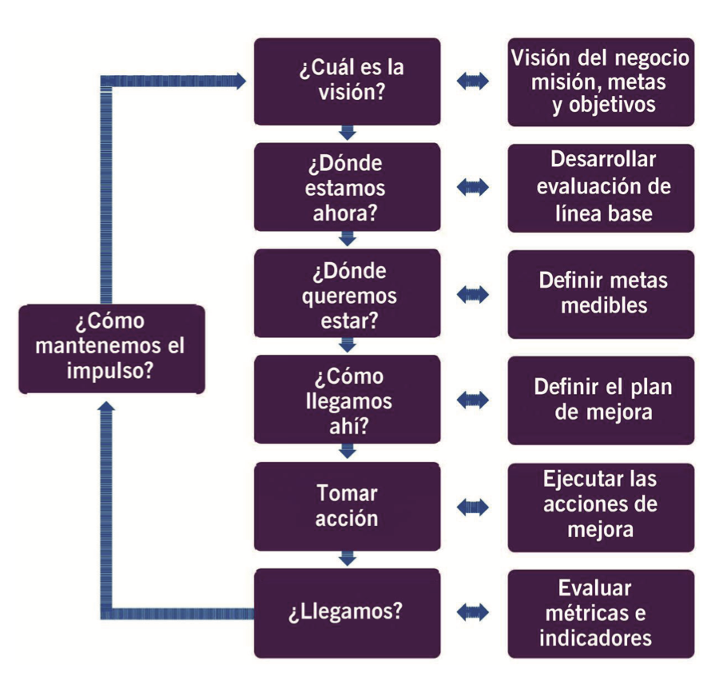  
 

---

## 🔄 2. PDCA (Ciclo de Deming)

El Ciclo PDCA (Plan-Do-Check-Act) es un enfoque iterativo para asegurar la calidad en procesos TIC.

| Fase  | Acción TIC                                                               |
|-------|--------------------------------------------------------------------------|
| **Plan**   | Identificar cuellos de botella en un servicio de help desk.             |
| **Do**     | Implementar un chatbot para consultas frecuentes.                     |
| **Check**  | Medir reducción en tiempos de atención y satisfacción del usuario.   |
| **Act**    | Estandarizar el uso del chatbot o ajustarlo si no cumple objetivos.  |

> **Aplicación en ISO/IEC 20000:** Estándar internacional que incorpora PDCA para gestión de servicios.

 
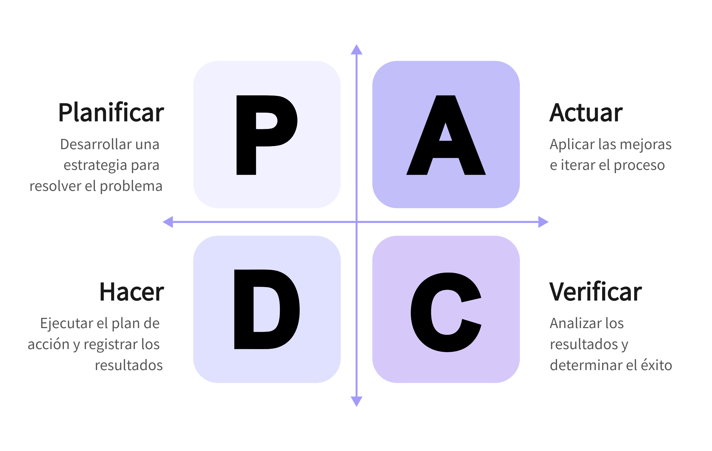  
 

 
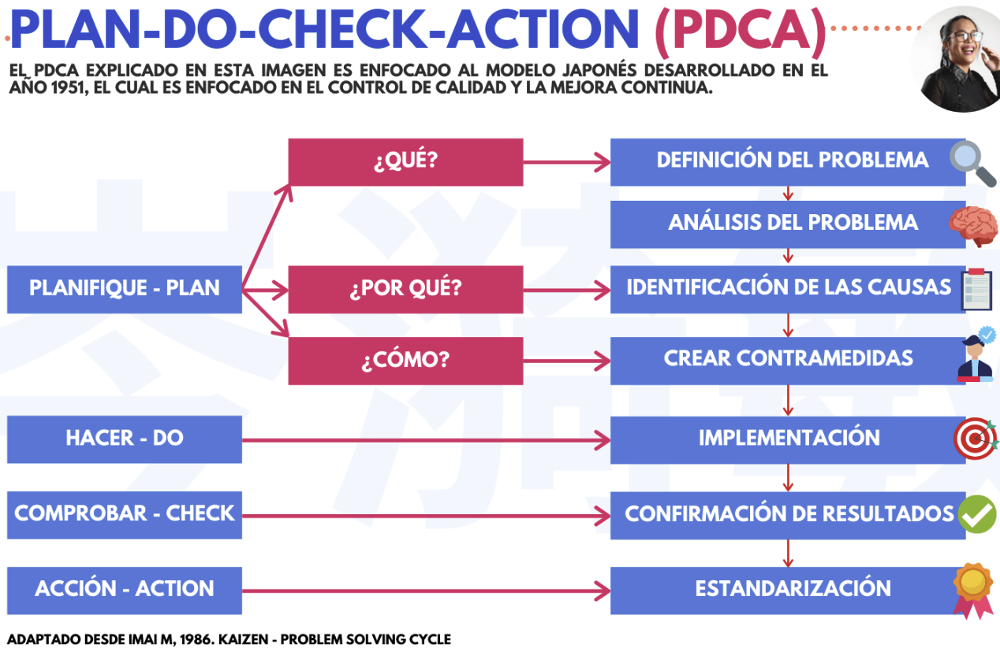  
 

---

## ⚙️ 3. Kaizen: Filosofía de Mejora Continua

Originada en Japón, **Kaizen** promueve mejoras pequeñas, frecuentes e impulsadas por todos los miembros de la organización.

- Detectar los problemas: levantar los problemas reales que existen dentro de cada actividad o paso dentro del proceso.
- Crear contramedidas: es hora de crear contramedidas según la realidad detectada, recuerden que una contramedida son soluciones efímeras que sirven para frenar la situación más no es la opción más viable para mejorar.
- Determinar la ruta de la causa: para comprender en detalle los elementos que generaron la situación anterior.
- Soluciones hipotéticas: después de comprender la causa, es hora de crear diversas posibles soluciones, que es necesario evaluar.
- Probar las posibles soluciones: es indispensable poner en práctica las diversas opciones de soluciones desarrolladas y evaluar cuál da el mejor resultado y que sea viable dentro del proceso.
- Implementar la solución: ya evaluados todas las posibles soluciones y seleccionada la más viable y adaptable, es hora de implementarla y que forme parte del proceso.
- Estandarizar: es necesario normalizar el trabajo o los procesos.

### Principios:
- **Jidoka:** Detenerse ante errores para solucionarlos antes de que escalen.
- **Just-in-Time:** Producir solo lo necesario, cuando se necesita.

> **Ejemplo TIC:** En una empresa de software, cada equipo propone mejoras semanales al flujo de desarrollo, eliminando pasos innecesarios en la integración continua.

 
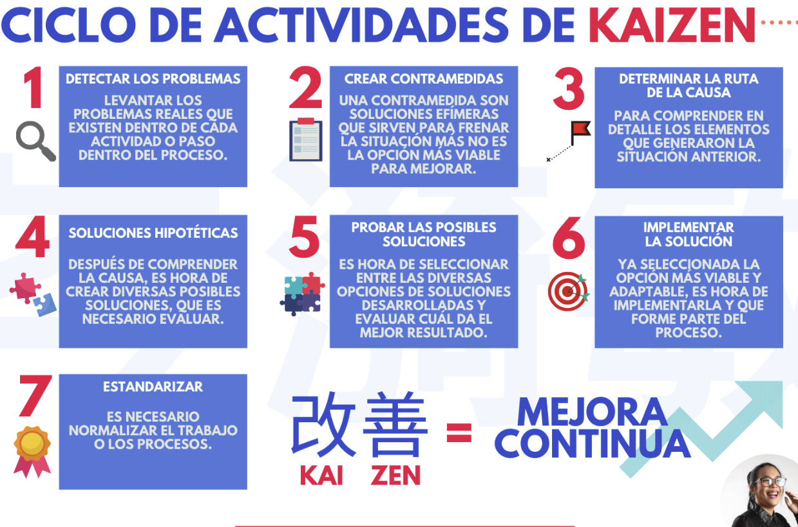  
 

---

## 📊 4. Six Sigma

Metodología creada por Motorola en 1988 para reducir defectos y variabilidad, utilizando análisis estadístico.

Six Sigma, es un modelo de gestión que mide y mejora la Calidad, con objeto de satisfacer las necesidades de los clientes y lograrlo con niveles próximos a la perfección (los niveles de perfección en Six Sigma son dependientes de multiples variables como verticales de negocio o áreas existen en una compañia). 

 
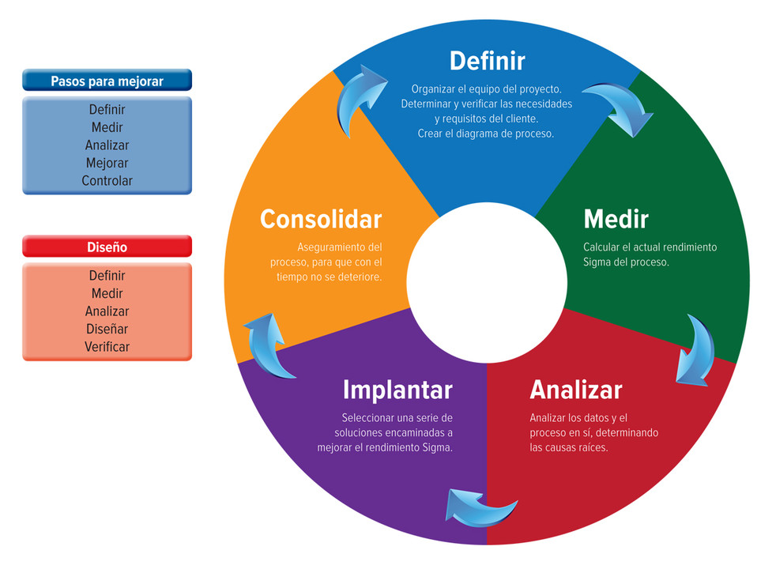  
 

Las siguientes son las dos principales metodologías de Six Sigma, que se utilizan en diferentes entornos empresariales:

### DMAIC

DMAIC es un enfoque basado en datos que se utiliza para optimizar y mejorar los diseños y procesos empresariales existentes. Es un método eficaz de gestión controlada de cambios. A continuación, se enumeran las cinco fases de DMAIC, cada una de las cuales incluye herramientas y tareas para ayudar a encontrar la solución final.

- Definir el problema y los objetivos del proyecto.
- Medir en detalle los diferentes aspectos del proceso existente
- Analizar datos para encontrar la falla principal en un proceso
- Mejorar el proceso dado
- Controlar la forma en que se implementará el proceso en el futuro

### DMADV

DMADV se centra en el desarrollo de un proceso, producto o servicio completamente nuevo. Se utiliza cuando los procesos existentes, incluso después de mejoras, no satisfacen las necesidades del cliente y se requiere el desarrollo de nuevos métodos. Consta de cinco fases:

- Definir el propósito del proyecto, producto o servicio.
- Medir los componentes cruciales de un proceso y las capacidades del producto
- Analizar datos y desarrollar alternativas de diseño, seleccionando finalmente el mejor diseño.
- Diseñar la mejor alternativa seleccionada y probar el prototipo
- Verificar la efectividad del diseño a través de varias simulaciones y un programa piloto

---

## 🏗️ 5. Lean

El pensamiento y la práctica Lean ayudan a las organizaciones a ser innovadoras y competitivas, lo que a su vez les permite ser sostenibles. Hoy en día, Lean se ha convertido en un nuevo enfoque más eficaz para hacer el trabajo, sin importar cuál sea el trabajo, el sector o el tamaño de la organización. 

En una organización Lean, los problemas son reales oportunidades para el aprendizaje significativo, en lugar de errores que se esconden bajo la alfombra o se resuelven rápidamente. Los líderes actúan como entrenadores, ayudando a otros a sentirse cómodos identificando problemas y practicando la mejora continua diariamente.

 
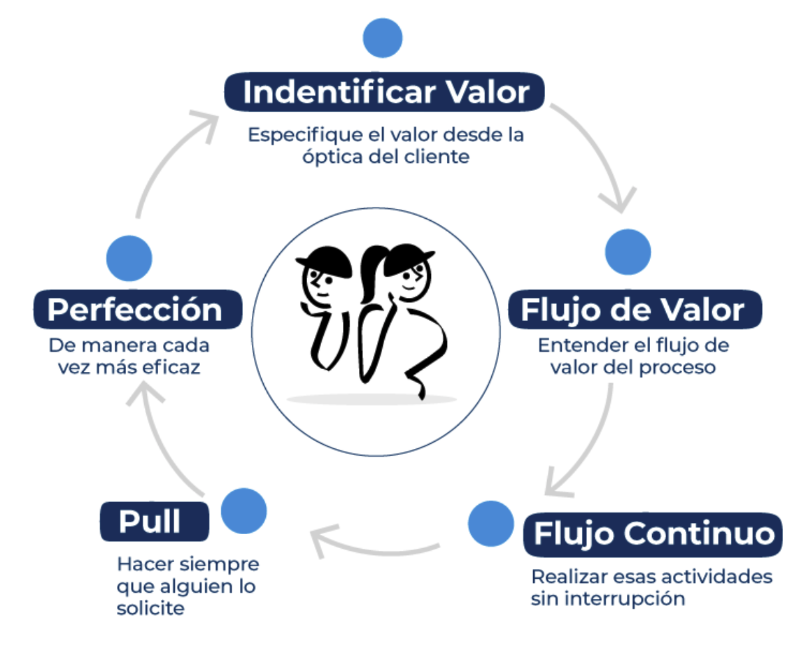  
 

 
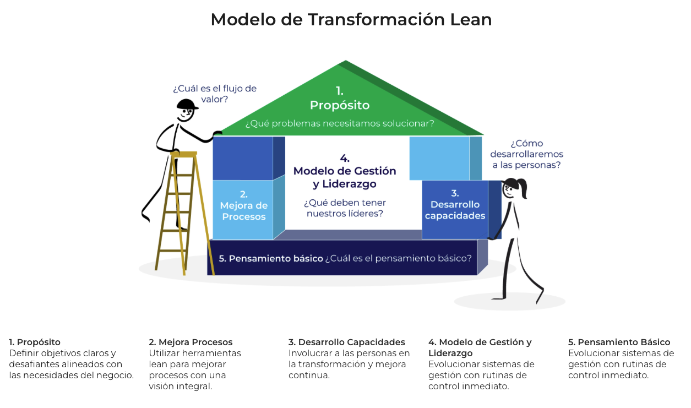  
 

 
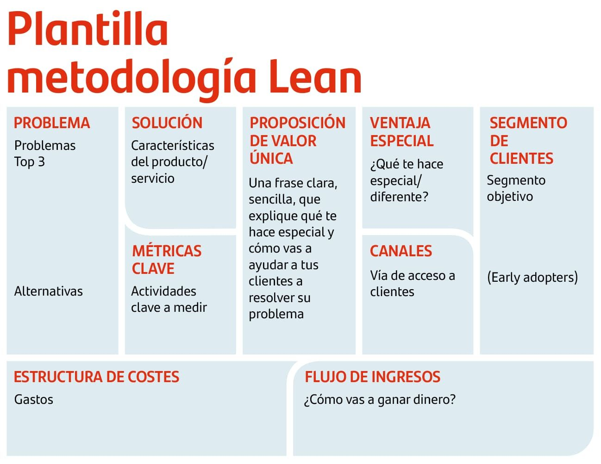  
 

---

## 🔄 6. Agile Retrospectives

En metodologías ágiles como Scrum, las retrospectivas permiten **reflexionar tras cada Sprint** para mejorar el trabajo en equipo y los procesos.

### Preguntas Clave:
- ¿Qué funcionó bien?
- ¿Qué podría mejorarse?
- ¿Qué haremos diferente en el próximo Sprint?

> **Ejemplo:** Al finalizar cada entrega de software, el equipo TIC identifica que la integración continua falla por conflictos de dependencias y decide automatizar su gestión.

---

## 🎯 7. OKR (Objectives and Key Results)

¿Por qué compañías cómo Intel, Google, LinkedIn, Microsoft y una larga lista de empresas de renombre utilizan OKR’s cómo una clave del éxito en sus resultados?

Este acrónimo -OKR-, corresponde a las siglas de “Objectives and Key Results” (objetivos y resultados clave).

OKR es una metodología de planificación cuyo propósito es establecer objetivos de manera abierta y colaborativa. En concreto, un OKR es un objetivo y unos resultados clave asociados a ese objetivo, lo cual nos ayuda a visualizar qué es el éxito que buscamos y a entender si lo estamos consiguiendo.

El objetivo se refiere a lo que hay que lograr. Es algo concreto, que llama a la acción y que resulta ambicioso e inspirador. Un resultado clave, tiene que ver con el cómo vamos a lograr un objetivo, a la vez que sirve de indicador de referencia de la consecución del objetivo.

 
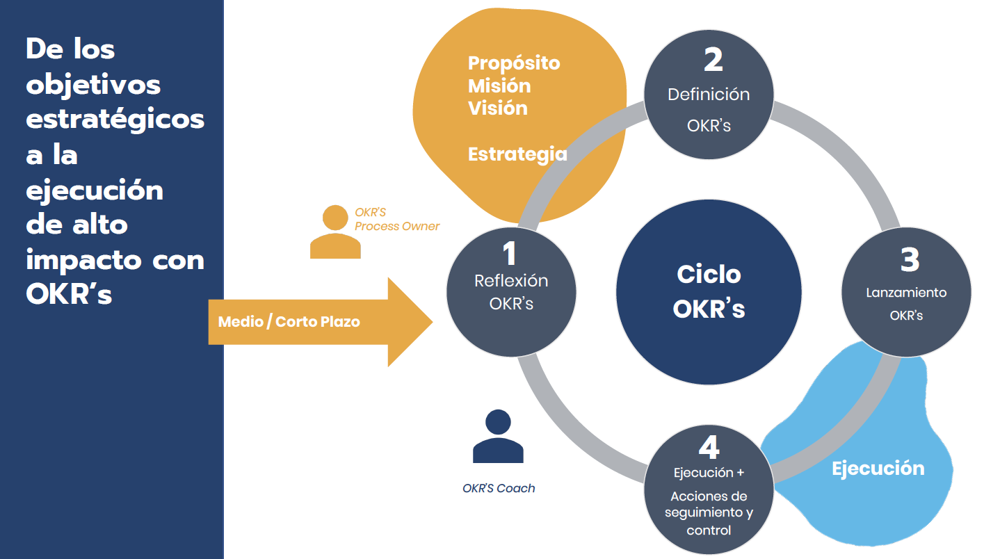  
 

### Comparativa de Sistemas de Gestión: KPI, OKR, KAR, OKAR

| **Criterio**                     | **KPI** (Key Performance Indicator)        | **OKR** (Objectives and Key Results)        | **KAR** (Key Activity Results)             | **OKAR** (Objectives, Key Activities and Results)           |
|----------------------------------|--------------------------------------------|---------------------------------------------|--------------------------------------------|------------------------------------------------------------|
| **Enfoque principal**            | Medición de desempeño                      | Alineación estratégica mediante objetivos   | Seguimiento de actividades clave           | Integración de objetivos, actividades y resultados         |
| **Elementos clave**              | Métricas cuantificables                    | Objetivo + Resultados clave (medibles)      | Actividades clave con resultados esperados | Objetivo + Actividades clave + Resultados medibles        |
| **Propósito**                    | Evaluar eficacia y eficiencia              | Establecer metas ambiciosas y medibles      | Ejecutar tareas estratégicas               | Alinear objetivos con acciones y resultados                |
| **Unidad de análisis**           | Indicadores (porcentaje, tiempo, costo…)   | Objetivo cualitativo + 2-5 KR medibles      | Actividades específicas y su cumplimiento  | Objetivo general + acciones clave + resultados             |
| **Temporalidad**                 | Continua (mensual, trimestral, anual)      | Ciclos definidos (trimestral/anual)         | Según actividad o proyecto                  | Cíclica con seguimiento de avances por fases               |
| **Nivel de detalle**             | Alto (operacional o táctico)               | Medio-alto (estratégico y táctico)          | Medio (enfoque operativo)                   | Alto (integra todos los niveles)                           |
| **Responsabilidad**              | Departamental o individual                 | Individual o equipo                         | Equipo o responsable por actividad          | Compartida: estratégico + operativo                        |
| **Ventaja principal**            | Seguimiento de resultados concretos        | Fomenta alineación, foco y ambición         | Aclara qué acciones son clave              | Conecta intención, acción y medición                       |
| **Desventaja o riesgo**          | Se centra en el resultado, no en el “cómo” | Puede volverse aspiracional sin ejecución   | No siempre mide impacto                     | Requiere mayor gestión y madurez organizacional            |
| **Ejemplo**                      | Tasa de retención del cliente: 95%         | Objetivo: Mejorar la satisfacción del cliente. KR1: Aumentar NPS de 60 a 75 | Lanzar 3 campañas de email en el trimestre | Objetivo: Mejorar retención. KA: Ejecutar 3 campañas. R: Elevar NPS de 60 a 75. |

 
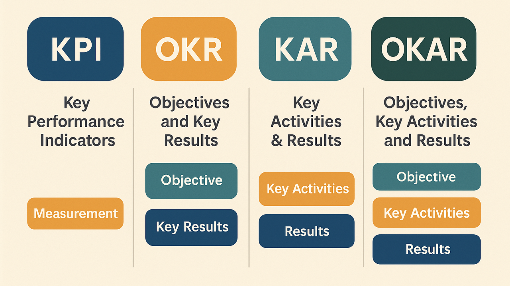  
 

---

## 📈 8. Balanced Scorecard (Cuadro de Mando Integral)

El Balanced Scorecard (BSC / Cuadro de Mando Integral) es una herramienta que permite enlazar estrategias y objetivos clave con desempeño y resultados a través de cuatro áreas críticas en cualquier empresa: desempeño financiero, conocimiento del cliente, procesos internos de negocio y aprendizaje y crecimiento.

 
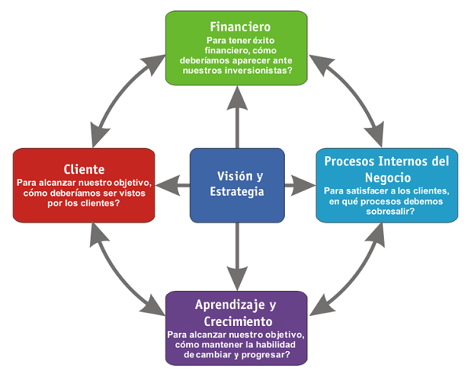  
 

---

## 🔄 9. SCOR (Supply Chain Operations Reference)

Marco para **optimizar operaciones de cadena de suministro**, aplicable también en cadenas de valor TIC (desarrollo, soporte, provisión de servicios).

### Niveles:
- **Estratégico:** Definir herramientas y tecnologías para toda la cadena TIC.
- **Táctico:** Definir métricas y KPIs para evaluar entregas y soporte.
- **Operativo:** Ejecutar tareas como despliegues, soporte técnico, etc.

> **Ejemplo:** Una empresa de eCommerce aplica SCOR para mejorar tiempos de respuesta del sistema de atención postventa y logística inversa.

---

## 🧭 ¿Cómo elegir el modelo adecuado?

| Necesidad                          | Modelo Recomendado                     |
|-----------------------------------|----------------------------------------|
| Mejoras iterativas y simples      | PDCA, Kaizen, Agile Retrospectives     |
| Reducción de defectos complejos   | Six Sigma, Lean                        |
| Alineación con estrategia         | OKR, Balanced Scorecard                |
| Optimización de procesos globales | ITIL, SCOR                             |

