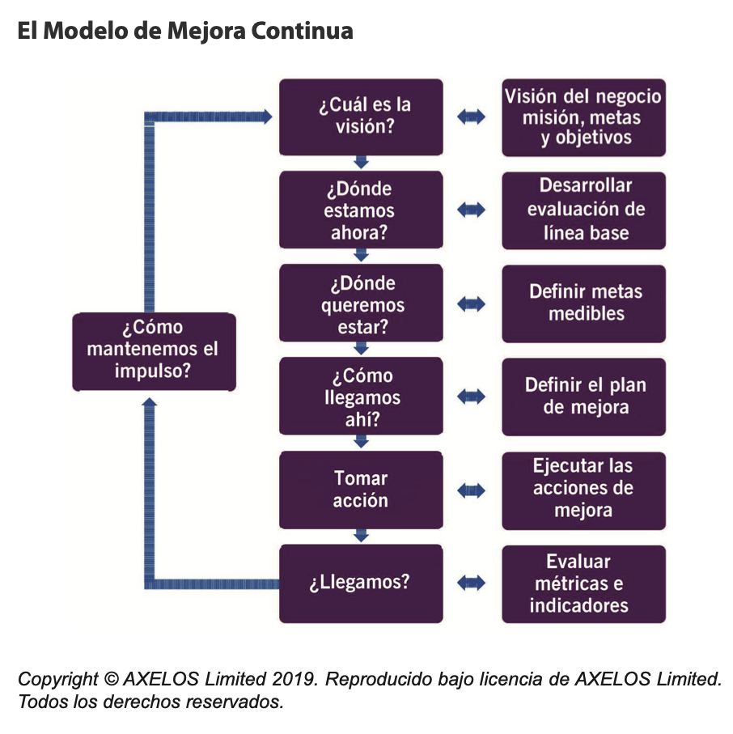
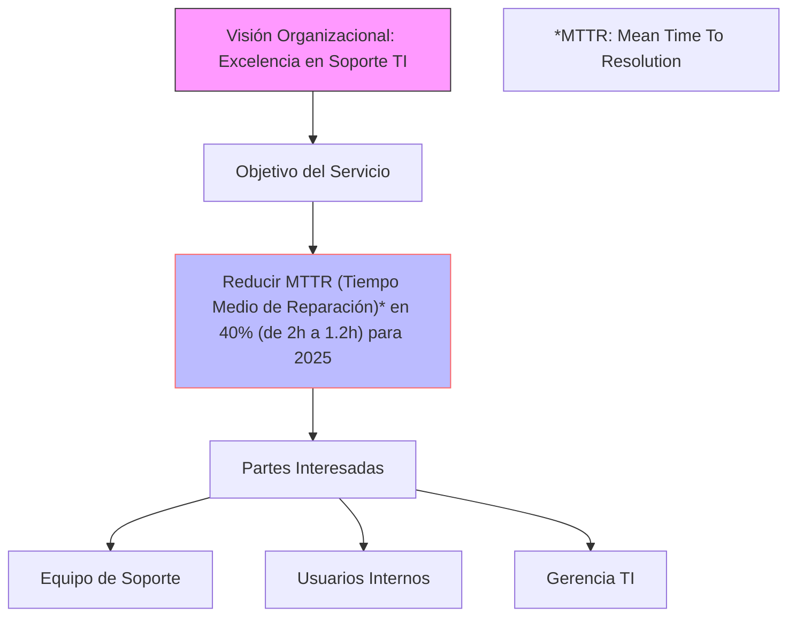
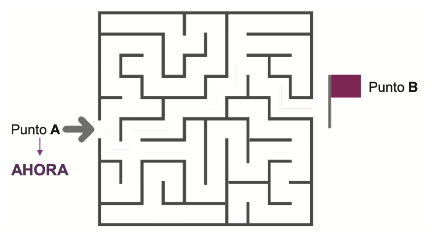
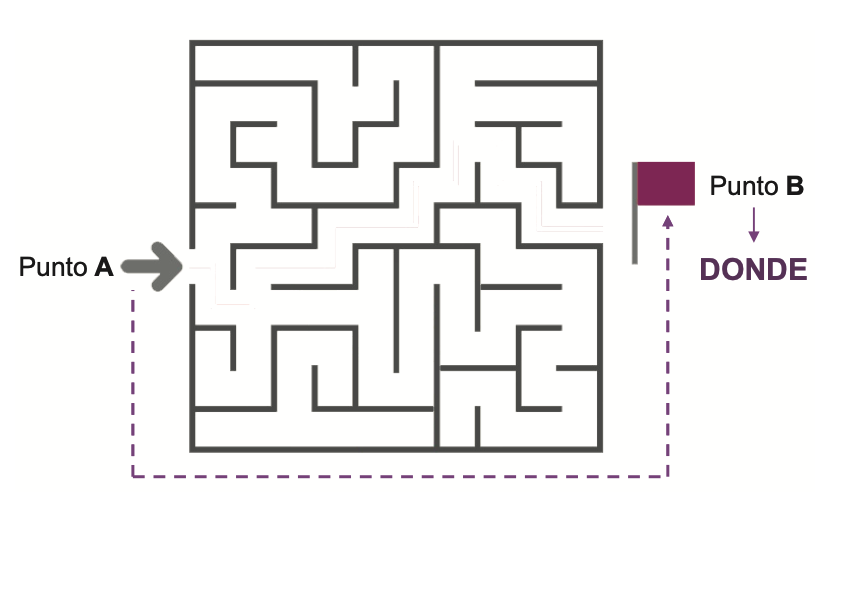
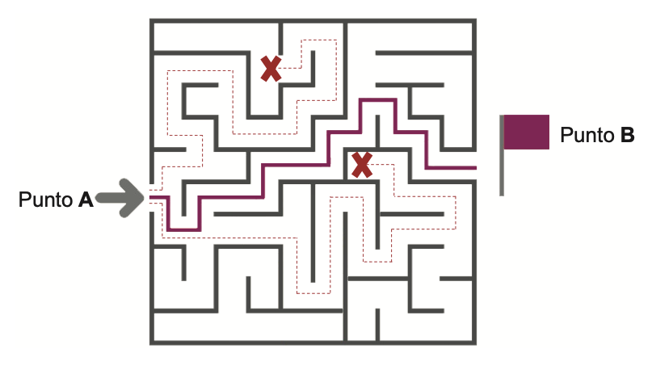
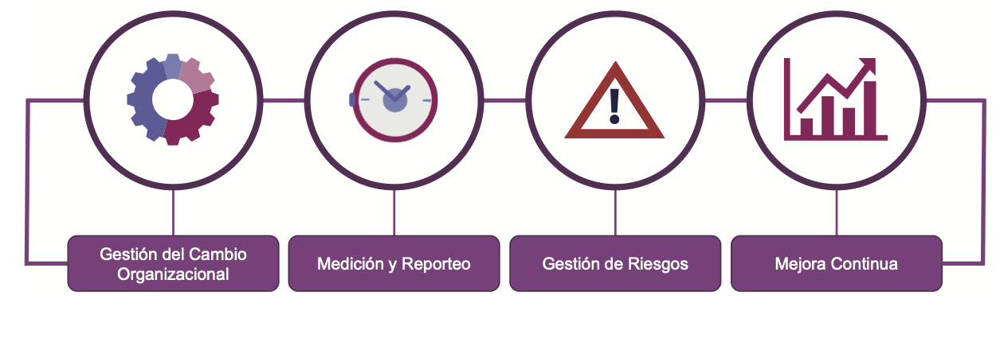
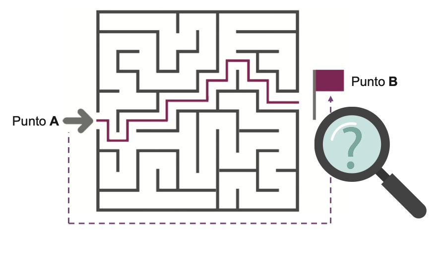
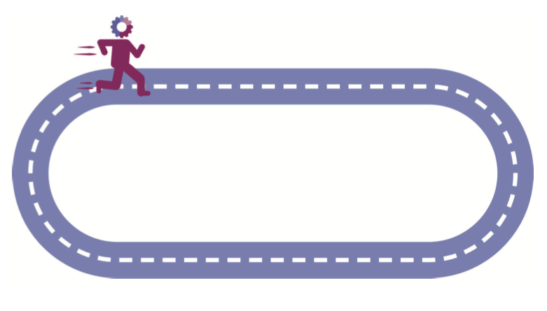
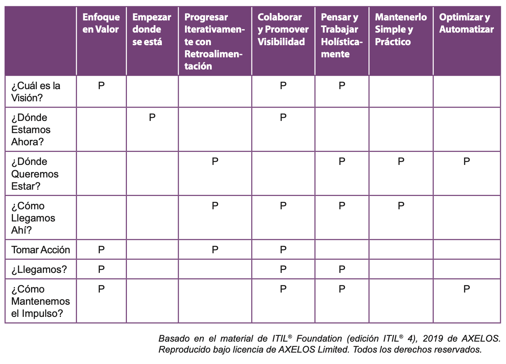

# 🧩 **Semana 13: Modelo de Mejora Continua ITIL 4**

**Curso:** Gestión de Tecnologías de la Información  
**Docente:** Dr. Oscar Jimenez Flores  
[CTI Vitae Concytec](https://www.google.com/url?sa=t&source=web&rct=j&opi=89978449&url=https://ctivitae.concytec.gob.pe/appDirectorioCTI/VerDatosInvestigador.do%3Fid_investigador%3D33398&ved=2ahUKEwi7_KSu8s2MAxWwIbkGHfcFN3EQFnoECA0QAQ&usg=AOvVaw1VPrJTyH8Dl3P6q-qEHKEY)  
[LinkedIn](https://www.linkedin.com/in/oscar-jimenez-flores/)

---
## Introducción al Modelo

El Modelo de Mejora Continua de ITIL es un componente clave del Sistema de Valor del Servicio (SVS) de ITIL. Puede aplicarse a cualquier tipo de mejora, desde cambios organizacionales de alto nivel hasta servicios individuales y elementos de configuración.

> "El alcance y los detalles de cada paso del modelo variarán significativamente según el tema y el tipo de mejora. Sin embargo, este modelo debe reconocerse como un flujo de trabajo que puede usarse como un recordatorio de alto nivel de un proceso de pensamiento sólido para garantizar que las mejoras se gestionen correctamente." (ITIL® Foundation, 2019)

 
  
 

---

## Los 7 Pasos del Modelo

### 1. ¿Cuál es la visión?
**Propósito:**  
Establecer el contexto estratégico para las mejoras.

**Contenido:**
- Traducir la visión y objetivos de la organización para la unidad de negocio, departamento, equipo o individuo específico
- Crear una visión de alto nivel para la mejora planeada
- Entender la dirección de alto nivel de la organización
- Definir claramente el valor esperado
- Identificar a las partes interesadas y sus roles

**Riesgo de omisión:**  
Si se omite este paso, las mejoras pueden optimizarse solo para equipos individuales en lugar de para toda la organización.

### Ejemplo

---
### 2. ¿Dónde estamos ahora?

El éxito de una iniciativa de mejora depende de una comprensión clara y
precisa del punto de partida y el impacto de la iniciativa. Se puede pensar en una mejora como un viaje desde el punto A al punto B, y este paso define cómo se ve el punto A.

Un elemento clave de este paso es una evaluación del estado actual.
La evaluación del estado actual incluye la evaluación de los servicios
existentes, como la percepción del valor recibido de los usuarios, los
procesos y procedimientos involucrados y / o las capacidades de las
soluciones tecnológicas disponibles. También incluye la comprensión de
la cultura de la organización para decidir qué nivel de gestión de cambio organizacional se requiere.

Si omite este paso, no podrá comprender el estado actual y localizar la medición de línea de base objetiva. Por lo tanto, será difícil realizar un seguimiento y medir la efectividad de las actividades de mejora.

 
  
 

**Elementos:**
- Evaluación exhaustiva del estado actual que incluye:
  - Servicios existentes (valor percibido por usuarios)
  - Procesos y procedimientos
  - Capacidades tecnológicas
  - Cultura organizacional

**Metodología:**  
Se conceptualiza como un viaje desde el Punto A (estado actual) al Punto B (estado deseado). Este paso define claramente cómo es el Punto A.

**Ejemplo práctico:**  
Evaluación de un servicio de help desk existente debe incluir:
- Métricas de tiempo de respuesta
- Niveles de satisfacción del usuario
- Capacidades del sistema de tickets

**Riesgo de omisión:**  
Sin una línea base clara, será imposible medir la efectividad de las mejoras.

**Ejemplo**

journey
    title Estado Actual del Servicio (Punto A)
    section Métricas Clave
      MTTR_actual: 5: 2.0 horas
      SLA_cumplido: 3: 78%
      Satisfacción: 2: 65%
    section Problemas Identificados
      Clasificación_manual: 8
      Comunicación_pobre: 7
      Herramientas_obsoletas: 9

---

### 3. ¿Dónde queremos estar?

► Este paso describe cómo debe ser el Punto B, el estado objetivo
para el siguiente paso del viaje.

► No se puede trazar un viaje si el destino no está claro.

► Si se omite este paso, el estado destino seguirá siendo poco claro.

Similar al Paso 2 que describe el Punto A en el viaje de mejora, este
paso describe cómo debería ser el Punto B. Sobre la base del resultado
de los dos primeros pasos, se realiza un análisis de brechas que evalúa
el alcance y la naturaleza de la distancia que se debe recorrer desde el
punto de partida hasta el logro de la visión de la iniciativa.

Este paso debe definir una o más acciones priorizadas para completar
la visión de la mejora, en base a lo que se conoce en el punto de
partida. Las oportunidades de mejora se pueden identificar y priorizar
en función del análisis de brechas, y se pueden establecer objetivos
de mejora, junto con los Factores Críticos de Éxito (CSF) y los
Indicadores clave de desempeño (KPI).

Si se omite este paso, el estado de destino seguirá siendo poco claro.
Esto implica que será difícil preparar una explicación satisfactoria de
qué partes interesadas clave pueden beneficiarse de la iniciativa de
mejora, lo que puede resultar en un bajo apoyo o incluso en un rechazo.

 
  
 

**Componentes esenciales:**
- Descripción detallada del Punto B (estado objetivo)
- Análisis de brechas que evalúa:
  - Alcance de la mejora necesaria
  - Naturaleza de los cambios requeridos
- Establecimiento de:
  - Objetivos de mejora claros
  - Factores Críticos de Éxito (CSF)
  - Indicadores Clave de Desempeño (KPI)

**Ejemplo:**  
Para un servicio de TI, el estado deseado podría incluir:
- Reducción del 30% en tiempo de resolución de incidentes
- Implementación de un nuevo sistema de automatización

**Riesgo de omisión:**  
Un estado destino poco claro dificultará la obtención de apoyo de las partes interesadas.

**Ejemplo**

gantt
    title Análisis de Brechas (Punto B)
    dateFormat  YYYY-MM-DD
    axisFormat %b'%y
    section Actual (A)
    MTTR 2.0h :a1, 2025-01-01, 2025-12-31
    section Objetivo (B)
    MTTR 1.2h :a2, after a1, 2025-12-31

---

### 4. ¿Cómo llegamos ahí?

► En este paso, se crea un plan para abordar los desafíos a medida que se identifican los puntos de inicio y finalización del viaje de mejora en los dos pasos anteriores.

 
  
 

► La mejor ruta puede no ser clara, a veces es necesario diseñar experimentos y probar opciones.

► Si se omite este paso, la ejecución de la mejora probablemente fracase y no logre lo que se le exige.

Sobre la base de los dos pasos anteriores, se han definido los puntos de inicio y finalización del viaje de mejora. Esto implica que se puede  acordar una ruta específica. Dependiendo de los estados actuales y de destino, y combinando el conocimiento con la experiencia en la materia, en este paso se crea un plan para abordar los desafíos. 

En este paso, el enfoque más eficaz para ejecutar la mejora puede no estar claro, pero le permitirá diseñar experimentos que probarán qué opciones tienen el mayor potencial.

Incluso si el enfoque o el camino de mejora es claro, será beneficioso
llevar a cabo el trabajo en una serie de iteraciones. Cada iteración
avanzará la mejora y le permitirá verificar el progreso, volver a evaluar el enfoque y cambiar la dirección si es necesario.

**Proceso:**
1. Creación de un plan basado en:
   - Estado actual (Punto A)
   - Estado deseado (Punto B)
   - Conocimiento experto del dominio
2. Diseño de experimentos para probar opciones
3. Enfoque iterativo con:
   - Verificación periódica del progreso
   - Re-evaluación del enfoque
   - Ajustes según sea necesario

**Prácticas ITIL relevantes:**
- Gestión del Cambio
- Gestión de Riesgos

**Riesgo de omisión:**  
Sin un plan claro, la ejecución de la mejora probablemente fracasará.

**Ejemplo**

flowchart LR
    A[Implementar IA para clasificación] --> B[Automatizar 50% de respuestas]
    B --> C[Integrar chatbot con base de conocimiento]
    C --> D[Capacitar equipo en nuevas herramientas]
    D --> E[Establecer KPI en tiempo real]
    style A stroke:#0f0,stroke-width:4px
    style E stroke:#f00,stroke-width:2px

---

### 5. Tomar acción

►  En este paso, se actúa sobre el plan de mejora.

► Las prácticas de ITIL que son importantes para lograr el éxito en este paso son:

 
  
 

En este paso, se crea el plan para tomar la acción para la mejora.
Puede implicar un enfoque tradicional al estilo de cascada, pero será más apropiado seguir el enfoque ágil.

Las mejoras pueden tener lugar como parte de una gran iniciativa que hace muchos cambios o como parte de iniciativas pequeñas pero
importantes. Incluso si el camino para completar la mejora parecía
claro cuando se planeó, es importante permanecer abierto al cambio
a lo largo del enfoque. El logro de los resultados deseados es el
objetivo, no la adhesión rígida a una visión de cómo proceder.

Durante el proceso de mejora, debe centrarse continuamente en
medir el progreso hacia la visión y gestionar los riesgos, así como en
garantizar la visibilidad y el conocimiento general de la iniciativa.

Una vez completado este paso, el trabajo estará en el punto final del
viaje, lo que dará como resultado un nuevo estado actual.

**Implementación:**
- Puede seguir enfoques tradicionales (cascada) o ágiles
- Debe incluir:
  - Medición continua del progreso
  - Gestión activa de riesgos
  - Comunicación constante

**Aspectos críticos:**
- Flexibilidad para ajustar el enfoque
- Foco en resultados (no en seguir el plan rigidamente)
- Participación de todas las partes interesadas

**Resultado esperado:**  
Un nuevo estado actual (Punto A actualizado)

**Ejemplo**

gantt
    title Cronograma de Implementación
    dateFormat  YYYY-MM-DD
    section Fase 1
    Adquisición Herramientas :done, 2025-01-01, 30d
    section Fase 2
    Desarrollo Chatbot :active, 2025-01-31, 45d
    section Fase 3
    Migración Datos :2025-03-15, 30d
    section Fase 4
    Entrenamiento :2025-04-15, 14d

---

### 6. ¿Llegamos?

Este paso implica verificar el destino del viaje de mejora, para
garantizar que se haya alcanzado el punto deseado.

Para validar el éxito:
- Compruebe y confi rme el progreso y el valor de cada iteración.
- Tomar acciones adicionales, a menudo disparar una nueva iteración si no se cumple
  
Si se omite este paso, es difícil asegurar si realmente se
lograron los resultados deseados o prometidos.

 
  
 

Este paso implica garantizar que se haya alcanzado el punto deseado
al verificar el destino del viaje de mejora.

El camino hacia el viaje de mejora está lleno de varios obstáculos, por
lo que el éxito debe ser validado. Para cada iteración de la iniciativa de mejora, tanto el progreso como el valor deben verificarse y confirmarse. Si no se logra el resultado deseado, se toman acciones adicionales.

Si se omite este paso, es difícil asegurar si realmente se lograron los
resultados deseados o prometidos, y se perderán las lecciones de esta
iteración, que respaldarían una corrección del curso si fuera necesario.

**Actividades de validación:**
- Verificación del estado alcanzado
- Confirmación de:
  - Progreso realizado
  - Valor generado
- Identificación de:
  - Brechas residuales
  - Oportunidades para nuevas iteraciones

**Riesgo de omisión:**  
Sin validación, no se puede asegurar el logro de los resultados prometidos.

**Ejemplo**

pie
    title Resultados a 6 meses
    "MTTR reducido a 1.5h" : 65
    "SLA cumplido 85%" : 25
    "Satisfacción 80%" : 10

---

### 7. ¿Cómo mantenemos el impulso?

► El enfoque de este paso es mostrar los éxitos y reforzar los métodos recientemente

► Esto garantiza que el progreso realizado no se pierda y se genere soporte e impulso para las próximas mejoras.

► Si se omite este paso, es probable que las mejoras permanezcan aisladas, las
realizado se pierda nuevamente con el tiempo.
iniciativas independientes y cualquier progreso realizado se

 
  
 

Para incorporar los cambios en la organización y garantizar que
las mejoras y los comportamientos modificados no corren el riesgo
de revertirse, se deben utilizar las prácticas de gestión de cambios
organizacionales y de gestión del conocimiento.

Los líderes y gerentes deben ayudar a los equipos a integrar nuevos
métodos de trabajo en su trabajo diario e institucionalizar nuevos
comportamientos.

Si no se lograron los resultados esperados de la mejora, las partes
interesadas deben ser informadas de las razones del fracaso de la
iniciativa.

**Estrategias:**
- Mostrar éxitos alcanzados
- Reforzar métodos mejorados
- Integrar cambios en operaciones diarias
- Aplicar prácticas de:
  - Gestión del Cambio Organizacional
  - Gestión del Conocimiento

**Acciones concretas:**
- Comunicación de resultados
- Capacitación continua
- Institucionalización de nuevos comportamientos

**Riesgo de omisión:**  
Las mejoras pueden revertirse sin una estrategia de sostenimiento.

**Ejemplo**

flowchart TB
    A[Revisión Mensual KPIs] --> B[Retroalimentación Usuarios]
    B --> C[Mejoras Continuas]
    C --> D[Actualización Base Conocimiento]
    D --> A
    style A fill:#0f0
    style D fill:#0f0

---

### Resultado resumido de los 7 pasos del modelo:

### 📌 Explicación del Caso

**Servicio de TI Seleccionado:** Gestión de Incidentes

| Paso | Acción Clave | Herramientas Implementadas |
|------|-------------|---------------------------|
| 1 | Definir reducción de MTTR como objetivo estratégico | OKRs compartidos |
| 2 | Diagnosticar causas de tiempos de resolución altos | Análisis de tickets históricos |
| 3 | Establecer meta de 1.2h MTTR | Benchmarking industrial |
| 4 | Diseñar solución con IA y automatización | Chatbot + Integración con ServiceNow |
| 5 | Implementar en fases controladas | Metodología Agile (Sprints) |
| 6 | Medir impacto en métricas operativas | Dashboards en Power BI |
| 7 | Institucionalizar mejoras | Programa de mejora continua |

### Beneficios Obtenidos:
- 35% reducción en tickets manuales
- 40% mejora en satisfacción de usuarios
- ROI de 300% en 12 meses

> 💡 **Lección Aprendida:** La automatización de clasificación inicial redujo en 60% el tiempo de asignación de tickets.

### 🛠️ Recursos Técnicos Utilizados

**Herramientas:**  
- ServiceNow para gestión de tickets  
- Dialogflow para chatbot  
- Power BI para analítica  

**Metodologías:**  
- ITIL 4 para gestión de servicios  
- Scrum para implementación  

**Métricas Clave:**  
- MTTR (Mean Time To Resolution)  
- SLA cumplido (%)  
- CSAT (Customer Satisfaction)  

---
## 📊 Relación con los Principios Guía de ITIL

La siguiente tabla muestra los Principios Guía de ITIL aplicables a los
pasos de Mejora Continua.

 
  
 

---

## 📚 Referencias
- AXELOS Limited (2019). *ITIL® Foundation, ITIL 4 edition*. 
