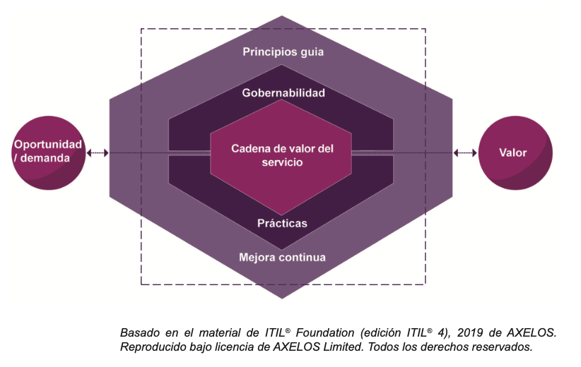
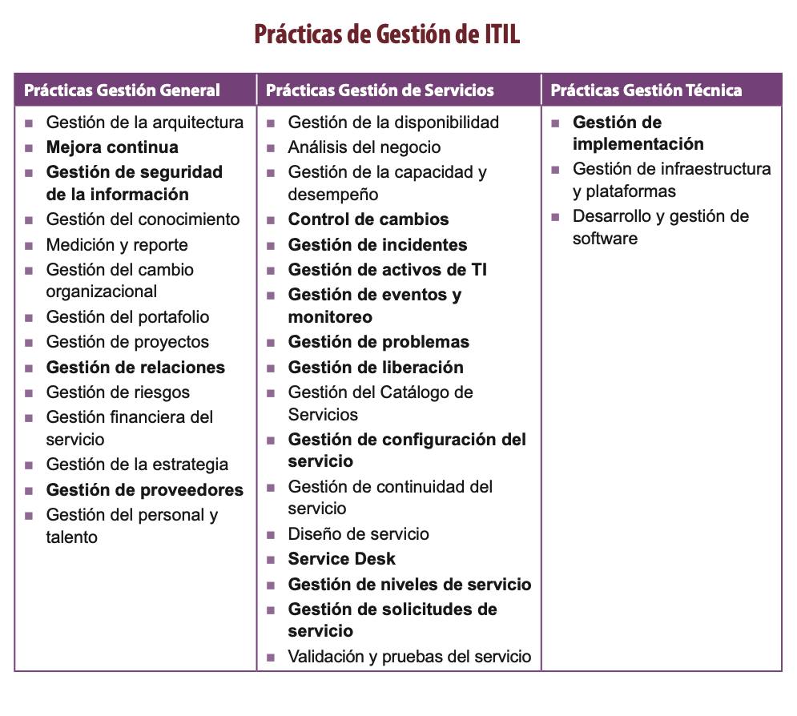
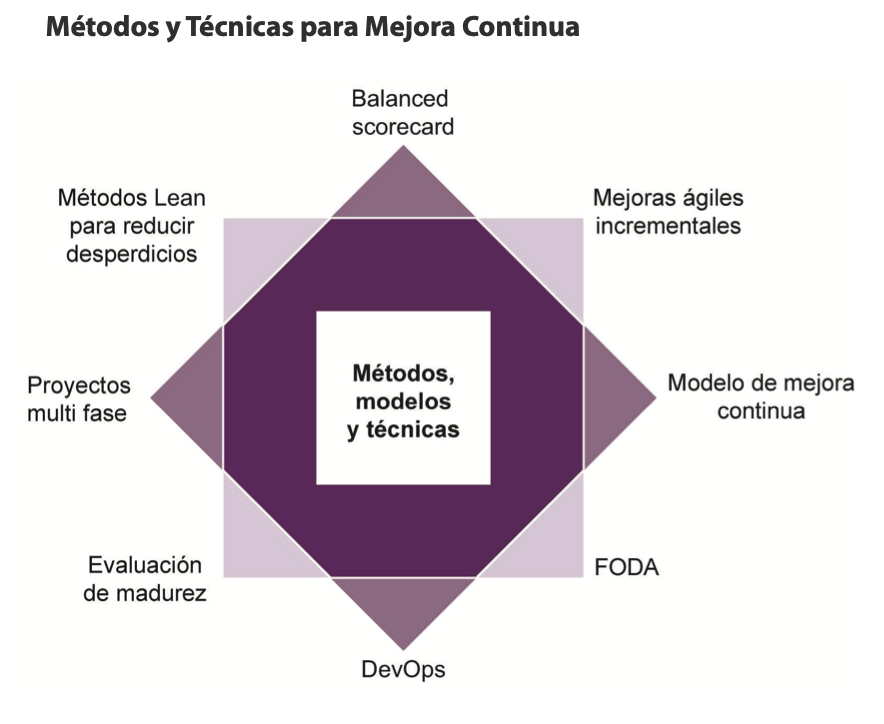
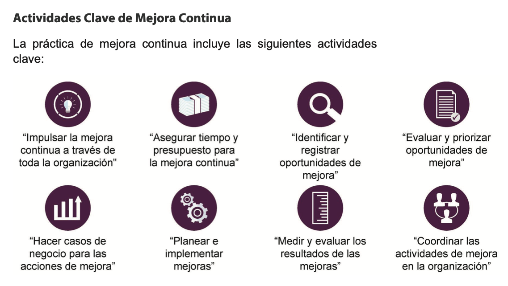
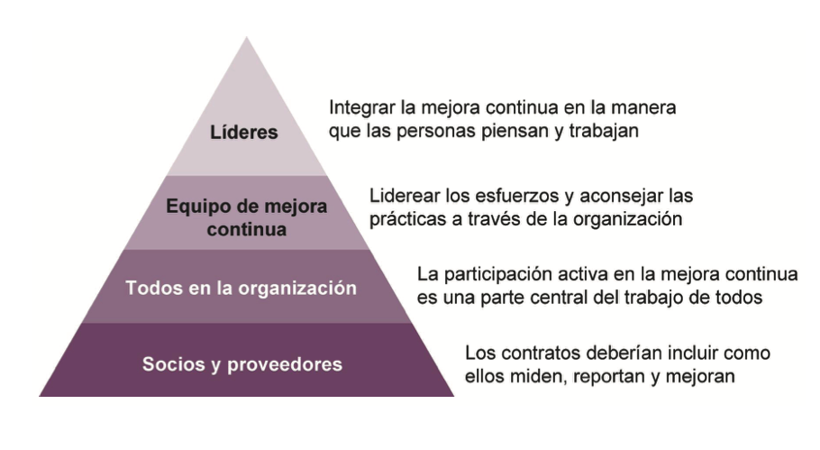

# 🧩 **Semana 14: Prácticas de ITIL 4**

**Curso:** Gestión de Tecnologías de la Información  
**Docente:** Dr. Oscar Jimenez Flores  
[CTI Vitae Concytec](https://www.google.com/url?sa=t&source=web&rct=j&opi=89978449&url=https://ctivitae.concytec.gob.pe/appDirectorioCTI/VerDatosInvestigador.do%3Fid_investigador%3D33398&ved=2ahUKEwi7_KSu8s2MAxWwIbkGHfcFN3EQFnoECA0QAQ&usg=AOvVaw1VPrJTyH8Dl3P6q-qEHKEY)  
[LinkedIn](https://www.linkedin.com/in/oscar-jimenez-flores/)

## 🎯 Objetivos del módulo

Al finalizar este módulo, será capaz de:

- Explicar el propósito general de las prácticas de ITIL.
- Describir cómo siete prácticas clave apoyan la cadena de valor del servicio en ITIL 4:
  - Mejora continua
  
---

## 🔍 Introducción: ¿Qué son las prácticas de ITIL?

Las **prácticas de ITIL** constituyen uno de los  componentes del Sistema de Valor del Servicio (SVS) y proporcionan herramientas adaptables para gestionar servicios de TI eficientemente.

> “Una práctica de ITIL es un conjunto de recursos organizacionales diseñados para realizar ciertos tipos de trabajo.”
>
> 
 
  
 

El SVS de ITIL incluye 34 prácticas, que se dividen en tres categorías:

- En primer lugar, las prácticas de gestión general se han adaptado para la gestión de servicios desde dominios generales de gestión de negocios;
- En segundo lugar, se han desarrollado prácticas de gestión de servicios en las industrias de gestión de servicios; y
- En tercer lugar, las prácticas de gestión técnica se han adaptado de los dominios de gestión de tecnología para fines de gestión de servicios.

---

## Prácticas de Gestión de ITIL

| Tipo de Práctica | Cantidad | Ejemplos |
|------------------|----------|----------|
| Gestión General | 14 | Arquitectura, Conocimiento, Seguridad de la Información |
| Gestión de Servicios | 17 | Incidentes, Problemas, Solicitudes de Servicio, Niveles de Servicio |
| Gestión Técnica | 3 | Desarrollo de Software, Infraestructura, Implementación |

 
  
 

## 🏛️ Prácticas de Gestión General (14)

| Práctica | Descripción |
|----------|-------------|
| **Gestión de Arquitectura** | Proporciona una visión integral de cómo los componentes organizacionales interactúan para alcanzar objetivos estratégicos. |
| **Mejora Continua** | Alinea servicios con necesidades cambiantes mediante optimización constante de productos, servicios y prácticas. |
| **Gestión de Seguridad de la Información** | Establece políticas robustas, asegura cumplimiento normativo y gestiona riesgos de ciberseguridad. |
| **Gestión del Conocimiento** | Preserva y mejora el uso efectivo de información, competencias y soluciones organizacionales. |
| **Medición e Informes** | Proporciona datos objetivos para mejorar pronósticos y toma de decisiones en todos niveles organizacionales. |
| **Gestión del Cambio Organizacional** | Facilita la adopción de transformaciones mediante capacitación y manejo de impactos. |
| **Gestión de Portafolio** | Optimiza la combinación de productos, servicios y procesos dentro de restricciones presupuestarias. |
| **Gestión de Proyectos** | Coordina la implementación de cambios asegurando entrega dentro de plazos y recursos definidos. |
| **Gestión de Relaciones** | Cultiva vínculos estratégicos con partes interesadas internas y externas. |
| **Gestión de Riesgos** | Identifica, evalúa y mitiga amenazas potenciales al negocio. |
| **Gestión Financiera de Servicios** | Administra presupuestos, costos y contabilidad alineados con objetivos estratégicos. |
| **Gestión Estratégica** | Define objetivos organizacionales y planes de acción con asignación de recursos correspondiente. |
| **Gestión de Proveedores** | Garantiza calidad en productos/servicios adquiridos y relaciones saludables con suministradores. |
| **Gestión del Talento** | Abarca reclutamiento, desarrollo y retención de personal calificado. |

## 🖥️ Prácticas de Gestión de Servicios (17)

| Práctica | Descripción |
|----------|-------------|
| **Gestión de Disponibilidad** | Asegura que servicios/activos de TI funcionen cuando sean requeridos. |
| **Análisis de Negocio** | Identifica problemas empresariales y propone soluciones alineadas. |
| **Gestión de Capacidad** | Optimiza rendimiento de servicios dentro de costos acordados. |
| **Control de Cambios** | Supervisa modificaciones en productos y servicios para minimizar riesgos. |
| **Gestión de Incidentes** | Restaura operaciones normales rápidamente tras interrupciones. |
| **Gestión de Activos de TI** | Administra ciclo de vida completo de componentes tecnológicos. |
| **Monitoreo de Eventos** | Observa continuamente servicios y registra cambios de estado relevantes. |
| **Gestión de Problemas** | Previene incidentes recurrentes mediante análisis de causa raíz. |
| **Gestión de Versiones** | Implementa servicios nuevos/modificados cumpliendo requisitos acordados. |
| **Catálogo de Servicios** | Centraliza ofertas de TI en un portal accesible para usuarios. |
| **Gestión de Configuración** | Mantiene inventario detallado de todos elementos de configuración (CI). |
| **Continuidad de Servicios** | Garantiza recuperación rápida de servicios tras crisis operacionales. |
| **Diseño de Servicios** | Crea soluciones tecnológicas que generen valor para el cliente. |
| **Gestión de Niveles de Servicio** | Define y monitorea cumplimiento de acuerdos (SLA) con métricas claras. |
| **Gestión de Solicitudes** | Administra peticiones de usuarios de manera estandarizada y eficiente. |
| **Pruebas de Servicios** | Valida que nuevos servicios cumplan requisitos antes de implementación. |

## ⚙️ Prácticas de Gestión Técnica (3)

| Práctica | Descripción |
|----------|-------------|
| **Gestión de Implementación** | Coordina despliegue de componentes en entornos productivos (enfoques: Big Bang, Faseado, etc.). |
| **Gestión de Infraestructura** | Administra recursos tecnológicos como servidores, redes y almacenamiento. |
| **Desarrollo de Software** | Gestiona ciclo de vida de aplicaciones mediante metodologías (Agile, Waterfall). |

  

Las siguientes 7 prácticas serán las que se desarrollarán a detalle:
- Mejora continua
- Control de cambios
- Gestión de incidentes
- Gestión de problemas
- Gestión de solicitudes de servicio
- Mesa de servicio
- Gestión de niveles de servicio

No solo necesita poder describir estas siete prácticas, sino también
cómo contribuyen a las actividades de la cadena de valor del servicio.

---

## 📚 Las 7 prácticas clave de ITIL

### 1. Mejora Continua

**Propósito:**  

“El propósito de la práctica mejora continua es alinear las prácticas
y los servicios de la organización con las necesidades comerciales
cambiantes a través de la identificación y mejora continua de los servicios, componentes del servicio, prácticas o cualquier elemento involucrado en la gestión eficiente y efectiva de los productos y servicios”.

 
  
 

# 📊 Diferencias Clave: Modelo vs. Método vs. Técnica

| **Concepto** | **Definición Rigurosa** | **Características Distintivas** | **Ejemplos en ITIL 4** | **Analogía** |
|--------------|-------------------------|----------------------------------|------------------------|-------------|
| **Modelo** | **Estructura conceptual** que establece relaciones entre componentes para representar un sistema. | - Abstracto y teórico - No prescribe acciones - Proporciona lenguaje común | - **Cadena de Valor del Servicio (SVS)** - **Modelo de Mejora Continua (7 pasos)** | Como un plano arquitectónico: muestra elementos y relaciones, pero no cómo construir. |
| **Método** | **Sistema de principios** para abordar un problema dentro de un modelo. Responde al "cómo" estratégico. | - Orientado a procesos - Secuencia lógica - Requiere adaptación contextual | - **ITIL Continual Improvement** (Ciclo DMAIC) - **Agile Service Management** | Como un manual de construcción: explica fases generales para edificar. |
| **Técnica** | **Procedimiento específico** para ejecutar parte de un método. Responde al "con qué" operativo. | - Acciones concretas - Reproducible - Resultados medibles | - **Análisis PESTLE** (evaluación externa) - **Matriz RACI** (asignación de roles) - **Timeboxing** (gestión de tiempos) | Como herramientas de albañilería: paleta para cemento, nivel para paredes. |

El alcance de la práctica de mejora continua incluye el desarrollo de
métodos y técnicas relacionados con la mejora y la propagación de una
cultura de mejora continua en toda la organización, en alineación con
la estrategia general de la organización. Diferentes tipos de mejoras
pueden requerir consideración para diferentes métodos de mejora.
Por ejemplo, algunas iniciativas de mejora pueden implementarse
mejor como un proyecto de varias fases, mientras que otras pueden
ser más apropiadas como un solo esfuerzo rápido.

El modelo de mejora continua, un componente del SVS de ITIL,
se puede aplicar a cualquier tipo de mejora, desde cambios
organizacionales de alto nivel hasta servicios individuales y elementos
de configuración. Al evaluar el estado actual, existen muchas técnicas
que se pueden usar, como el análisis de fortalezas, debilidades,
oportunidades y amenazas (FODA), revisiones de cuadros de mando
integral (balanced scorecard), evaluaciones y auditorías internas y
externas, o una combinación de varias técnicas.

Los enfoques para la mejora continua se pueden encontrar en muchos
métodos y técnicas. Los métodos Lean proporcionan perspectivas
sobre la eliminación de desperdicios. Los métodos ágiles se centran
en hacer mejoras de forma incremental. Los métodos de DevOps
buscan trabajar de manera integral y garantizar que las mejoras no
solo se diseñen bien, sino que se apliquen de manera efectiva.

Aunque hay varios métodos disponibles, es una buena idea
seleccionar algunos métodos clave que sean apropiados para los
tipos de mejoras que la organización considera y para promover esos
métodos. De esta manera, los equipos pueden tener una comprensión
compartida de cómo trabajar juntos en las mejoras y se puede realizar
una mayor cantidad de cambios a un ritmo más rápido. Sin embargo,
la organización también debe probar nuevos enfoques o fomentar la
innovación. Aquellos en la organización con habilidades en métodos
alternativos deben ser alentados a aplicarlos cuando tenga sentido, y si este esfuerzo tiene éxito, los métodos más antiguos pueden
retirarse en favor de los nuevos.

 
  
 
 

**Responsabilidades:**

La mejora continua es responsabilidad de todos. Todos en la
organización deben comprender la necesidad de una participación
activa en las actividades de mejora continua como parte fundamental
de su trabajo. La mejora continua debe incluirse en las descripciones
de puestos y objetivos de cada empleado, así como en los contratos
con proveedores y contratistas externos.

- Todos deben participar activamente en la mejora.
- Un equipo especializado puede facilitar, coordinar y mentorear a los demás.
- Los proveedores deben estar involucrados mediante cláusulas contractuales.

 
  
 

Los niveles más altos de la organización deben asumir la responsabilidad
de incorporar mejoras continuas en la forma en que las personas piensan
y trabajan. Los líderes de la organización deben mostrar compromiso
con la mejora continua y el apoyo a las actitudes, el comportamiento y
la cultura hasta un punto en el que se consideren las mejoras en todo lo
que se hace, en todos los niveles.

Si bien todos deberían contribuir de alguna manera, debería haber
un equipo dedicado a tiempo completo para dirigir los esfuerzos de
mejora continua y guiar a otros en la organización para que desarrollen
las habilidades que necesitan y naveguen sobre cualquier dificultad
que pueda encontrar. Este equipo puede servir como coordinadores
y mentores para ayudar a otros a desarrollar las habilidades que
necesitan y navegar por cualquier dificultad que pueda encontrar. En una
organización, los empleados deben recibir capacitación y asistencia para
ayudarlos a sentirse preparados para contribuir a la mejora continua.

Cuando las partes y los proveedores externos forman parte del panorama
de servicios, deben incluirse en el esfuerzo de mejora. Un contrato para
el servicio de un proveedor debe incluir detalles de cómo medirán,
informarán y mejorarán sus servicios durante la vida del contrato.
Cualquier dato requerido de los proveedores para operar mejoras internas
debe especificarse en el contrato. Los datos precisos y cuidadosamente
analizados son la base de la toma de decisiones basada en hechos para
mejorar. La práctica de mejora continua debe ser respaldada por fuentes
de datos relevantes y análisis de datos para asegurar que cada mejora
potencial sea entendida y priorizada.

**Registro de Mejora continua:**

Las organizaciones usan un documento estructurado o base de datos
llamada *Registro de Mejora Continua* (CIR) para rastrear y administrar
ideas de mejora.

- La base para la mejora es cuidadosamente analizada y los
datos son precisos.
- Aquí es donde las ideas de mejora se capturan, documentan,
evalúan, priorizan y se implementan de manera apropiada para
garantizar que la organización y sus servicios siempre se mejoren.

**Ejemplo de CIR:**

| Fecha       | Iniciativa de Mejora                     | Magnitud | Prioridad | Fecha Límite | Equipo Responsable   | Estado Actual               |
|-------------|------------------------------------------|----------|-----------|--------------|----------------------|-----------------------------|
| Noviembre 2018 | Optimización de velocidad de Red       | Mediana  | Alta      | Enero 2019   | Infraestructura      | En espera de proveedor       |
| Abril 2018    | Portal de Autoayuda para Mesa de Servicio | Mediana  | Media     | Diciembre 2018 | Mesa de Servicio     | Implementación en progreso   |
| Enero 2019    | Campaña de Concientización en Seguridad  | Grande   | Alta      | Diciembre 2019 | Gestión de Riesgos y Cumplimiento | Retroalimentación positiva |

La base para la mejora es cuidadosamente analizada y los datos
precisos. La práctica de mejora continua debe estar respaldada por
las fuentes de datos relevantes y el análisis de datos para asegurar
que cada mejora potencial sea suficientemente entendida y priorizada.

El (los) se utiliza(n) como base para volver a priorizar las ideas de
mejora a medida que se documentan las nuevas ideas. La estructura
de la información capturada en un CIR no es importante. Lo importante
es que cada idea de mejora se capture, documente, evalúe, priorice y
se actúe de manera apropiada para garantizar que la organización y
sus servicios siempre se mejoren.

### 🛠️ Cómo Implementar Este CIR en Tu Organización

1. **Personaliza los campos** según tus necesidades
2. **Usa herramientas colaborativas** como:
   - SharePoint o Confluence para versiones digitales
   - Tableros Kanban físicos para equipos presenciales
3. **Integra con otros procesos**:
   - Gestión de Cambios
   - Gestión de Proyectos
   - Monitoreo de Servicios

---

### 2. Control de Cambios

**Propósito:**  
Garantizar que los cambios en los servicios y componentes de servicio se realicen de forma controlada, con evaluación de riesgos, autorización formal y trazabilidad completa.

**Apoyo en la cadena de valor:**  
- Planear
- Diseñar y construir
- Entregar y admitir

---

### 3. Gestión de Incidentes

**Propósito:**  
Minimizar el impacto negativo de los incidentes restaurando el servicio lo antes posible.

**Ejemplo de actividad:**  
Un usuario reporta que no puede acceder al sistema. El incidente es registrado, priorizado, escalado y resuelto por el equipo de soporte.

**Apoyo en la cadena de valor:**  
- Entregar y admitir
- Soportar

---

### 4. Gestión de Problemas

**Propósito:**  
Reducir la probabilidad e impacto de incidentes a través de la identificación y eliminación de causas raíz.

**Enlace con la Gestión de Incidentes:**  
Una vez que un incidente es resuelto, se puede investigar el problema subyacente para evitar que vuelva a ocurrir.

**Apoyo en la cadena de valor:**  
- Mejora
- Soportar

---

### 5. Gestión de Solicitudes de Servicio

**Propósito:**  
Manejar todo tipo de solicitudes de servicio de los usuarios de manera eficiente y profesional (por ejemplo, restablecer contraseñas, entregar hardware, acceso a software).

**Apoyo en la cadena de valor:**  
- Entregar y admitir
- Soportar

---

### 6. Mesa de Servicio (Service Desk)

**Propósito:**  
Actuar como punto único de contacto entre el proveedor de servicios y los usuarios. Se encarga de coordinar incidentes, solicitudes y comunicaciones.

**Funciones típicas:**
- Registrar solicitudes
- Clasificar y escalar problemas
- Comunicar soluciones

**Apoyo en la cadena de valor:**  
- Soportar
- Comprometer

---

### 7. Gestión de Niveles de Servicio

**Propósito:**  
Establecer acuerdos claros sobre la calidad del servicio entre el proveedor y el cliente, y asegurar que se cumplan continuamente.

**Componentes:**
- Acuerdos de Nivel de Servicio (SLA)
- Monitoreo y reportes
- Mejora continua del servicio

**Apoyo en la cadena de valor:**  
- Planear
- Comprometer

---

## 📌 Conclusión

Las prácticas de ITIL permiten establecer un sistema de gestión sólido, adaptable y alineado a la estrategia organizacional. La correcta implementación de estas prácticas asegura que los servicios se desarrollen correctamente y **mejoren de forma continua**, generando valor tangible para los usuarios y el negocio.
