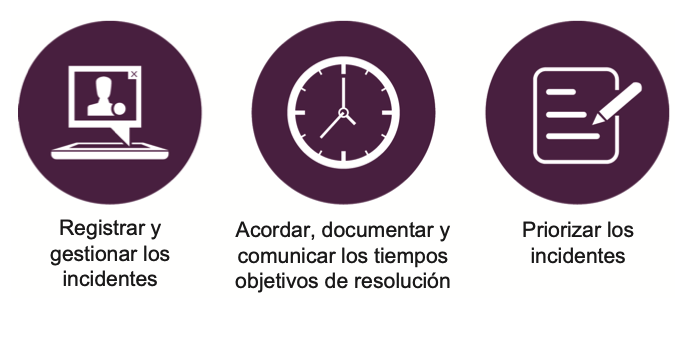
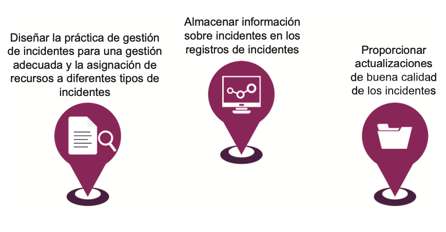
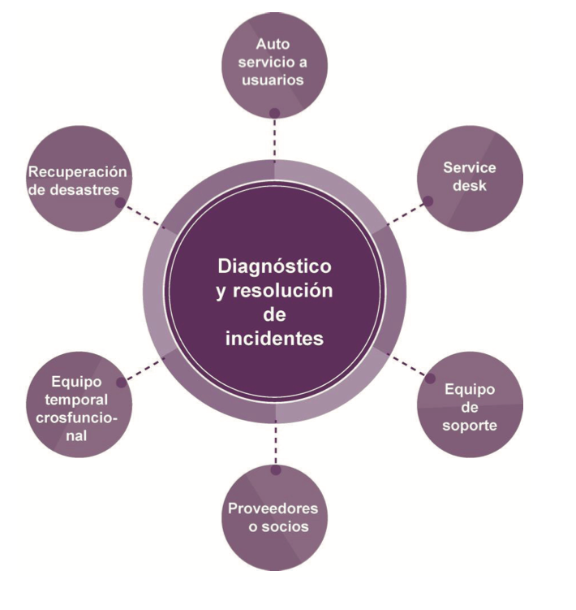

# 🧩 **Semana 15: Práctica Control de Cambios y Práctica Gestión de Incidentes

**Curso:** Gestión de Tecnologías de la Información  
**Docente:** Dr. Oscar Jimenez Flores  
[CTI Vitae Concytec](https://www.google.com/url?sa=t&source=web&rct=j&opi=89978449&url=https://ctivitae.concytec.gob.pe/appDirectorioCTI/VerDatosInvestigador.do%3Fid_investigador%3D33398&ved=2ahUKEwi7_KSu8s2MAxWwIbkGHfcFN3EQFnoECA0QAQ&usg=AOvVaw1VPrJTyH8Dl3P6q-qEHKEY)  
[LinkedIn](https://www.linkedin.com/in/oscar-jimenez-flores/)

### 🎯 Objetivos de la sesión

- Comprender los fundamentos de la práctica de Control de Cambios según ITIL 4.
- Describir la práctica de Gestión de Incidentes y su impacto en la continuidad del servicio.
- Distinguir entre cambios estándar, normales y de emergencia.
- Implementar procesos eficientes para restaurar servicios tras interrupciones.
  
---

## 🔄 La práctica Control de Cambios

### Propósito de Control de Cambios

> “El cambio se refiere a la adición, modificación o eliminación de cualquier cosa que pueda tener un efecto en los servicios”.

“El propósito de la práctica de control de cambios es maximizar el número de cambios exitosos de TI al:

- Asegurar que los riesgos hayan sido medidos adecuadamente  
- Autorizar cambios para proceder  
- Gestionar el calendario de cambios”

Cada organización define el alcance del cambio. El alcance suele incluir toda la infraestructura de TI, las aplicaciones, la documentación, los procesos, las relaciones con los proveedores y cualquier cosa que pueda afectar directa o indirectamente a un producto o servicio.

### 🔍 Distinguir el Control de Cambios y la Gestión del Cambio Organizacional

| Gestión del cambio organizacional | Control de cambios |
|----------------------------------|--------------------|
| Gestiona los aspectos de los cambios en las personas | Se centra en los cambios de productos y servicios |
| Asegura que las mejoras e iniciativas de transformación organizacional se implementen con éxito | Equilibra la necesidad de realizar cambios beneficiosos que brinden valor adicional con la necesidad de proteger a los clientes y usuarios del efecto adverso de los cambios |

### 🧷 Tipos de Cambios

| **Cambios Estándar**                                                                 | **Cambios Normales**                                                                 | **Cambios de Emergencia**                                                                 |
|--------------------------------------------------------------------------------------|-------------------------------------------------------------------------------------|------------------------------------------------------------------------------------------|
| - Cambios pre-autorizados de bajo riesgo, bien entendidos y documentados.            | - Deben programarse y evaluarse con un proceso estándar (generalmente con autorización). | - Se implementan urgentemente para resolver un incidente.                               |
| - Implementación sin necesidad de autorización adicional.                            | - Pueden ser de bajo riesgo o cambios mayores.                                       | - Proceso de evaluación y autorización acelerado.                                       |
| - Incluyen solicitudes de servicio o cambios operacionales.                          |                                                                                     | - Puede requerir aprobación de gerentes senior por el riesgo del negocio.                |

Diferentes cambios tratan la autorización de manera diferente.

Los cambios estándar no requieren ninguna autorización adicional
y pueden implementarse siempre que sigan un flujo de trabajo o
estructura predefinidos. Los riesgos en torno a los cambios estándar
generalmente se evalúan por adelantado y el flujo de trabajo y el
procedimiento en torno al cambio se acuerdan. Ejemplo de un cambio
estándar puede ser la actualización del software antivirus; agregar o
quitar memoria del servidor.

Los cambios normales pueden representar un riesgo bajo o un riesgo
alto para las organizaciones. Para los cambios de bajo riesgo, la
autoridad de cambio suele ser alguien que puede tomar decisiones
rápidas, a menudo utilizando la automatización para acelerar el
cambio. Para cambios importantes, la autoridad de cambio podría ser
tan alta como el consejo de administración (o equivalente). Aunque
este tipo de autorización puede tardar un poco más, es importante
comprender el impacto y el riesgo para la organización para garantizar
que el cambio esté bien planificado y que el riesgo se entienda en los
niveles correctos.

Los cambios de emergencia son a menudo de alto riesgo, por lo
que aunque la autorización puede ser acelerada, es fundamental
garantizar que todos los roles entiendan el riesgo para la organización.

### 🧑‍⚖️ Autoridad de Cambio

- Todos los cambios son evaluados y autorizados por las personas que comprenden los riesgos y beneficios esperados antes de implementar los cambios.
- La persona o grupo que autoriza un cambio se conoce como una autoridad de cambio.

Las personas autorizadas son conocidas como autoridad de cambio. Es importante asignar cada tipo de cambio a la autoridad de cambio correcta para garantizar que el control de cambios sea eficiente y efectivo. En las organizaciones de alta velocidad, es una práctica común descentralizar la aprobación del cambio, lo que hace que la revisión entre pares sea el mejor predictor de alto desempeño.

### 📢 Comunicando Cambios

 
  
 

Una vez que los cambios identificados han sido implementados, el calendario de cambios también se puede utilizar para proporcionar la información necesaria para la gestión de incidentes, gestión de problemas y planificación de mejoras.

El calendario de cambios se puede utilizar para comunicar el cambio en toda la organización; independientemente de quién es la autoridad de cambio o qué tipo de cambio es.

La comunicación sobre el cambio es importante para la actividad de evaluación de riesgos, donde es importante comprender qué otros cambios se planifican y quiénes están involucrados.

También es importante comunicar información sobre el cambio para garantizar que las personas en TI y la empresa estén completamente preparadas antes de implementarse.

---

## 🚨 La práctica Gestión de Incidentes

### Propósito de Gestión de Incidentes

> “Incidente se refiere a una interrupción no planificada de un servicio, o reducción en la calidad de un servicio”.

“El propósito de gestión de incidentes es minimizar el impacto negativo de los incidentes mediante la restauración del funcionamiento normal del servicio lo más rápido posible”.

La gestión de incidentes puede tener un impacto masivo en la satisfacción del cliente y del usuario, y en cómo reconocen al proveedor del servicio. La gestión de incidentes es una práctica importante para que el proveedor de servicios cumpla con las expectativas de los usuarios y clientes.

### 🔧 Actividades Clave de Gestión de Incidentes

Las siguientes actividades son importantes para resolver incidentes
de manera eficiente y efectiva:

 
  
 

- Registrar y gestionar los incidentes
- Acordar, documentar y comunicar los tiempos objetivos de resolución
- Priorizar los incidentes

Para garantizar que cada incidente se resuelva en un momento que cumpla con las expectativas del cliente, debe registrarse y administrarse.

Para hacer las expectativas realistas, los tiempos objetivo de resolución se acuerdan, documentan y comunican.

Los incidentes se priorizan según una clasificación acordada para garantizar que los incidentes con el mayor impacto al negocio se resuelvan primero.

### 🛠 Diseñando la práctica Gestión de Incidentes

Las organizaciones deben diseñar su práctica de gestión de incidentes:

- Diseñar la práctica de gestión de incidentes para una gestión adecuada y la asignación de recursos a diferentes tipos de incidentes.
  - Los incidentes de bajo impacto deben gestionarse de manera eficiente.
  - Los incidentes con mayor impacto pueden requerir más recursos y administración compleja.
  - Procesos separados pueden existir para incidentes mayores y de seguridad.

- Almacenar información sobre incidentes en los registros de incidentes.
  - Utilizar herramientas que permitan enlaces a CI, cambios, problemas, errores conocidos, etc.

- Proporcionar actualizaciones de buena calidad sobre incidentes.
  - Incluir síntomas, impacto en el negocio, CIs afectados, acciones completadas y planificadas, tiempos e involucrados.

 
  
 

- Diseñe la práctica de gestión de incidentes para una
gestión adecuada y la asignación de recursos a diferentes
tipos de incidentes: los incidentes de bajo impacto deben
gestionarse de manera eficiente para garantizar que no
consuman demasiados recursos. Los incidentes con mayor
impacto pueden requerir más recursos y una administración
más compleja. Por lo general, existen procesos separados
para administrar los incidentes mayores y para administrar
los incidentes de seguridad de la información.

- Almacene información sobre incidentes en registros de
incidentes: se debe utilizar una herramienta adecuada
para almacenar y proporcionar enlaces a elementos de
configuración, cambios, problemas, errores conocidos y otros
conocimientos para permitir un diagnóstico y recuperación
rápidos y eficientes.

- Proporcione actualizaciones de buena calidad sobre
incidentes: las personas que trabajan en un incidente
deben proporcionar actualizaciones de buena calidad sobre
los síntomas, el impacto en el negocio, los elementos de
configuración afectados, las acciones completadas y las
acciones planificadas. Las actualizaciones deben tener
especificado la hora e información sobre las personas
involucradas, para que las personas involucradas o
interesadas puedan mantenerse informadas.

### 🧩 Diagnóstico y Resolución de Incidentes

El diagnóstico y resolución de incidents involucra personas de diferentes grupos/equipos.

 
  
 

Los incidentes pueden ser diagnosticados y resueltos por personas
en muchos grupos diferentes, según la complejidad del problema o el
tipo de incidente. Los incidentes pueden ser escalados a un equipo de
soporte para su resolución. 

El enrutamiento se basa típicamente en la
categoría de incidente. Cualquier persona que trabaje en un incidente
debe proporcionar actualizaciones oportunas y de calidad. La gestión
de incidentes requiere un alto nivel de colaboración dentro y entre los
equipos. 

Es importante que todos estos grupos comprendan el proceso
de gestión de incidentes y cómo su contribución a esto ayuda a administrar
el valor, los resultados, los costos y los riesgos de los servicios prestados:

- Algunos incidentes serán resueltos por los propios usuarios (autoayuda).
- Otros serán resueltos por la mesa de servicio.
- Incidentes complejos se escalan a soporte.
- Enrutamiento según categoría del incidente.
- Equipos temporales pueden ser formados en incidentes mayores (incluye proveedores, usuarios, etc.).
- En casos extremos, se invocan planes de recuperación de desastres (descritos en la práctica de continuidad del servicio).
