# 🌟 **Semana 2: Introducción de Gestión del Servicio (ITIL)~~, Ciclo de Vida del Servicio~~ **

**Curso:** Gestión de Tecnologías de la Información  
**Docente:** Dr. Oscar Jimenez Flores  
**URL:** [CTI Vitae](https://www.google.com/url?sa=t&source=web&rct=j&opi=89978449&url=https://ctivitae.concytec.gob.pe/appDirectorioCTI/VerDatosInvestigador.do%3Fid_investigador%3D33398&ved=2ahUKEwi7_KSu8s2MAxWwIbkGHfcFN3EQFnoECA0QAQ&usg=AOvVaw1VPrJTyH8Dl3P6q-qEHKEY)  
**URL:** [LinkedIn](https://www.linkedin.com/in/oscar-jimenez-flores/)

---

## 📚 **1. Introducción a ITIL 4**

Information Technology Infrastructure Library (Biblioteca de Infraestructura de Tecnologías de Información) -ITIL 4- representa la evolución del marco de mejores prácticas para la gestión de servicios TI, enfocándose en la **transformación digital** y la **integración con marcos ágiles** . Proporciona un modelo operativo digital de extremo a extremo para la entrega y operación de productos y servicios habilitados por TI.

**Conceptos fundamentales**:

- Integra marcos como **Lean, Agile y DevOps**.
- El **Sistema de Valor del Servicio (SVS)** incluye:
  - Principios guía
  - Gobernanza
  - Cadena de valor del servicio
  - 34 prácticas
  - Mejora continua

_Figura 1. Estructura del Sistema de Valor del Servicio (SVS)_  
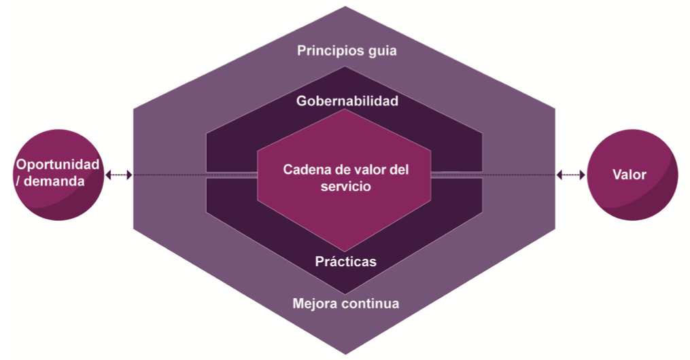  
_Nota. Copyright © AXELOS Limited 2019. Reproducido bajo licencia de AXELOS Limited.
Todos los derechos reservados._
 

### 📐 **Las 4 Dimensiones de ITIL 4**

Los componentes clave del marco ITIL 4 son el Sistema de Valor del Servicio (SVS) y el Modelo de cuatro dimensiones. El SVS representa cómo los diversos componentes y actividades de la organización trabajan juntos para facilitar la creación de valor mediante servicios habilitados por TI.. El SVS facilita la integración y coordinación y proporciona una dirección fuerte, unificada y enfocada en el valor, para la organización.

> "Para garantizar un enfoque holístico en la gestión de servicios, ITIL 4 define cuatro dimensiones:
>
> 1. **Organizaciones y personas**: Cultura y estructura organizacional
> 2. **Información y tecnología**: Sistemas y datos que habilitan los servicios
> 3. **Asociados y proveedores**: Relaciones con terceros
> 4. **Flujos de valor y procesos**: Cómo se coordinan las actividades"

**Ejemplo práctico**:
Una implementación de nube híbrida requiere:

- 👥 Equipos capacitados (Dimensión 1)
- ☁️ Plataformas tecnológicas (Dimensión 2)
- 🤝 Acuerdos con proveedores cloud (Dimensión 3)
- 🔄 Procesos de gestión de cambios (Dimensión 4)

### 🎓 **Esquema de Certificación**

La certificación **ITIL Foundation** ofrece conocimiento general de los conceptos clave. Luego, los candidatos pueden elegir:

> - **Managing Professional (MP)**: 4 módulos técnicos
> - **Strategic Leader (SL)**: 2 módulos estratégicos"

_Figura 2. Rutas de certificación_  
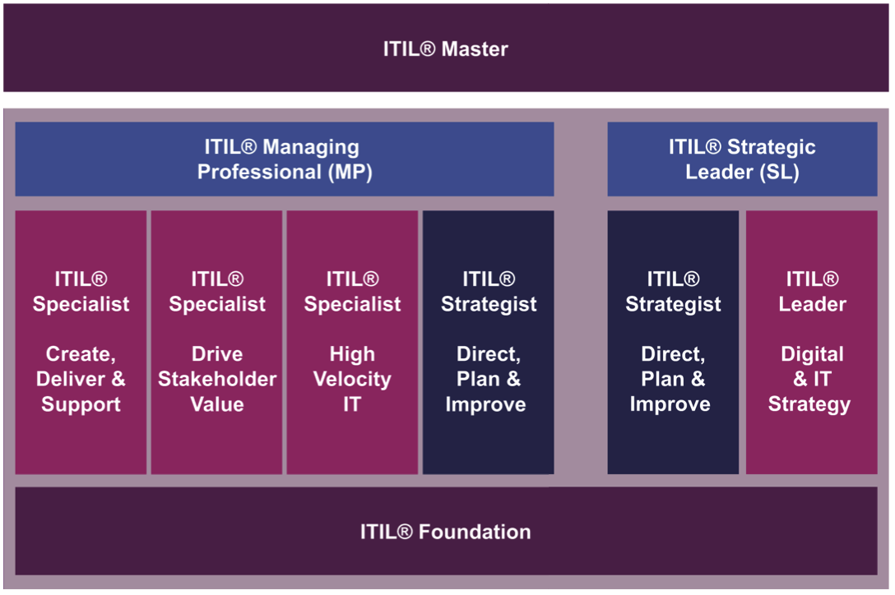  
 

## 💎 **2. Gestión de Servicios**

La gestión de servicios se define como un conjunto de competencias organizacionales especializadas para entregar el valor a los clientes en forma de servicios

### 2.1. **Valor y Co-Creación**

**Organización**

> _“Una persona o grupo de personas que tiene sus propias funciones con responsabilidades, autoridades y relaciones para lograr sus objetivos”. (adaptado de ISO 9001:2015)_

Las organizaciones varían en tamaño y complejidad. Una organización puede ser una entidad legal, una parte de una entidad legal o una compleja red de entidades legales unidas por objetivos, relaciones y autoridades comunes.

Las relaciones entre y dentro de las organizaciones son complejas. Cada organización depende de otras en su funcionamiento y desarrollo. Las organizaciones pueden tener diferentes roles, dependiendo de las diferentes percepciones. En el contexto de la gestión de servicios,
una organización puede actuar como un proveedor de servicios o como un consumidor de servicios; en realidad, una organización puede desempeñar ambos roles en un momento dado.

**Valor**

> "Valor es el beneficio percibido, utilidad e importancia de algo. Se co-crea mediante la colaboración activa entre proveedores y consumidores."

El propósito de una organización es crear valor para las partes interesadas. Las diferentes personas, grupos o entidades en una organización siempre operan de manera integrada y coordinada para facilitar la creación de valor y cumplir un conjunto común de objetivos.

> El término “valor” es un concepto importante en la gestión de servicios y es un punto clave de ITIL 4.

El valor no es un término fijo; está sujeto a la percepción de las partes interesadas, ya sean clientes o consumidores del servicio o parte de la (s) organización (es) del proveedor del servicio.

#### 🛠️ Componentes de Valor

- **Servicio**: Medio para entregar valor (ej: plataforma cloud).
- **Producto**: Configuración de recursos (ej: software SaaS).
- **Oferta de servicio**:
  - Bienes (ej: hardware)
  - Acceso a recursos (ej: licencias)
  - Acciones de servicio (ej: soporte)

 

> **Ejemplo, según figura 3**. "Antes se veía como relación unidireccional (proveedor → consumidor). Ahora es bidireccional, donde el consumidor ayuda a definir requisitos y diseño."

_Figura 3. Modelo de co-creación_  
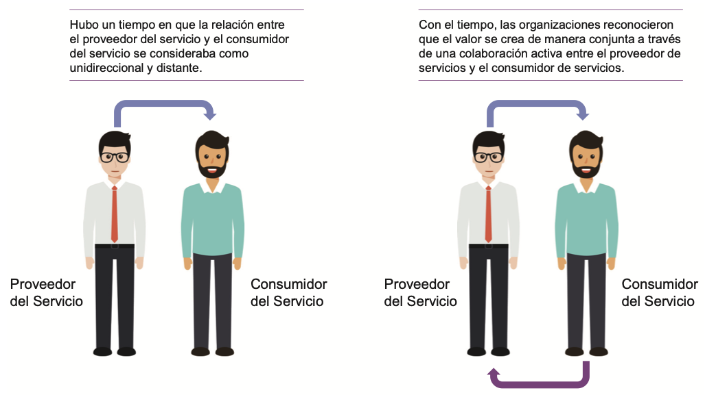  
 

Con el tiempo, las organizaciones reconocieron que el valor se crea de manera conjunta a través de una colaboración activa entre los proveedores de servicios y los consumidores de servicios, así como otras partes interesadas. Los proveedores de servicios no deben trabajar de forma aislada para definir el valor para sus clientes y usuarios. Deben establecer relaciones de servicios con los consumidores para co-crear valor.

Las relaciones de servicios son mutuamente beneficiosas, las relaciones de servicios interactivas con sus consumidores para comprender la perspectiva de valor del consumidor. Esto permitirá a los consumidores de servicios contribuir a la definición de requisitos, diseño de soluciones de servicios y a la creación de Servicios y/o aprovisionamiento de los mismos.

_Figura 4. Proveedores de servicio, consumidores de servicio y otras partes Interesadas_  
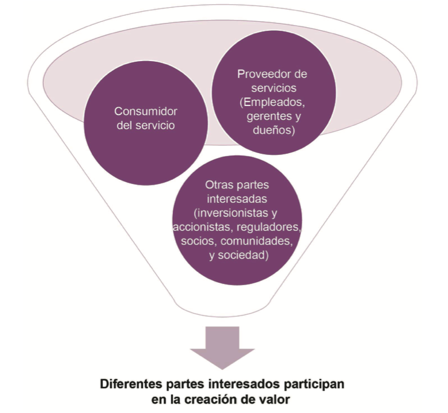  
 

Uno de los grupos de partes interesadas más importantes para cualquier organización son los consumidores de servicios. Sin embargo, en la gestión de servicios hay muchos otros grupos de partes interesadas, incluidos inversores y accionistas, reguladores, socios, comunidades y sociedades.

**Proveedores de Servicio**

> **Aprovisionamiento del Servicio**. “Al aprovisionar servicios, una organización asume el rol de proveedor de servicios. El proveedor puede ser externo a la organización del consumidor, o ambos pueden ser parte de la misma organización”.

El proveedor de servicios y el consumidor de servicios pueden ser organizaciones diferentes, o ambos pueden ser parte de la misma organización.

_**Un ejemplo simple**_ de modelo de proveedor-consumidor es donde el proveedor de servicios puede ser el departamento de TI de una organización y otros departamentos o unidades pueden considerarse consumidores. En realidad, existen diferentes modelos completos proveedor-consumidor. Por ejemplo, un proveedor de servicios puede vender servicios en el mercado abierto a consumidores individuales u otras organizaciones, o puede ser parte de una alianza de servicios.

**Consumidores del Servicio**

> **Consumidores del Servicio**. “Al recibir servicios, una organización asume el rol de consumidor del servicio”.

El consumidor de servicios es un rol genérico; en la práctica, el consumo de servicios incluye roles más específicos: cliente, usuario y patrocinador.

_Figura 5. Cliente-Patrocinador-Usuario_  
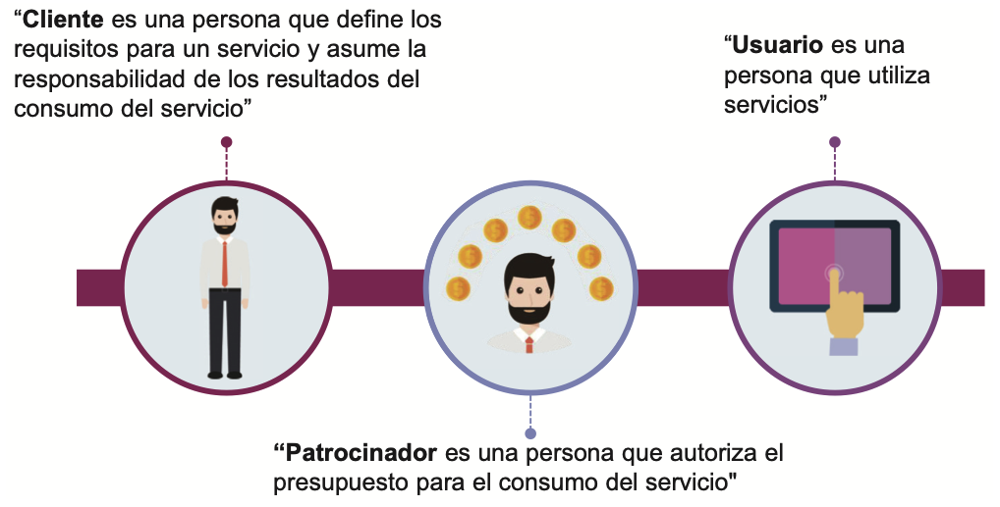  
 

| Rol              | Definición          | Ejemplo                            |
| ---------------- | ------------------- | ---------------------------------- |
| **Cliente**      | Define requisitos   | Departamento que contrata servicio |
| **Patrocinador** | Aprueba presupuesto | Director Financiero                |
| **Usuario**      | Utiliza el servicio | Empleados que usan la herramienta  |

 

_**Por ejemplo**_, si una organización desea comprar servicios de taxi para sus empleados a un proveedor de servicios de alquiler de automóviles, los tres roles de los consumidores se pueden distribuir de la siguiente manera:

    - 👥 El funcionario de administración y los miembros clave del equipo de comunicaciones cumplen la función de -CLIENTE-, que analiza los requisitos de taxi de los empleados de la empresa y negocia el contrato con el proveedor de servicios de alquiler de automóviles y supervisa el desempeño del proveedor de servicios contra los requisitos contratados.
    - 👥 El Gerente de Finanzas cumple la función del -PATROCINADOR-, quien revisa el acuerdo de servicio propuesto y aprueba el costo del contrato tal como se negoció.
    - 👥 Los empleados (incluidos el Funcionario de Administración, el Gerente de Finanzas y los miembros del equipo de comunicaciones) cumplen la función del -USUARIO- cuando solicitan, reciben y utilizan los servicios de taxi.

### 2.2. **Valor desde la Perspectiva de Diferentes Partes Interesadas**

El valor está sujeto a la percepción de los diferentes grupos de interés. Aquí hay un ejemplo genérico de diferentes partes interesadas y una definición de valor para estas partes interesadas.

| Parte Interesada       | Valor (ejemplo)                                                                      |
| ---------------------- | ------------------------------------------------------------------------------------ |
| Consumidor de Servicio | Beneficios obtenidos, costos y riesgos optimizados                                   |
| Proveedor de Servicio  | Financiamiento del consumidor; desarrollo de negocios; mejora de la imagen           |
| Socios                 | Incentivos financieros y no financieros, desarrollo de negocios; mejora de la imagen |
| Accionistas            | Beneficios financieros, tales como dividendos; sensación de seguridad y estabilidad  |

 

### 2.3. **Valor: Servicios, productos y recursos**

_Figura 6. Productos-Servicios y recursos_  
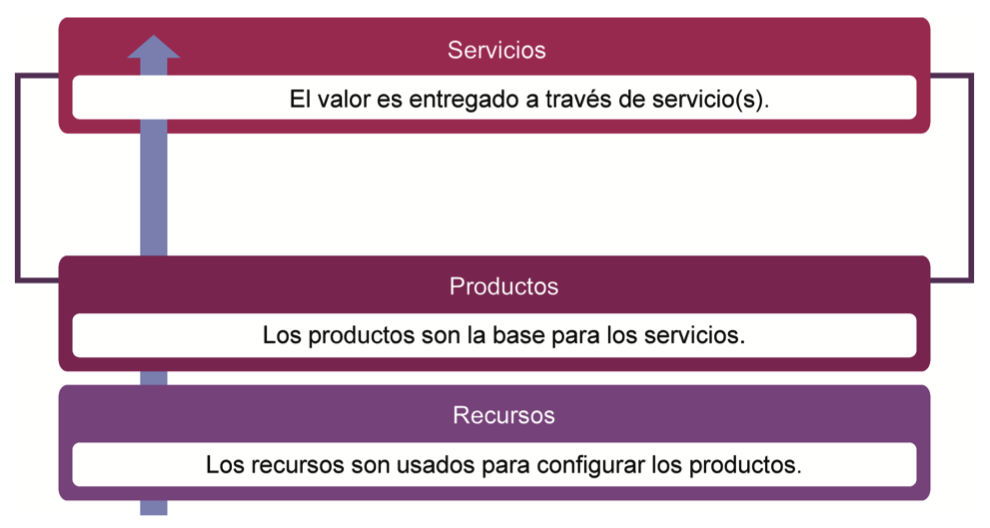  
 

El componente central de la gestión de servicios es el servicio. El proveedor de servicios entrega valor a través del servicio. Los servicios
que proporciona una organización se basan en productos. Los productos son la configuración de los recursos de una organización diseñados para ofrecer valor a un consumidor.

> **Servicio**. “Es un medio para habilitar la creación conjunta de valor al facilitar los resultados que los clientes desean alcanzar, sin que el cliente tenga que administrar los costos y riesgos específicos”.

Todos los servicios tienen un costo de servicio cuando se vuelven operativos y este costo debe ser gestionado. Para evitar tomar riesgos, los consumidores recurren a los proveedores de servicios para satisfacer su necesidad de esos servicios. El proveedor de servicios, por otro lado, proporciona esos servicios de acuerdo con los requisitos de los clientes.

> **Producto**. “Es una configuración de los recursos de una organización designados para ofrecer valor a un consumidor”.

Los servicios que proporciona una organización se basan en uno o más de sus productos. Las organizaciones poseen o tienen acceso a múltiples recursos, como personas, información y tecnología, flujos de valor y procesos, proveedores y socios. Los productos son configuraciones de estos recursos, creados por la organización, que potencialmente ofrecerán valor para sus clientes.

Cada producto que ofrece una organización se crea teniendo en cuenta los requisitos de la cantidad de grupos de consumidores objetivo. Un producto no es exclusivo de un grupo de consumidores y puede utilizarse para abordar los requisitos de numerosos grupos diferentes. Los productos están diseñados para atraer a los diferentes grupos de consumidores y para satisfacer sus requisitos.

Los productos suelen ser complejos y no son completamente visibles para el consumidor. La parte del producto que es realmente visible para el consumidor no siempre representa los componentes completos que forman parte del producto y que respaldan su entrega.

> **Oferta de Servicios**. “Es la descripción de uno o más servicios, diseñado para satisfacer las necesidades de un específico grupo de consumidores. Una oferta de servicio puede incluir bienes, acceso a recursos y acciones de servicio”.

_Figura 7. Relación completa de Productos-Servicios y recursos_  
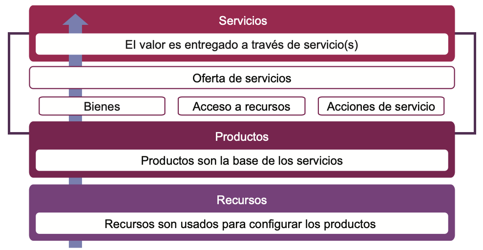  
 

> "**Producto**: Configuración de recursos para ofrecer valor (ej: software). **Servicio**: Medio para habilitar resultados sin que el cliente gestione riesgos."

**Componentes de oferta de servicio**:

1. Bienes (ej: hardware)
2. Acceso a recursos (ej: licencias)
3. Acciones de servicio (ej: soporte)

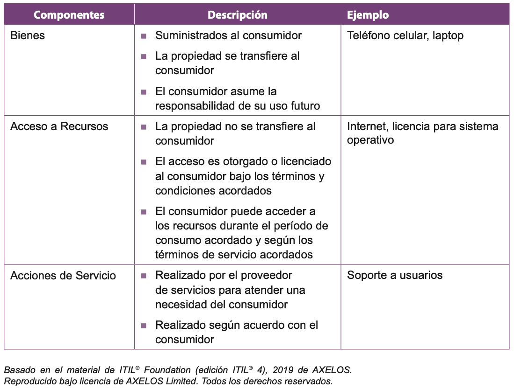  
 

### ⚖️ **Relación de servicios**

Las relaciones de servicios se establecen entre dos o más organizaciones para co-crear valor. En una relación de servicio, las organizaciones asumirán los roles de proveedor de servicios y consumidor de servicios. Los dos roles no se excluyen mutuamente, y las organizaciones generalmente proporcionan y consumen una cantidad de servicios en un momento dado.

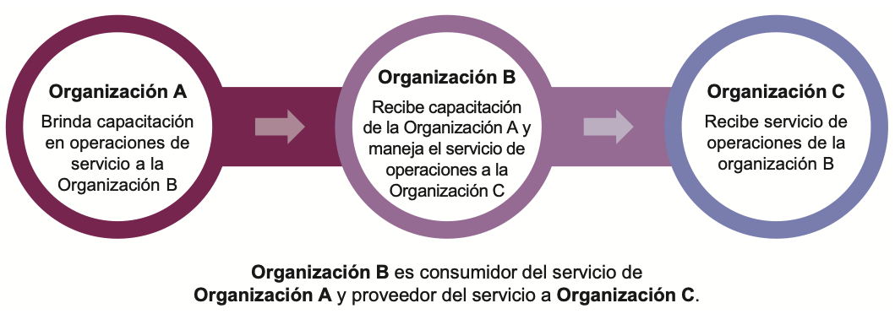  
 
 

🔸 Gestión de relaciones de servicios

Las relaciones de servicios incluyen la gestión de relaciones de servicios, prestación y servicios, prestación y consumo de los mismos.

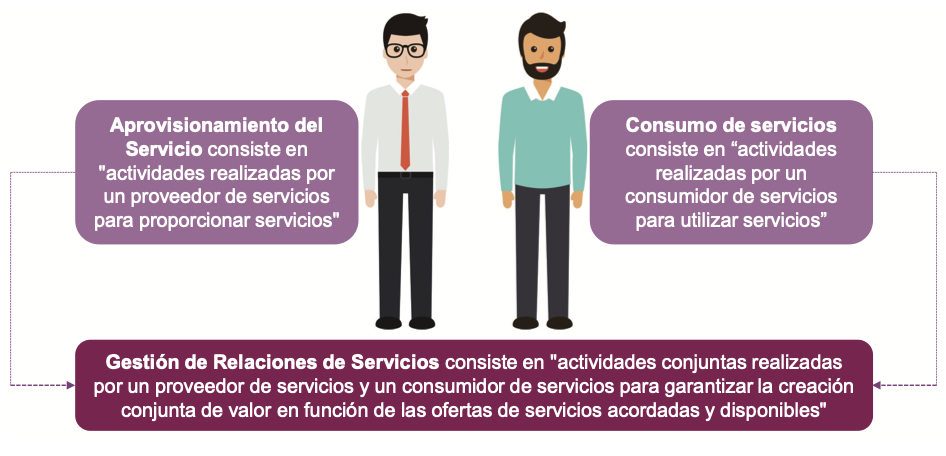  
 
 

🔸 Aprovisionamiento de servicios

- Gestión de los recursos del proveedor, confi gurados para la entrega del servicio
- Acceso a estos recursos por los usuarios
- Cumplimiento de las acciones de servicio acordadas
- Gestión del nivel de servicio y mejora continua

🔸 Consumo de servicios

- Gestión de los recursos del consumidor necesarios para utilizar el servicio
- Acciones para el uso del servicio
- Utilización de los recursos del proveedor
- Acciones de solicitud de servicio a cumplir

🔸 Modelo de Relaciones de Servicio  
Cuando el proveedor de servicios entrega servicios, crea nuevos recursos para los consumidores de los mismos o modifican sus recursos existentes. Los consumidores de servicios pueden usar sus recursos nuevos o modificados para crear sus propios productos para satisfacer las necesidades de otro grupo de consumidores y convertirse en un proveedor de servicios. Estas relaciones e interacciones de servicio se representan a través del modelo de relaciones de servicios.

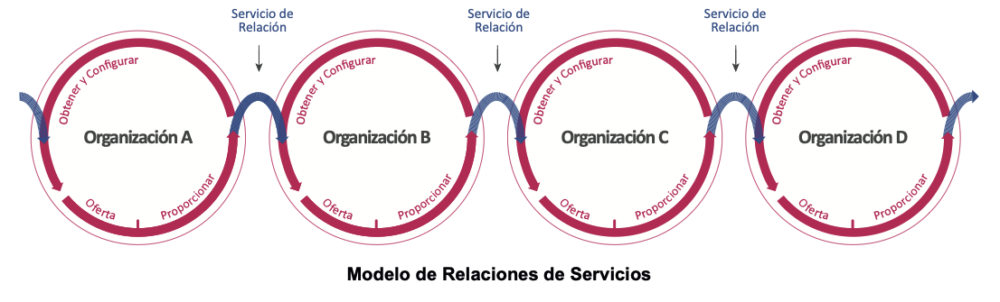  
 
 

_Figura 8. Relaciones de Servicios, Oferta de Servicios y Productos_  
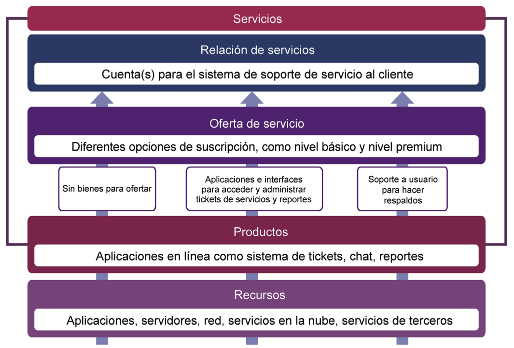  
 

### 📈 **Valor: Resultados, Costos y Riesgos**

#### 🔹 **Servicios Facilitan Resultados**

> "Un servicio es un medio para habilitar la co-creación de valor al facilitar los resultados que los clientes desean lograr sin que el cliente tenga que gestionar los costos y riesgos específicos.”

Como se especifica en la definición de servicio, los proveedores de servicios ayudan a los consumidores de servicios a lograr resultados y, al hacerlo, asumen algunos de los riesgos y costos asociados.

#### 🔹 **Resultados, costos y riesgos**

Lograr los resultados deseados requiere recursos (y por lo tanto costos) y, a menudo, están relacionados con los riesgos.

Además, las relaciones de servicios pueden introducir nuevos riesgos y costos, o pueden afectar negativamente algunos de los resultados establecidos, al mismo tiempo que respaldan a otros. Las relaciones de servicios se perciben como valiosas sólo cuando tienen más efectos positivos que negativos.

_Figura 9. Relación de Resultados, costos y riesgos_  
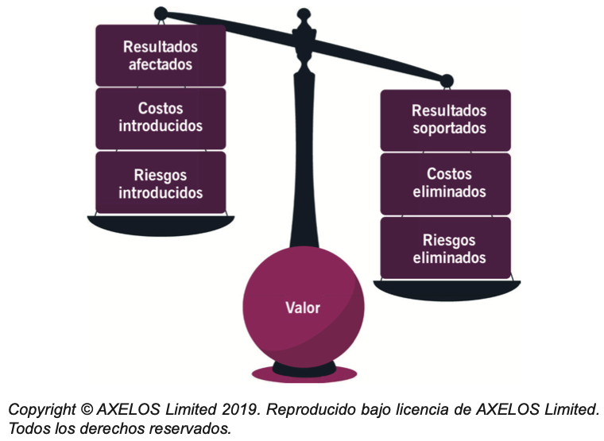  
 

### 📊 Valor = Beneficios - (Costos + Riesgos)

- **Resultados**: Logros del cliente (ej: empleados certificados).
- **Costos**:
  - Eliminados (ahorros)
  - Impuestos (inversión requerida)
- **Riesgos**:
  - Mitigados (por el servicio)
  - Asumidos (por el consumidor)

#### 🔹 **Salidas y resultados**

Un proveedor de servicios produce salidas que ayudan a sus consumidores a lograr ciertos resultados.

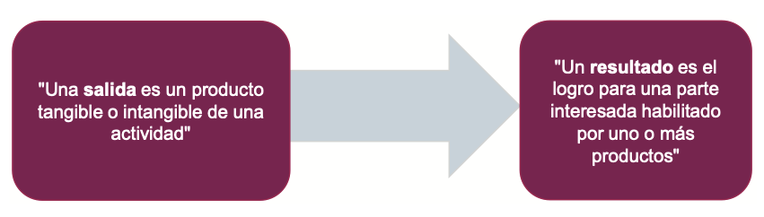  
 

> "**Salida**: Producto tangible/intangible (ej: informe). **Resultado**: Logro habilitado por el servicio (ej: decisión empresarial)."

#### 🔹 **Costos**

La cantidad de dinero invertido en una actividad o recurso específico. Desde la perspectiva del consumidor del servicio, hay dos tipos de costos involucrados en las relaciones de servicios:

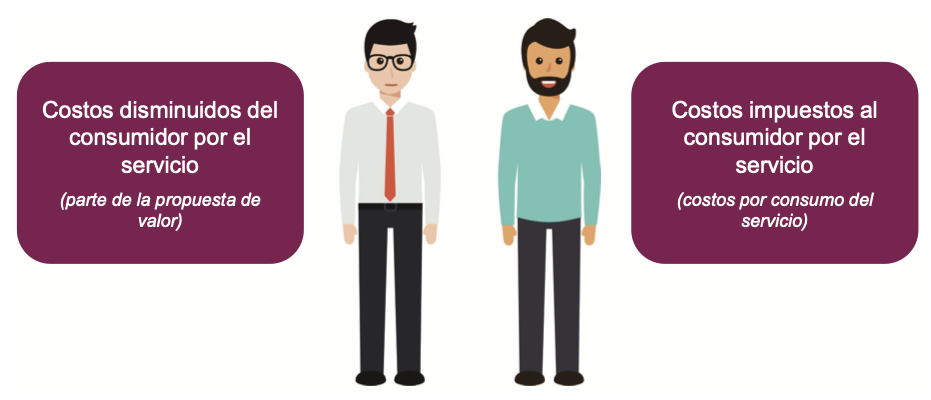  
 
Los costos eliminados para el consumidor por el servicio pueden incluir los costos del personal del proveedor del servicio, la tecnología y otros recursos.

 

**Tipos**:

- **Eliminados**: Ahorros para el consumidor
- **Impuestos**: Inversión requerida

**Ejemplo numérico**:

> "Un servicio cloud reduce costos de infraestructura ($50k/año) pero requiere capacitación ($10k). Valor neto = $40k."

#### 🔹 **Riesgo**

Un posible evento que podría causar daño o pérdida, o dificultar el logro de los el logro de los objetivos. Desde la perspectiva del consumidor de servicios, existen dos tipos de riesgos:

  
 

> "El proveedor debe gestionar riesgos técnicos, mientras el consumidor comunica requisitos claros."

#### 🔹 **Utilidad y Garantía**

**Comparación detallada**:
| Concepto | Definición | Métricas Clave |
| ------------ | ------------------------------------------------------------------------------------------------------------- | ----------------------------- |
| **Utilidad** | La utilidad es la funcionalidad ofrecida por un producto o servicio para satisfacer una necesidad particular. | Funcionalidades implementadas |
| **Garantía** | La garantía es la seguridad que un producto o servicio cumplirá con los requisitos acordados. | Disponibilidad, seguridad |

## 📚 **Conclusiones**

1. El valor es subjetivo y co-creado
2. Las organizaciones son tanto proveedoras como consumidoras
3. Los servicios deben balancear utilidad y garantía
