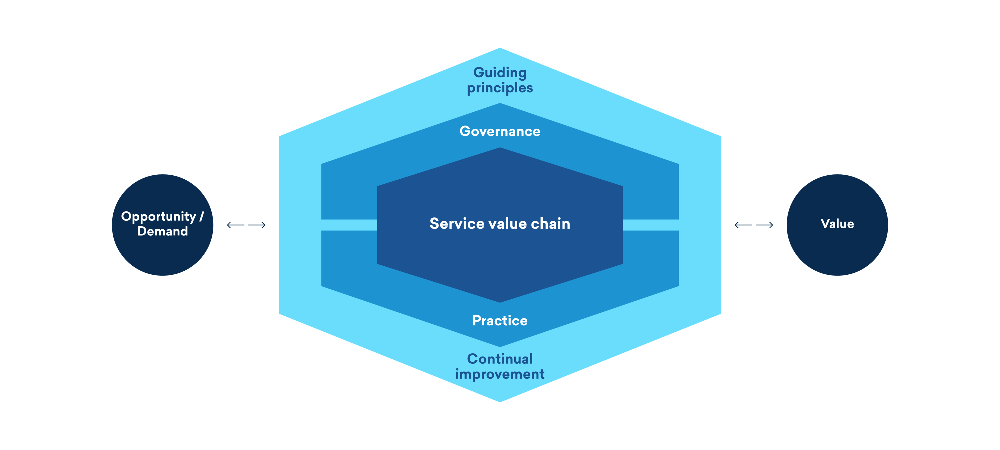
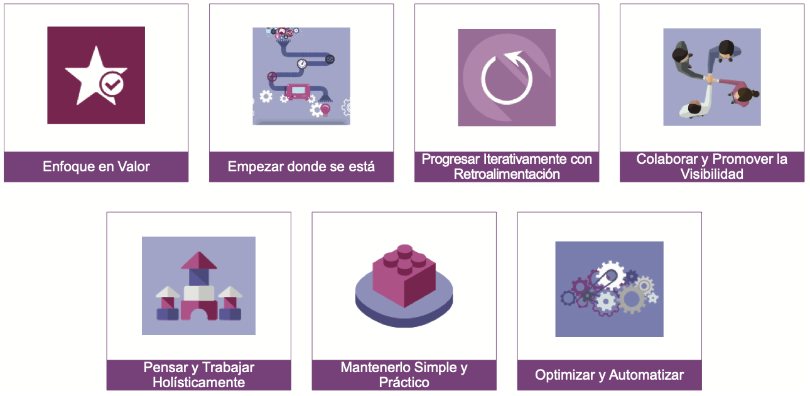
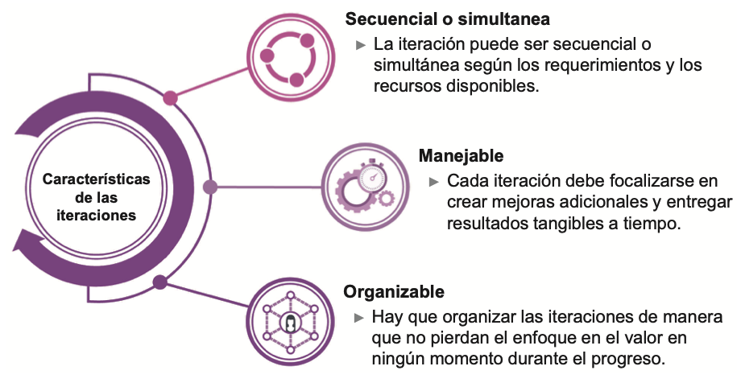
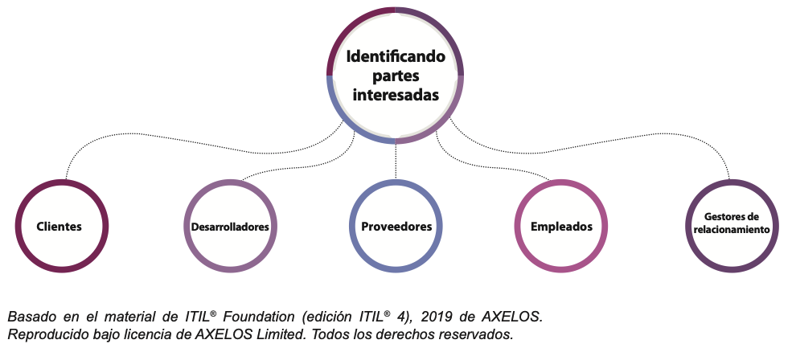
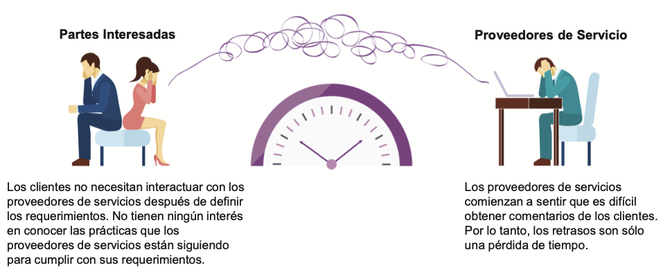
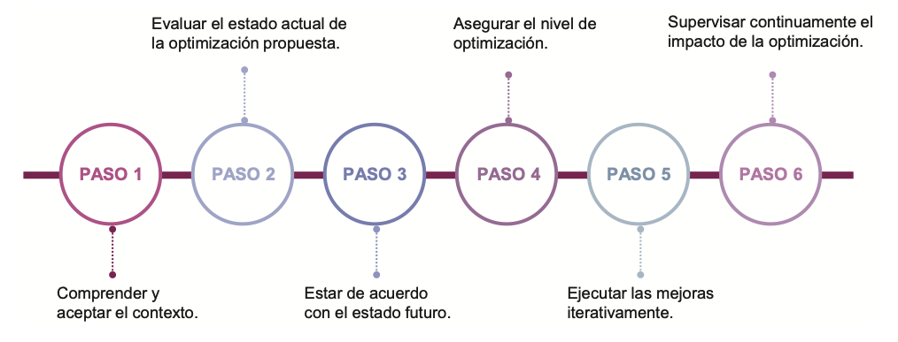
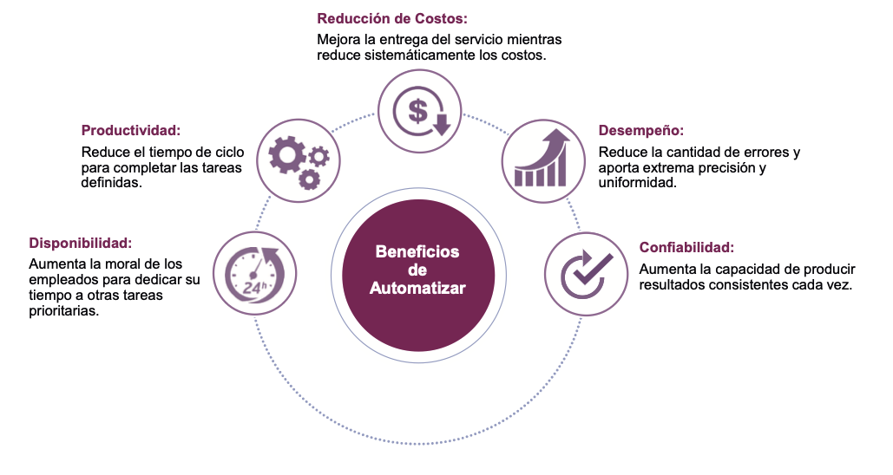

# 🧩 **Semana 3: Ciclo de Vida del Servicio (ITIL 3) - Los Principios Guía de ITIL 4**

**Curso:** Gestión de Tecnologías de la Información  
**Docente:** Dr. Oscar Jimenez Flores  
[CTI Vitae Concytec](https://www.google.com/url?sa=t&source=web&rct=j&opi=89978449&url=https://ctivitae.concytec.gob.pe/appDirectorioCTI/VerDatosInvestigador.do%3Fid_investigador%3D33398&ved=2ahUKEwi7_KSu8s2MAxWwIbkGHfcFN3EQFnoECA0QAQ&usg=AOvVaw1VPrJTyH8Dl3P6q-qEHKEY)  
[LinkedIn](https://www.linkedin.com/in/oscar-jimenez-flores/)

---

## 1. ITIL V3 Framework y el ciclo de vida del servicio

Las características de ITIL V3 giran en torno al **ciclo de vida del servicio** y un conjunto de procesos de apoyo y mejores prácticas para cada una de sus cinco etapas:

1. **Estrategia del Servicio**  
2. **Diseño del Servicio**  
3. **Transición del Servicio**  
4. **Operación del Servicio**  
5. **Mejora Continua del Servicio**  

_Figura 1. Ciclo de vida del servicio ITIL 3_  
  

---

### 1.1. Prácticas y procesos de ITIL 4

En la versión 3 de ITIL, el marco se construyó alrededor de procesos claramente definidos para ITSM (IT Service Management). Con **ITIL 4**, estos procesos han sido reformulados como **prácticas**. Es un enfoque más amplio y flexible que incluye procedimientos paso a paso, así como las habilidades, herramientas y orientación necesarias para una gestión de servicios eficaz.

Existe un total de **34 prácticas de ITIL** divididas en tres categorías:

1. **Prácticas de Gestión Generales**  
2. **Prácticas de Gestión de Servicios**  
3. **Prácticas de Gestión Técnica**  

### 1.2. Entonces que pasó con el ciclo de vida del servicio de ITIL 3 en ITIL 4?

ITIL4 substituye al ciclo de vida con el nuevo concepto de **Sistema de Valor del Servicio (SVS)**, y pretende mostrarnos cómo la mezcla de distintos componentes nos asistirá en la conversión de Demanda y Oportunidades en Valor, consumible por el negocio al que servimos. 

ITIL4 no define procesos específicos: los proveedores de servicios son libres de diseñar procesos a la medida que funcionen para su organización.

_Figura 2. Sistema de valor del servicio ITIL V4_  
  

---

## 2. Principios rectores (Guiding principles)

Los principios guía de ITIL 4 (Biblioteca de Infraestructura de Tecnología de la Información) representan los mensajes centrales para la gestión de servicios de TI y son relevantes porque:

1. **Son universales**: Aplicables más allá de ITIL/ITSM (Gestión de Servicios de TI)
2. **Relacionales**: Guían interacciones con partes interesadas
3. **Complementarios**: Funcionan con Lean, DevOps, etc.
4. **Unificadores**: Eliminan silos organizacionales

Por tanto, un principio guía es:
- Una filosofía rectora permanente
- Aplicable en **todas** las circunstancias
- Base para decisiones e iniciativas de mejora
- Promueve cultura colaborativa

**Ejemplo**: Una multinacional aplica estos principios tanto en TI como en Recursos Humanos y Operaciones.

### 2.1. Los Siete Principios

_Figura 3. Los 7 principios guía_  
  

### A. PRINCIPIO - Enfoque en Valor

> El principio “Enfoque en Valor” apunta a crear valor para los consumidores de servicios. Para lograr este valor, las organizaciones deben vincular las diferentes actividades (directa o indirectamente) que realizan de una manera lógica.

En otras palabras, una organización puede crear valor para los consumidores de servicios solo creando valor para sí misma, sus clientes y partes interesadas.

- Ejemplo directo: Repensar los servicios desde la perspectiva del cliente, incluyendo a los nuevos usuarios, para asegurarse de que realmente estén recibiendo algo valioso y útil para ellos.

- Ejemplo indirecto: Mejorar el proceso de gestión de cambios para que los cambios frecuentes o menores, sean más rápidos y causen menos interrupciones. Esto no se ve directamente, pero contribuye a que el cliente perciba un mejor servicio.

| Tipo de Ejemplo | Descripción                                                                                                   | Ejemplo Concreto                                                                 |
|------------------|---------------------------------------------------------------------------------------------------------------|----------------------------------------------------------------------------------|
| Directo          | Repensar los servicios desde la perspectiva del cliente.                                                     | Una empresa de hosting rediseña su panel de usuario para que sea más intuitivo, permitiendo a nuevos clientes crear y gestionar sus sitios web sin asistencia técnica. |
| Indirecto        | Mejorar procesos internos que afectan indirectamente la percepción de valor del cliente.                      | El equipo de TI optimiza su proceso de gestión de cambios, permitiendo actualizaciones del sistema sin necesidad de reinicios ni interrupciones visibles para el usuario final. |

  

**Entonces** todo debe vincularse a la creación de valor para:
- Clientes
- Partes interesadas
- La propia organización

**Y son aspectos críticos**:
1. Identificar consumidores reales
2. Comprender su percepción de valor
3. Mejorar experiencia del cliente

### B. PRINCIPIO - Empezar donde se está

> El principio “Empezar donde se está” se enfoca en considerar lo que ya está disponible en lugar de comenzar desde cero (o reutilización). Para lograr esto, es esencial analizar el estado existente para identificar lo que puede ser útil para crear el nuevo valor.

Las organizaciones a menudo toman la decisión de eliminar los métodos o servicios antiguos o fallidos para mejorar y estar actualizados. Sin embargo, no es una decisión inteligente ya que
puede llevar a:
- Eliminar los servicios, procesos, personas y herramientas existentes que podrían desempeñar un papel importante en la entrega del nuevo valor,
- Desarrollando un valor completamente diferente al pasado,
- Desperdicio de esfuerzo,

Es importante no comenzar de nuevo sin considerar primero lo que ya está disponible para ser aprovechado. 

Por ejemplo, considere la necesidad de una organización de revisar sus procesos de gestión de servicios debido a que los servicios en la nube entran en operación, en paralelo con los servicios tradicionales. Sería un desperdicio comenzar desde cero, cuando existan diferentes herramientas y portales con respecto a la solución actual. Es óptimo usar lo que ya tiene y ajustarlo para los servicios en la nube.

**Advertencia** - No eliminar sistemas existentes sin evaluar su potencial de reutilización.

**Metodología**:
  1. Auditoría del estado actual
  2. Identificar activos reutilizables
  3. Evaluar riesgos de reutilización

### C. PRINCIPIO - Progresar Iterativamente con Retroalimentación

> El principio “Progresar Iterativamente con Retroalimentación” se focaliza en evitar el buscar el todo de una vez y en recibir retroalimentación oportuna. Para lograr esto, es necesario dividir el trabajo en componentes más pequeños y manejables para lograr de manera iterativa la iniciativa.

Para llevar a cabo las iniciativas, ni siquiera intente hacer todo de una vez, sino trabajar en iteraciones. Siempre divida el trabajo en unidades lógicas más pequeñas y manejables. En otras palabras, divida la iniciativa de mejora en las iniciativas significativas más pequeñas que requieran esfuerzos mínimos de mejora. 

Organizar el trabajo de tal manera ayuda en la entrega oportuna, teniendo un mayor enfoque en cada esfuerzo y un fácil mantenimiento. Sin embargo, debe continuar reevaluando la iniciativa general con el avance, para garantizar el enfoque en el valor y reflejar los cambios en las circunstancias, si los hubiera.

Las iteraciones también ayudan a recopilar comentarios tempranos. Obtener los comentarios antes, durante y después de cada iteración garantiza que todo está progresando según las expectativas, y que el enfoque esté en el valor.

_Figura 4. Progresar Iterativamente con Retroalimentación_  
  

**El flujo de trabajo debería ser**:
1. Dividir iniciativas en iteraciones de 2-4 semanas
2. Establecer MVPs (Productos Mínimos Viables)
3. Ciclos de feedback continuo

**Beneficios**:
- Reducción de riesgos
- Adaptabilidad a cambios
- Resultados tangibles rápidos

### D. PRINCIPIO - Colaborar y Promover Visibilidad

> El principio “Colaborar y Promover Visibilidad” se centra en eliminar silos y generar confianza. Para lograr esto, las personas en una organización necesitan trabajar juntas y compartir información en la mayor medida posible.

***Eliminar Silos***  
Los silos pueden ocurrir a través del comportamiento de individuos y equipos, así como también a través de causas estructurales. En una organización, los silos generalmente se deben a la incapacidad de las diferentes unidades de negocios para colaborar.

Por ejemplo, los procesos, sistemas, documentación y comunicaciones pueden diseñarse para satisfacer las necesidades de una parte específica de una organización solamente.

Los silos se producen cuando las personas trabajan de forma aislada y el intercambio de información se limita a unas pocas personas.

Cuando las personas no conocen los detalles, es más probable que ocurran suposiciones y rumores. Como resultado, se crea un muro de confusión entre individuos o equipos. En tales circunstancias, la resistencia al cambio se convierte en un desafío importante a medida que las personas comienzan a preguntarse qué está cambiando y cómo podría afectarlas.

      Tácticas anti-silos:
      - Tableros Kanban compartidos
      - Reuniones cross-funcionales
      - Sistemas de comunicación unificados

***Construir confianza***  
Trabajar juntos en iniciativas de forma colaborativa proporciona más relevancia y una mejor comprensión que hace que todo sea visible. La visibilidad ayuda a tomar decisiones efectivas, lo que a su vez aumenta las posibilidades de éxito a largo plazo. Sin embargo, el trabajo colaborativo no es una tarea fácil, ya que requiere generar confianza.

La confianza dentro de los equipos les ayuda a mantenerse comprometidos y administrar las cosas (incluso lo desconocido) con confianza. Solo si las personas tienen confianza, compartirán
información que les ayudará a aprender, crecer y hacer un gran trabajo juntos.

Compartir información ayuda a las personas a tener una mejor comprensión y una visibilidad clara, tales como cuáles son las agendas ocultas, qué está sucediendo y por qué. Mientras más gente sepa acerca de las iniciativas y la información asociada, más estarán dispuestos a apoyar.

**Ejemplo** - Hospital que redujo errores médicos 30% mediante:
- Historia clínica unificada
- Chat médico-enfermería 24/7
- Reportes visibles para todos

Es así que las organizaciones deben considerar los siguientes aspectos cuando planean trabajar en un modo colaborativo:
- *Identificar con quién colaborar*: Comprender para quién se está trabajando y cuáles son sus perspectivas y expectativas, es esencial para una colaboración exitosa
- *Comunicando y mejorando*: Los proveedores de servicios deben saber hasta qué punto cada parte interesada contribuye a mejorar el servicio en cada nivel.
- *Mayor urgencia a través de la visibilidad*: Crear la urgencia del trabajo es esencial para que todos conozcan acerca de su prioridad.

_Figura 5. Identificar con quién colaborar_  
  

      Partes interesadas (actores):
      - Clientes
      - Desarrolladores
      - Proveedores
      - Empleados
      - Gestores de relacionamiento

Una organización tiene diferentes partes interesadas. Sin embargo, el primer actor más importante es el cliente debido a su gran participación.

_Figura 6. Partes interesadas vs proveedores de servicio_  
  

### E. PRINCIPIO - Pensar y Trabajar Holísticamente

> El principio “Pensar y Trabajar Holísticamente” se centra en trabajar de manera integral. Para lograr esto, las diversas actividades de una organización deben centrarse en la entrega de valor.  

Ningún trabajo se realiza de forma aislada. Del mismo modo, ningún servicio, práctica, proceso, departamento o proveedor puede ser independiente. 

Trabajar como una entidad separada no puede ayudarlos a producir el resultado requerido. Tienen que trabajar juntos de manera integrada para entregar los resultados esperados. 

El manejo de las actividades en su conjunto, que se centran en la entrega de valor, solo puede ayudar a las organizaciones a producir los resultados requeridos para sus clientes y para las partes interesadas internas y externas.  

**Las 4 dimensiones a considerar**:

1. **Organizaciones y Personas**: Estructura y competencias
2. **Información y Tecnología**: Sistemas y datos
3. **Socios y Proveedores**: Relaciones externas
4. **Procesos y Flujos de Valor**: Cadena de actividades

**Caso de estudio**: Implementación de ERP que falló por:
- Enfoque solo en tecnología (dimensión 2)
- Negligencia en capacitación (dimensión 1)
- Falta de alineación con proveedores (dimensión 3)

### F. PRINCIPIO - Mantenerlo Simple y Práctico

> El principio “Mantenlo Simple y Práctico” se enfoca en simplificar los métodos de trabajo complejos. Para lograr esto, identifique y elimine procesos, servicios, acciones o métricas que no agregen ningún valor al resultado.  

Las organizaciones pueden simplificar su complejo sistema al reducir los pasos necesarios para lograr el(los) objetivo(s). Siempre use un pensamiento basado en resultados para generar soluciones prácticas que entreguen beneficios al negocio.

Las organizaciones generalmente intentan proporcionar una solución para cada excepción. Al hacerlo, ignoran el principio “Mantenlo simple y práctico” y terminan desarrollando métodos de trabajo complejos que no maximizan los resultados ni minimizan los costos.

**Metodología KISS (Keep It Simple, Stupid)**:
1. Identificar actividades que no agregan valor
2. Eliminar burocracia innecesaria
3. Simplificar procedimientos

**Ejemplo real** - Aerolínea que:
- Redujo pasos de check-in online de 5 a 2
- Unificó 7 formularios en 1
- Resultado: CSAT +25 puntos
  - Customer Satisfaction Score (Puntuación de Satisfacción del Cliente), Es una métrica que generalmente se obtiene preguntando al cliente "¿Qué tan satisfecho está con el servicio recibido?". Las respuestas suelen ser de 1 a 5 (o 1 a 10), y se convierten en un porcentaje o puntaje promedio.

### G. PRINCIPIO - Optimizar y Automatizar

>  El principio “Optimizar y Automatizar” se centra en optimizar el trabajo realizado por sus recursos humanos y técnicos. Para lograr esto, las organizaciones deben automatizar el trabajo en la medida de lo posible que requiera una intervención humana mínima.  

La optimización ayuda a las organizaciones a maximizar el valor del trabajo. Les ayuda a eliminar acciones innecesarias y repetitivas utilizando la tecnología adecuada. Sin embargo, tener una visión holística de cómo funcionan las distintas partes de una organización es esencial. 

Además la tecnología permite a las organizaciones ampliar y utilizar sus recursos humanos para la toma de decisiones complejas. Tenga en cuenta que no puede confiar en la tecnología sin la capacidad requerida de intervención humana. 

      Automatizar todo sin ninguna razón subyacente puede generar enormes costos y reducir la solidez y la capacidad de recuperación de la organización.

**Aspectos a considerar**  
Las organizaciones deben considerar los siguientes aspectos cuando planifican optimizar el valor del trabajo a través de la automatización.

- Encontrar el camino correcto para la optimización: No importa las prácticas que siga una organización. El camino a la optimización es el mismo. 

- Utilizando automatización: La automatización ayuda a las Optimizar y Automatizar (Continuación)
organizaciones a ahorrar costos, reducir errores humanos y mejorar la experiencia de los empleados.

**Encontrar el Camino Correcto Para la Optimización**
Independientemente de las prácticas que siga una organización, el camino a la optimización consiste en los siguientes pasos:

_Figura 7. Camino Correcto Para la Optimización_  
  

Las organizaciones pueden optimizar las prácticas y los servicios de muchas maneras. Sin embargo, requieren del uso efectivo de los conceptos y buenas prácticas. Estas prácticas que siguen las organizaciones para optimizar el trabajo y para mejorar el desempeño pueden ser específicas de ITIL, Lean, DevOps, Kanban y otras fuentes.

**Utilizando Automatización**  
La automatización es el proceso de utilizar la tecnología para maximizar el valor del trabajo con una intervención humana mínima.

_Figura 8. Utilizando Automatización_  
  

Las organizaciones pueden encontrar muchas oportunidades de automatización que pueden ayudarles a ahorrar costos, reducir los errores humanos y mejorar la experiencia de los empleados. 

En palabras simples, la automatización es el proceso de estandarización y racionalización de las acciones manuales. Como resultado, la necesidad mínima de participación humana para detenerse y evaluar cada parte de un proceso conduce a una mayor eficiencia.

**Enonces la Jerarquía de implementación sería...**
1. Optimizar procesos manuales
2. Estandarizar
3. Automatizar solo lo estable

**Los beneficios posibles y cuantificables**:
- Reducción de errores: 40-60%
- Ahorro de tiempo: 30-50%
- Mejor experiencia empleados: +35% NPS

**Un Caso** de Automatización:
- Tickets recurrentes (resetear passwords)
- Aprobaciones de cambios estándar
- Reportes mensuales
