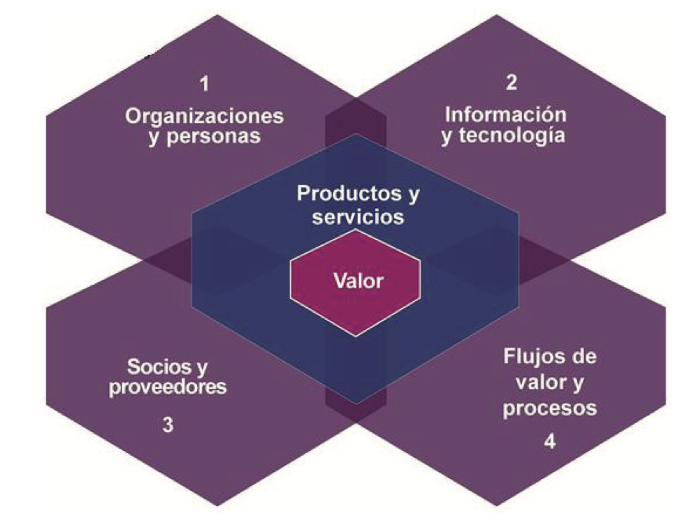
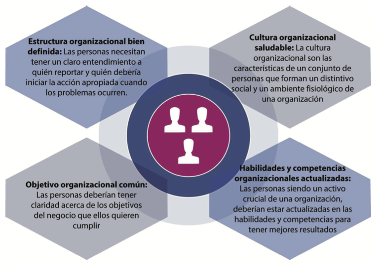
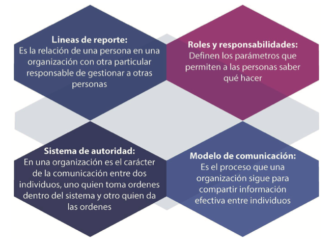
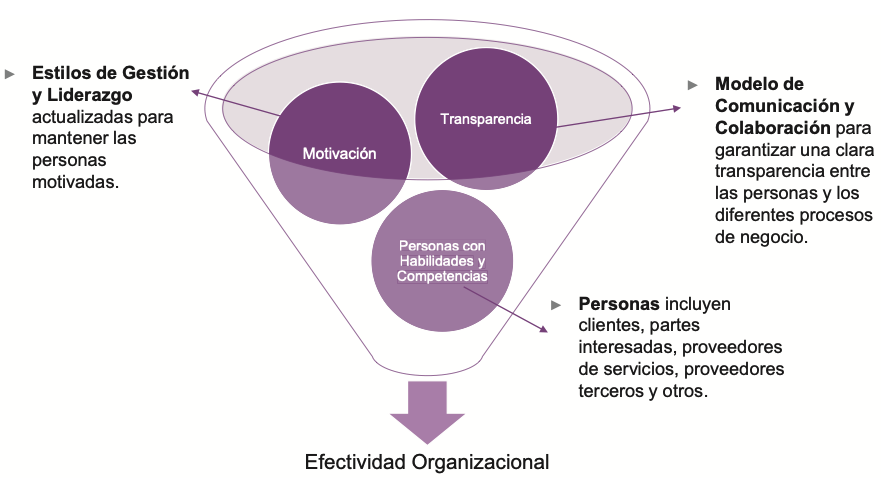
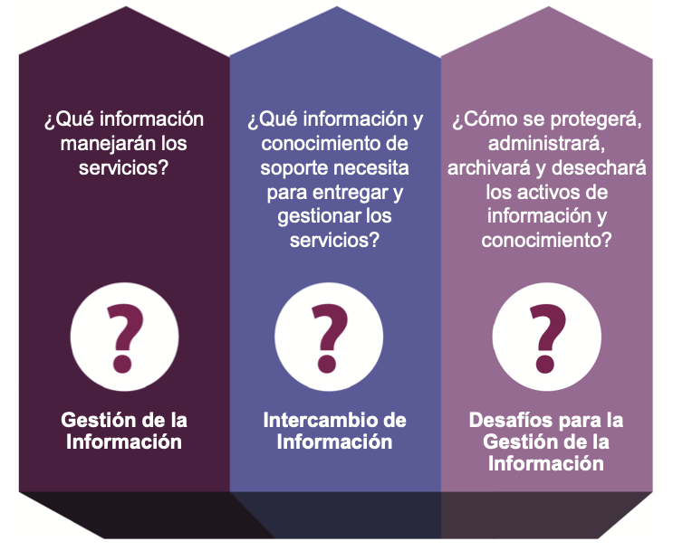
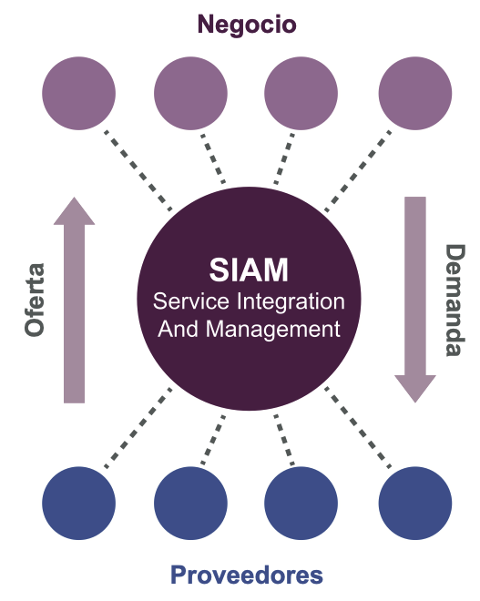
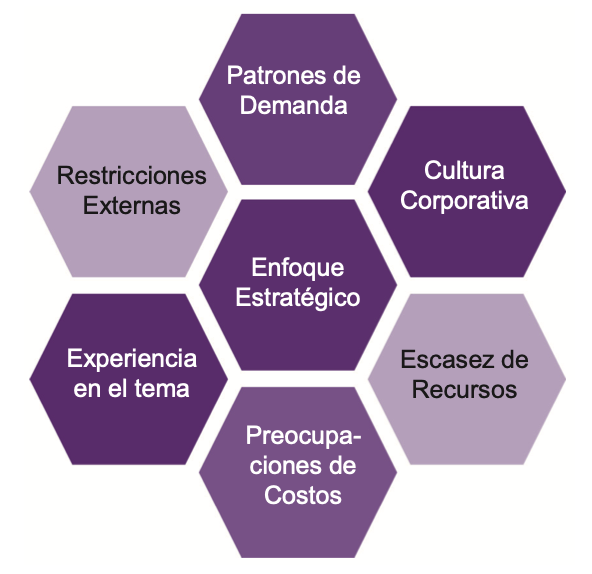
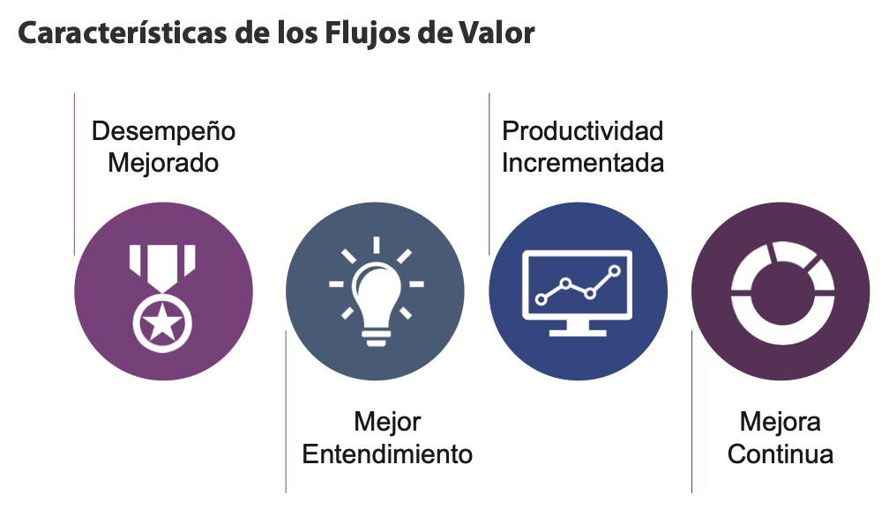
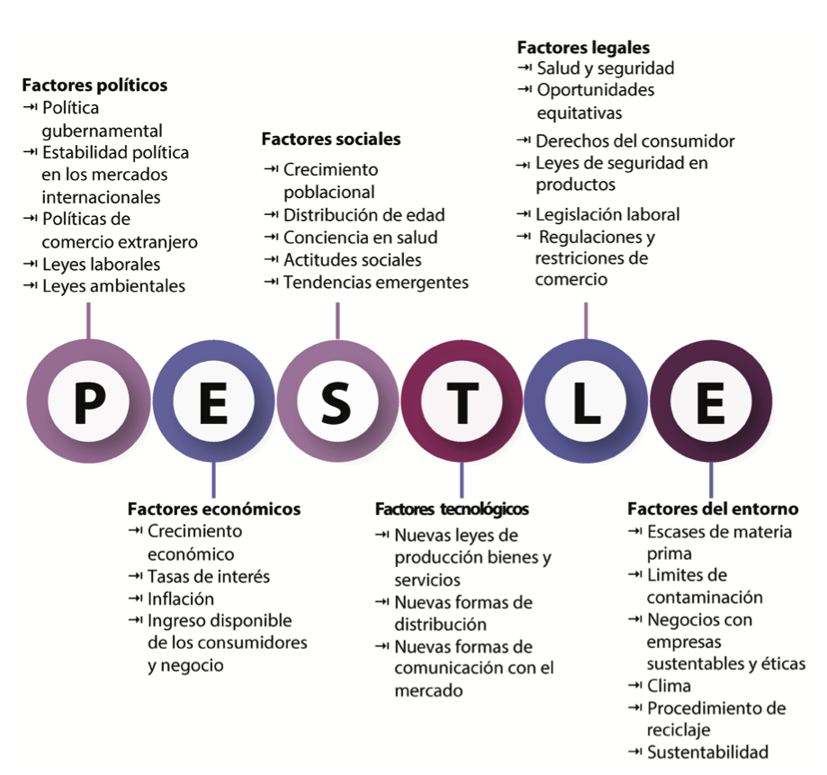

# 🧩 **Semana 4: Las Cuatro Dimensiones de Gestión de Servicios**

**Curso:** Gestión de Tecnologías de la Información  
**Docente:** Dr. Oscar Jimenez Flores  
[CTI Vitae Concytec](https://www.google.com/url?sa=t&source=web&rct=j&opi=89978449&url=https://ctivitae.concytec.gob.pe/appDirectorioCTI/VerDatosInvestigador.do%3Fid_investigador%3D33398&ved=2ahUKEwi7_KSu8s2MAxWwIbkGHfcFN3EQFnoECA0QAQ&usg=AOvVaw1VPrJTyH8Dl3P6q-qEHKEY)  
[LinkedIn](https://www.linkedin.com/in/oscar-jimenez-flores/)

---

## Introducción

La meta de cualquier organización es crear valor para sus clientes, partes interesadas y socios. Puede lograr este objetivo utilizando el Sistema de valor de servicio (SVS) de ITIL. Este sistema describe las formas en que los diversos segmentos y actividades de una organización están vinculados entre sí. Las cuatro dimensiones definidas por ITIL se relacionan e impactan a todos los elementos de la SVS.

> "Las cuatro perspectivas que son críticas para la facilitación efectiva y eficiente de valor para los clientes y otras partes interesadas en la forma de productos y servicios." - Glosario ITIL 4

  

**Analogía**: Las cuatro dimensiones son como los cuatro pilares críticos de una organización. Cuando falta un pilar o es inestable, conlleva mayores riesgos, servicios que no se pueden entregar y expectativas no satisfechas.

## Las Cuatro Dimensiones

Para respaldar un enfoque holístico de Gestión de Servicios, ITIL define cuatro dimensiones:

1. **Organizaciones y personas**  
2. **Información y tecnología**  
3. **Socios y proveedores**  
4. **Flujos de valor y procesos**  

  

**Características**:
- No tienen límites definidos y pueden superponerse
- Interactúan de manera impredecible según la complejidad organizacional
- Son la base sólida para construir un SVS completo

---

## 1. Organizaciones y Personas

  

### Características:
- **Estructura organizacional bien definida**
- **Objetivo organizacional común**
- **Cultura organizacional saludable**
- **Habilidades y competencias actualizadas**

### Componentes detallados:

**Estructura Organizacional**:
- Líneas de reporte (sólidas y punteadas)
- Roles y responsabilidades claros
- Sistemas de autoridad (línea, personal, funcional)
- Modelo de comunicación efectivo

  

**Cultura Organizacional**:
- Basada en actitudes compartidas, creencias y reglas
- Incluye visión, valores, normas y hábitos
- Requiere liderazgo que eduque y apoye valores deseables

> La cultura se basa en actitudes compartidas, creencias,
costumbres y reglas escritas y no escritas que se han desarrollado
a lo largo del tiempo y se consideran válidas.
The Business Dictionary

> La cultura también incluye la visión, valores, normas, sistemas,
símbolos, lenguaje, suposiciones, creencias y hábitos de la
organización.
Needle, 2004

> La cultura es la forma en que una organización lleva a cabo su
trabajo que crea valores y actitudes compartidas, que con el
tiempo se convierten en la cultura organizacional.

**Habilidades y Competencias**:
- Estilos de gestión y liderazgo actualizados
- Transparencia y motivación
- Comunicación y colaboración efectivas
- Crecimiento continuo del personal

  

**Objetivo Común**:
- Claridad en los objetivos del negocio
- Entendimiento de la contribución individual al valor
- Alineación de todos los recursos humanos

El objetivo de negocio es el resultado que una organización desea lograr. Por lo tanto, las organizaciones deben asegurarse que su personal lo entienda claramente.

Las personas son el recurso crucial de una organización, y es esencial que estén en el mismo canal. Si no lo están, la eficacia organizacional se verá afectada. Por lo tanto, deben ser claros acerca de su contribución para lograr el objetivo de crear valor para los clientes, socios y partes interesadas.

---

## 2. Información y Tecnología

**Información**:
- Gestión eficaz de la información (creación de valor)
- Intercambio de información entre servicios
- Desafíos regulatorios y de cumplimiento

  

**Preguntas clave sobre información**:
1. ¿Qué información manejarán los servicios?
2. ¿Qué información de soporte se necesita?
3. ¿Cómo se protegerá y gestionará la información?

**Tecnología**:
- Compatibilidad con arquitectura existente
- Influencia de tecnologías emergentes
- Viabilidad futura y riesgos
- Alineación estratégica
- Capacidades de automatización

**Factores que afectan la tecnología**:

Una organización debería considerer muchos factores para elegír la tecnología correcta, como la cultura organizacional y naturaleza del negocio.

| Cultura Organizacional | Naturaleza del Negocio |
|------------------------|-----------------------|
| Vanguardia vs tradicional | Restricciones de seguridad |
| Adopción de IA vs herramientas básicas | Datos confidenciales |

---

## 3. Socios y Proveedores

### Conceptos clave:
- Relaciones con otras organizaciones
- Contratos y acuerdos
- Integración y gestión de servicios

**Formas de cooperación**:

| Tipo | Salidas | Responsable | Formalidad | Ejemplo |
|------|---------|------------|------------|---------|
| Suministro | Bienes | Proveedor | Contrato | Compra de equipos |
| Servicio | Servicios | Proveedor | Acuerdos | Cloud computing |
| Sociedad | Valor co-creado | Compartido | Metas compartidas | RRHH + TI |

**Service Integration and Management (SIAM)**:
- Coordinación de relaciones de servicios
- Integrador especializado
- Modelo de oferta/demanda

  

***proveedores e Impacto en la Estrategia Organizacional***

  

**Factores que afectan la estrategia**:
- Enfoque estratégico (core vs autosuficiencia)
- Cultura corporativa
- Escasez de recursos
- Preocupaciones de costo
- Experiencia en la materia
- Restricciones externas
- Patrones de demanda

---

## 4. Flujos de Valor y Procesos

> Flujos de valor.  
“Un flujo de valor es una serie de pasos que una organización
utiliza para crear y entregar productos y servicios a los
consumidores. Un flujo de valor es una combinación de las

  

> Procesos.  
Un proceso es un conjunto de actividades interrelacionadas o
interactivas que transforman entradas en salidas. Los procesos definen
la secuencia de acciones y sus dependencias. Un proceso toma una
o más entradas definidas y las convierte en salidas específicas. Los
procesos generalmente se detallan en procedimientos, que describen
quiénes están involucrados en el proceso, e instrucciones de trabajo,
que explican cómo se llevan a cabo.

### Puntos clave:
- **Flujo de valor**: Serie de pasos para crear/deliver productos/servicios
- **Proceso**: Actividades interrelacionadas que transforman inputs en outputs

### Beneficios:
- Desempeño mejorado
- Mejor comprensión
- Mayor productividad
- Mejora continua

### Preguntas clave para servicios:
1. ¿Cuál es el modelo de entrega genérico?
2. ¿Qué flujos de valor están involucrados?
3. ¿Quién realiza las acciones requeridas?

---

## Factores Externos y Modelo PESTLE

  

**Dimensiones PESTLE**:
1. **Políticos**: Gobierno, políticas, leyes
2. **Económicos**: Crecimiento, tasas, inflación
3. **Sociales**: Demografía, actitudes
4. **Tecnológicos**: Innovación, automatización
5. **Legales**: Regulaciones, derechos
6. **Ambientales**: Sostenibilidad, recursos

  