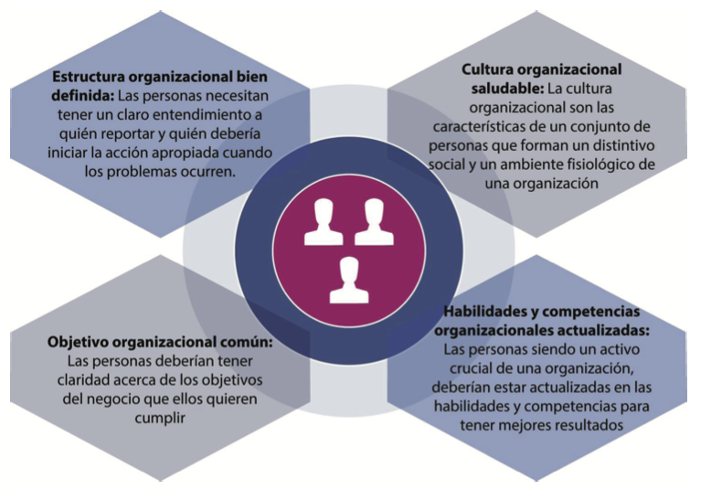
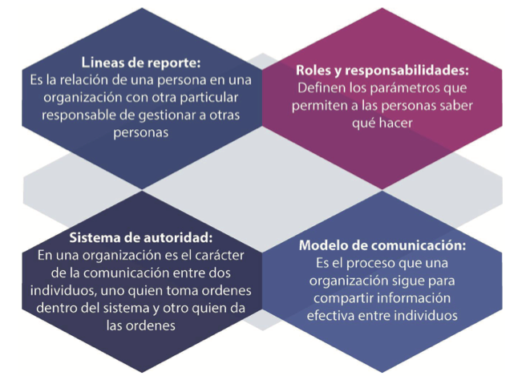
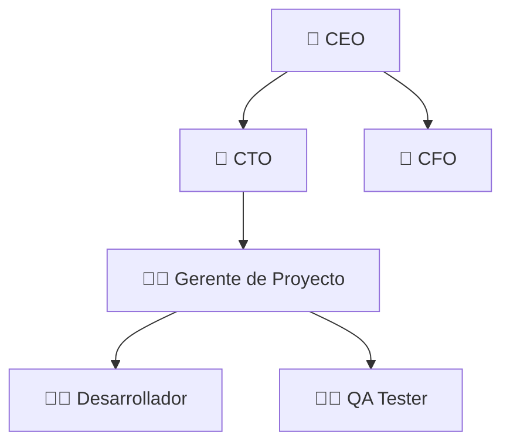
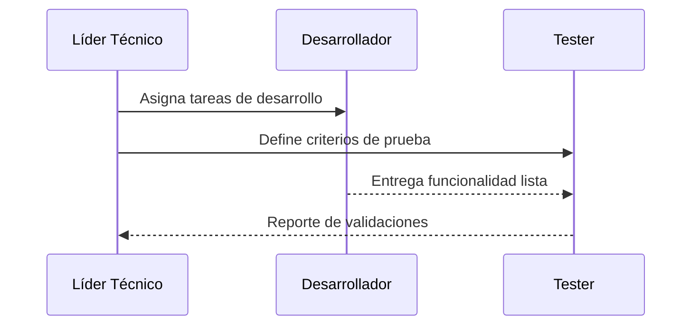
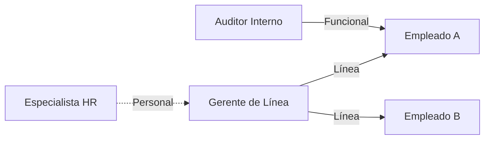
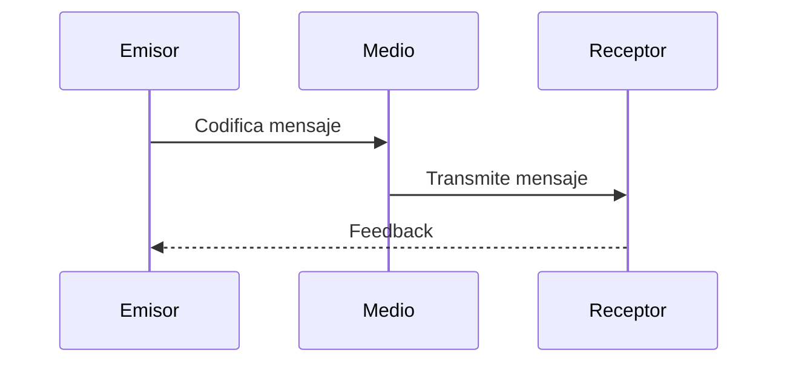
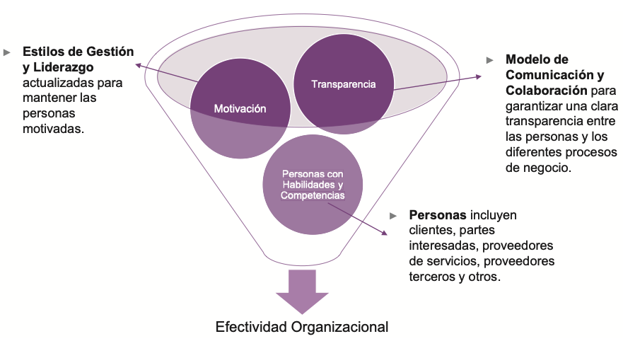

# 🧩 **Semana 5: Organizaciones y personas**

**Curso:** Gestión de Tecnologías de la Información  
**Docente:** Dr. Oscar Jimenez Flores  
[CTI Vitae Concytec](https://www.google.com/url?sa=t&source=web&rct=j&opi=89978449&url=https://ctivitae.concytec.gob.pe/appDirectorioCTI/VerDatosInvestigador.do%3Fid_investigador%3D33398&ved=2ahUKEwi7_KSu8s2MAxWwIbkGHfcFN3EQFnoECA0QAQ&usg=AOvVaw1VPrJTyH8Dl3P6q-qEHKEY)  
[LinkedIn](https://www.linkedin.com/in/oscar-jimenez-flores/)

---

---

#### **Las Cuatro Dimensiones y Sistema de Valor del Servicio (SVS)**
Las cuatro dimensiones deben considerarse para el funcionamiento eficiente de todo el SVS. Estas cuatro dimensiones representan perspectivas que son relevantes para todo el Sistema de Valores del Servicio (SVS), incluida la cadena de valor del servicio y todas las prácticas de ITIL.

**1. Organizaciones y Personas:**  
Se relaciona con roles y responsabilidades, estructura organizacional, cultura, personal y competencias requeridas. Estos aspectos son clave para la creación, mejora y entrega de un servicio.

**2. Información y Tecnología:**  
Abarca la información y conocimiento, tecnologías requeridas y relaciones entre componentes del SVS. Incluye sistemas de gestión de flujo de trabajo, bases de conocimiento, sistemas de inventario, comunicación y herramientas analíticas.

**3. Socios y Proveedores:**  
Cubre relaciones con otras organizaciones involucradas en diferentes fases de servicios, contratos y acuerdos. Las relaciones pueden variar desde contratos formales hasta asociaciones flexibles con objetivos compartidos.

**4. Flujos de Valor y Procesos:**  
Define actividades, flujos de trabajo, controles y procedimientos necesarios para alcanzar objetivos. Se centra en cómo las actividades organizacionales se integran para crear valor de manera eficiente.

  

*Basado en el material de ITIL® Foundation (edición ITIL® 4), 2019 de AXELOS. Reproducido bajo licencia de AXELOS Limited. Todos los derechos reservados.*

### 🎯 **Ejemplo**
> Caso: Una empresa de telecomunicaciones usa las 4 dimensiones para lanzar un nuevo servicio de cloud:
> - **Organizaciones y Personas:** Define roles (Ej: 📞 *Service Desk* para soporte).  
> - **Información y Tecnología:** Implementa un 🛠️ *Sistema de Gestión de Conocimiento (ITSM)*.  
> - **Socios y Proveedores:** Firman un 🤝 *contrato con AWS* para infraestructura.  
> - **Flujos de Valor:** Diseña un 🔄 *proceso de onboarding de clientes*.

---

## 👥 DIMENSIÓN 1. ORGANIZACIONES Y PERSONAS 

La siguiente figura muestra las características clave de la dimensión Organizaciones y Personas.

### Componentes de la dimensión organizaciones y personas
- **A. Estructura organizacional bien definida**
- **B. Cultura organizacional saludable**
- **C. Habilidades y competencias organizacionales actualizadas**
- **D. Objetivo organizacional común**

  

### A. Estructura organizacional bien definida

Las organizaciones necesitan una estructura bien definida para alinear a su personal con la estrategia organizacional general y el modelo operativo. Para respaldar la estrategia y el modelo operativo, las personas deben tener una comprensión clara de:

- Líneas de reporte
- Roles y responsabilidades claros
- Sistemas de autoridad (línea, personal, funcional)
- Modelo de comunicación efectivo

  

- **Líneas de reporte:** Una organización debe definir claramente las líneas de responsabilidad sólidas y punteadas. Las líneas continuas indican la responsabilidad de las actividades de los empleados, incluida la administración de la disciplina. Las líneas de puntos indican un nivel más limitado de responsabilidad y autoridad sobre los demás.
  
- **Roles y responsabilidades:** Cuando una organización define
roles y responsabilidades claros, permite a las personas
conocer las expectativas, tales como cómo comportarse, qué
cumplir y cómo alcanzar la meta. Una comprensión clara
también les permite trabajar juntos con menos argumentos y
más creatividad.

- **Sistemas de Autoridad:** Dependiendo de los diferentes tipos
de responsabilidades, las personas en una organización
pueden tener tres tipos de autoridad:
  - ***Autoridad de línea:*** es la autoridad más básica en una organización que permite a los gerentes dirigir el trabajo de los empleados. Los gerentes pueden tomar algunas decisiones incluso sin consultar a nadie. La autoridad de línea incluye principalmente gerentes que son responsables de alcanzar los objetivos organizacionales.
  - ***Autoridad del personal:*** los gerentes de personal apoyan a los gerentes de línea y otro personal al ayudarlos y aconsejarlos sobre cómo mejorar su eficacia para realizar las tareas requeridas.
  - ***Autoridad funcional:*** una organización proporciona autoridad funcional a un empleado o departamento para realizar un trabajo en particular durante un período de tiempo. Este tipo de derechos se refiere a procesos, prácticas, políticas o asuntos relacionados con las actividades de otros departamentos.

- **Modelo de comunicación:** la comunicación es el catalizador para una comprensión clara de cualquier cosa, ya que se trata de compartir información de una persona a otra. El proceso que siguen las organizaciones para una comunicación efectiva se conoce como el modelo de comunicación. Por lo tanto, la comunicación efectiva es esencial para tener un entendimiento claro de las líneas de reporte, roles y responsabilidades, sistemas de autoridad y para otros asuntos.

**EJEMPLOS**

Las líneas de reporte definen relaciones jerárquicas y funcionales. A continuación, un ejemplo:

Tipos de líneas de reporte

| Tipo de línea  | Descripción                                                        |
| -------------- | ------------------------------------------------------------------ |
| Línea continua | Representa responsabilidad directa sobre tareas y disciplina.      |
| Línea punteada | Indica responsabilidad funcional limitada o supervisión indirecta. |

🔹 Roles y responsabilidades

| Rol                 | Responsabilidades clave                        |
| ------------------- | ---------------------------------------------- |
| Gerente de Proyecto | Planificación, control de alcance y cronograma |
| Desarrollador       | Codificación, pruebas unitarias                |
| Tester              | Pruebas funcionales, reporte de errores        |
| Administrador TI    | Soporte, infraestructura, backup               |

🔹 Sistemas de Autoridad

| Tipo de autoridad      | Definición                                                          |
| ---------------------- | ------------------------------------------------------------------- |
| Autoridad de línea     | Permite a los gerentes tomar decisiones operativas directas         |
| Autoridad del personal | Apoya con consejos y asistencia técnica a los responsables de línea |
| Autoridad funcional    | Poder temporal o específico sobre procesos de otros departamentos   |

🔹 Modelo de Comunicación

| Elemento | Descripción                                                      |
| -------- | ---------------------------------------------------------------- |
| Emisor   | Persona que origina el mensaje                                   |
| Medio    | Canal por el cual se transmite (correo, reunión, chat, etc.)     |
| Receptor | Persona que recibe e interpreta el mensaje                       |
| Feedback | Respuesta que valida si el mensaje fue comprendido correctamente |

### B. Cultura Organizacional Saludable

> La cultura se basa en actitudes compartidas, creencias, costumbres y reglas escritas y no escritas que se han desarrollado a lo largo del tiempo y se consideran válidas. *The Business Dictionary*

> La cultura también incluye la visión, valores, normas, sistemas, símbolos, lenguaje, suposiciones, creencias y hábitos de la organización. *Needle, 2004*

> La cultura es la forma en que una organización lleva a cabo su trabajo que crea valores y actitudes compartidas, que con el tiempo se convierten en la cultura organizacional.

No se puede asegurar la efectividad de una organización simplemente teniendo una estructura o sistema de autoridad bien definido. La organización también necesita una cultura de apoyo que sea lo suficientemente competente para cumplir los objetivos de la organización. Tener una cultura así es crucial para cualquier organización y requiere que los líderes eduquen y apoyen valores que alienten a las personas a trabajar de manera deseable. Puede establecer una cultura organizacional saludable adoptando los principios guía de ITIL.

**Entonces la cultura organizacional saludable es...**

- Basada en actitudes compartidas, creencias y reglas
- Incluye visión, valores, normas y hábitos
- Requiere liderazgo que eduque y apoye valores deseables

**EJEMPLOS**

### C. Habilidades y competencias organizacionales actualizadas

Las personas son un recurso clave en la dimensión Organizaciones y Personas. Es importante prestar atención no sólo a las habilidades y competencias de los equipos o elementos individuales, sino también a los estilos de gestión y liderazgo, así como las habilidades de comunicación y colaboración.

  

La efectividad de una organización está relacionada de manera positiva y directa con la motivación de su gente. Por lo tanto, es esencial que las organizaciones cuenten con estilos actualizados de gestión y liderazgo, para mantenerlas motivadas para tener éxito en sus negocios.

En la era actual, es esencial que las personas entiendan no solo su función y especialización, sino también las de los demás. Por lo tanto, las organizaciones deben seguir actualizando las habilidades de comunicación y colaboración, para garantizar una transparencia clara entre las personas y entre los diferentes procesos de negocios.

**Entonces las Habilidades y competencias organizacionales son...**

- Estilos de gestión y liderazgo actualizados
- Transparencia y motivación
- Comunicación y colaboración efectivas
- Crecimiento continuo del personal

**EJEMPLOS**

### D. Objetivo organizacional común

El objetivo de negocio es el resultado que una organización desea lograr. Por lo tanto, las organizaciones deben asegurarse que su personal lo entienda claramente.

Las personas son el recurso crucial de una organización, y es esencial que estén en el mismo canal. Si no lo están, la eficacia organizacional se verá afectada. Por lo tanto, deben ser claros acerca de su contribución para lograr el objetivo de crear valor para los clientes, socios y partes interesadas.

**Entonces el objetivo organizacional común necesita de...**

- Claridad en los objetivos del negocio
- Entendimiento de la contribución individual al valor
- Alineación de todos los recursos humanos

**EJEMPLOS**
