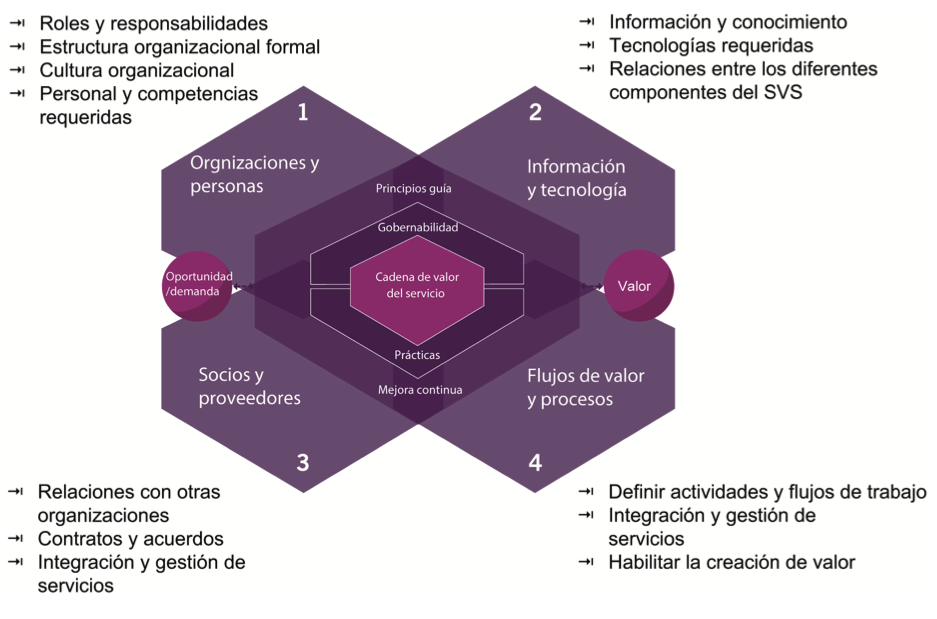
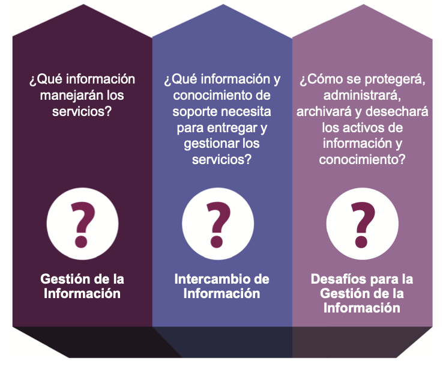

# 🧩 **Semana 6: Información y Tecnología**

**Curso:** Gestión de Tecnologías de la Información  
**Docente:** Dr. Oscar Jimenez Flores  
[CTI Vitae Concytec](https://www.google.com/url?sa=t&source=web&rct=j&opi=89978449&url=https://ctivitae.concytec.gob.pe/appDirectorioCTI/VerDatosInvestigador.do%3Fid_investigador%3D33398&ved=2ahUKEwi7_KSu8s2MAxWwIbkGHfcFN3EQFnoECA0QAQ&usg=AOvVaw1VPrJTyH8Dl3P6q-qEHKEY)  
[LinkedIn](https://www.linkedin.com/in/oscar-jimenez-flores/)

---

#### **Las Cuatro Dimensiones y Sistema de Valor del Servicio (SVS)**
Las cuatro dimensiones deben considerarse para el funcionamiento eficiente de todo el SVS. Estas cuatro dimensiones representan perspectivas que son relevantes para todo el Sistema de Valores del Servicio (SVS), incluida la cadena de valor del servicio y todas las prácticas de ITIL.

**1. Organizaciones y Personas:**  
Se relaciona con roles y responsabilidades, estructura organizacional, cultura, personal y competencias requeridas. Estos aspectos son clave para la creación, mejora y entrega de un servicio.

**2. Información y Tecnología:**  
Abarca la información y conocimiento, tecnologías requeridas y relaciones entre componentes del SVS. Incluye sistemas de gestión de flujo de trabajo, bases de conocimiento, sistemas de inventario, comunicación y herramientas analíticas.

**3. Socios y Proveedores:**  
Cubre relaciones con otras organizaciones involucradas en diferentes fases de servicios, contratos y acuerdos. Las relaciones pueden variar desde contratos formales hasta asociaciones flexibles con objetivos compartidos.

**4. Flujos de Valor y Procesos:**  
Define actividades, flujos de trabajo, controles y procedimientos necesarios para alcanzar objetivos. Se centra en cómo las actividades organizacionales se integran para crear valor de manera eficiente.

  

*Basado en el material de ITIL® Foundation (edición ITIL® 4), 2019 de AXELOS. Reproducido bajo licencia de AXELOS Limited. Todos los derechos reservados.*

### 🎯 **Ejemplo**
> Caso: Una empresa de telecomunicaciones usa las 4 dimensiones para lanzar un nuevo servicio de cloud:
> - **Organizaciones y Personas:** Define roles (Ej: 📞 *Service Desk* para soporte).  
> - **Información y Tecnología:** Implementa un 🛠️ *Sistema de Gestión de Conocimiento (ITSM)*.  
> - **Socios y Proveedores:** Firman un 🤝 *contrato con AWS* para infraestructura.  
> - **Flujos de Valor:** Diseña un 🔄 *proceso de onboarding de clientes*.

---

## 👥 DIMENSIÓN 2. INFORMACIÓN Y TECNOLOGÍA

### 📌 Información y tecnología
Cada negocio trata con datos, que no es más que la información estructurada. En los tiempos modernos, las organizaciones utilizan la tecnología para gestionar la gran cantidad de datos. Por lo tanto, esta  dimensión se centra en dos elementos, la información y la tecnología.

## 🗂️ Sección 1: Información  

Cuando se refiere a la parte de información de la dimensión Información y Tecnología, una organización debe responder las siguientes preguntas: 

#### 🔍 Preguntas que deben hacerce las Organizaciones  
1. **¿Qué información manejarán los servicios?**  
   - Ejemplo: Un banco gestiona datos de clientes (saldo, transacciones) y productos financieros.  
2. **¿Qué información de soporte se necesita?**  
   - Ejemplo: Un hospital requiere historiales médicos y protocolos de atención.  
3. **¿Cómo se gestionarán los activos de información?**  
   - Incluye protección (encriptación), archivado (cloud) y desecho (borrado seguro).  

  

Vamos a comentar las preguntas o aspectos en detalle.

- Gestión de la información: la gestión eficaz de la información es
 la principal forma de entregar valor a los clientes. Es el resultado clave de casi todos los servicios de TI consumidos por los clientes de negocio. Consideremos el ejemplo de uno de los servicios de Recursos Humanos (RH) para comprender cómo crean valor para sus clientes al administrar la información. Crean valor mediante:
   -  Permitir a la organización acceder y mantener información precisa sobre sus empleados, su empleo y sus prestaciones.
   -  Mantener la confidencialidad de los datos de los empleados al limitar el acceso a personas no autorizadas

-  Intercambio de información: Uno de los aspectos de la dimensión de la información y la tecnología es cómo intercambiar información entre diferentes servicios y sus componentes. Hoy en día, es esencial mantener la optimización
de los servicios teniendo en cuenta los diversos factores, como la disponibilidad, confiabilidad, accesibilidad, puntualidad, precisión de la información e intercambio de información entre los servicios. Como resultado, es crucial la comprensión clara de la arquitectura de información que utilizan los servicios.

- Desafíos de la gestión de la información: La dimensión de la información y la tecnología también se centra en los desafíos de la gestión de la información. Existen muchas regulaciones que restringen a las industrias o países la administración de datos utilizando sus estándares, como los requisitos de seguridad
y cumplimiento de normas. Estos requisitos influyen en gran medida en las políticas y prácticas que las organizaciones siguen para gestionar la información.

### 📊 Ejemplos  
| **Aspecto**               | **Descripción**                                                                 | **Ejemplo**                                                                 |
|---------------------------|---------------------------------------------------------------------------------|-----------------------------------------------------------------------------|
| **Gestión de Información** | Entrega valor al cliente mediante datos precisos y accesibles.                 | HR gestiona nóminas y beneficios de empleados con herramientas como SAP.   |
| **Intercambio de Información** | Optimiza servicios mediante disponibilidad y precisión.                       | API que conecta sistemas de ventas y logística en tiempo real.              |
| **Desafíos**              | Regulaciones (GDPR - Reglamento General de Protección de Datos), seguridad y cumplimiento.                                 | Fintechs deben cumplir PCI-DSS (Payment Card Industry Data Security Standard) para procesar pagos.                         |

---

## 💻 Sección 2: Tecnología  

Hoy en día, casi todos los servicios se basan en Tecnología de Información, y una organización puede elegir utilizar la tecnología en cualquier momento para sus productos o servicios. Por lo tanto, surgen muchas inquietudes cuando se elige utilizar la tecnología.

Discutamos algunas de las preguntas que las organizaciones se pueden hacer.

- ¿La tecnología es compatible con la arquitectura existente de la organización y sus clients? ¿Los productos tecnológicos usados por la organización y sus partes interesadas trabajan juntos?

- ¿Cómo las tecnologías emergentes influyen en el servicio y la organización? ¿Hay temas regulatorios o de cumplimiento en las políticas de la organización y/o controles de la seguridad de la información?

- ¿La tecnología continuará siendo viable en el futuro próximo?

- ¿La organización aceptará el riesgo de usar tecnología antigüa o cambiará a tecnología emergente y no probada?

- ¿La tecnología está alineada a la estrategia del proveedor de servicio y sus clientes?

- ¿La organización tiene las habilidades necesarias para soportar y manterner la tecnología?

- ¿La tecnología tiene las capacidades de automatización suficientes para apoyar el desarrollo, implementación y operación?

- ¿La tecnología ofrece capacidades adicionales que puedan apoyar a otros productos y servicios?

- ¿La tecnología introduce nuevos riesgos o restricciones a la organización?

### ❓ Preguntas Críticas para la implementación de la tecnología
- **Compatibilidad**: ¿Funciona con sistemas existentes?  
  - Ejemplo: Migrar de Windows a Linux requiere evaluar compatibilidad de software.  
- **Futuro**: ¿Será viable la tecnología?  
  - Ejemplo: Blockchain en logística aún es emergente pero prometedor.  
- **Riesgos**: ¿Tecnología obsoleta vs. no probada?  
  - Ejemplo: Empresas que usan COBOL enfrentan falta de soporte técnico.  

### 🛠️ Factores de elección tecnológica  

Una organización debería considerer muchos factores para elegír la tecnología correcta, como la cultura organizacional y naturaleza del negocio.

| **Factor**               | **Impacto**                                                                     | **Caso**                                                                   |
|--------------------------|---------------------------------------------------------------------------------|----------------------------------------------------------------------------|
| **Cultura Organizacional** | Empresas innovadoras adoptan IA/ML; tradicionales prefieren ERP clásicos.      | Google vs. Bancos tradicionales en adopción de cloud.                      |
| **Naturaleza del Negocio** | Sectores con alta seguridad (salud/gobierno) evitan código abierto.            | Hospitales usan software propietario para cumplir HIPAA (Norma de confidencialidad de la Ley de Portabilidad y Responsabilidad de Seguros Médicos - Health Insurance Portability and Accountability Act).                   |

---

## 🚀 Ejemplos Prácticos  
### 🔐 Caso de Gestión de Información  
**Empresa**: Amazon  
- **Gestión**: Usa AWS para almacenar y analizar datos de compras.  
- **Intercambio**: APIs conectan marketplace con proveedores.  
- **Desafío**: Cumplir GDPR (Reglamento General de Protección de Datos) en Europa con políticas de privacidad.  

### 🤖 Caso de Tecnología  
**Empresa**: Tesla  
- **Tecnología**: Autopilot basado en IA.  
- **Riesgo**: Regulaciones de seguridad vehicular en diferentes países.  

---

## 📝 Conclusión  
La gestión efectiva de información y tecnología es importante para:  
✅ Crear valor al cliente.  
✅ Mantener competitividad.  
✅ Cumplir regulaciones.  

*"La tecnología debe alinearse con la estrategia, no ser solo una moda."*  
