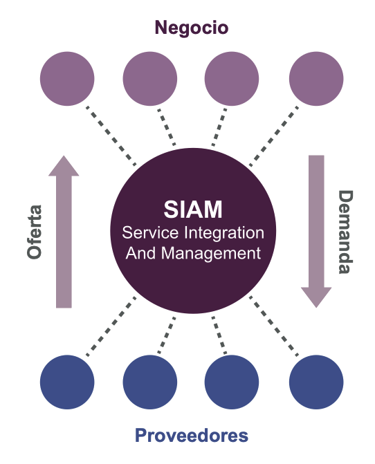

# 🧩 **Semana 7: Socios y Proveedores**

**Curso:** Gestión de Tecnologías de la Información  
**Docente:** Dr. Oscar Jimenez Flores  
[CTI Vitae Concytec](https://www.google.com/url?sa=t&source=web&rct=j&opi=89978449&url=https://ctivitae.concytec.gob.pe/appDirectorioCTI/VerDatosInvestigador.do%3Fid_investigador%3D33398&ved=2ahUKEwi7_KSu8s2MAxWwIbkGHfcFN3EQFnoECA0QAQ&usg=AOvVaw1VPrJTyH8Dl3P6q-qEHKEY)  
[LinkedIn](https://www.linkedin.com/in/oscar-jimenez-flores/)

---

#### **Las Cuatro Dimensiones y Sistema de Valor del Servicio (SVS)**
Las cuatro dimensiones deben considerarse para el funcionamiento eficiente de todo el SVS. Estas cuatro dimensiones representan perspectivas que son relevantes para todo el Sistema de Valores del Servicio (SVS), incluida la cadena de valor del servicio y todas las prácticas de ITIL.

**1. Organizaciones y Personas:**  
Se relaciona con roles y responsabilidades, estructura organizacional, cultura, personal y competencias requeridas. Estos aspectos son clave para la creación, mejora y entrega de un servicio.

**2. Información y Tecnología:**  
Abarca la información y conocimiento, tecnologías requeridas y relaciones entre componentes del SVS. Incluye sistemas de gestión de flujo de trabajo, bases de conocimiento, sistemas de inventario, comunicación y herramientas analíticas.

**3. Socios y Proveedores:**  
Cubre relaciones con otras organizaciones involucradas en diferentes fases de servicios, contratos y acuerdos. Las relaciones pueden variar desde contratos formales hasta asociaciones flexibles con objetivos compartidos.

**4. Flujos de Valor y Procesos:**  
Define actividades, flujos de trabajo, controles y procedimientos necesarios para alcanzar objetivos. Se centra en cómo las actividades organizacionales se integran para crear valor de manera eficiente.

  

*Basado en el material de ITIL® Foundation (edición ITIL® 4), 2019 de AXELOS. Reproducido bajo licencia de AXELOS Limited. Todos los derechos reservados.*

### 🎯 **Ejemplo**
> Caso: Una empresa de telecomunicaciones usa las 4 dimensiones para lanzar un nuevo servicio de cloud:
> - **Organizaciones y Personas:** Define roles (Ej: 📞 *Service Desk* para soporte).  
> - **Información y Tecnología:** Implementa un 🛠️ *Sistema de Gestión de Conocimiento (ITSM)*.  
> - **Socios y Proveedores:** Firman un 🤝 *contrato con AWS* para infraestructura.  
> - **Flujos de Valor:** Diseña un 🔄 *proceso de onboarding de clientes*.

---

## 👥 DIMENSIÓN 3. SOCIOS Y PROVEEDORES

### 📊 "Socios y Proveedores"  
La dimensión Socios y Proveedores incluye las relaciones de una organización con otras organizaciones.

- Casi todas las organizaciones y todos los servicios dependen en cierta medida de los servicios proporcionados por otras organizaciones. Por lo tanto, trabajan con socios y proveedores para lograr el objetivo organizacional.

- Socios y proveedores pueden participar en todas las fases del desarrollo del producto o la gestión del servicio, como el diseño, desarrollo, implementación, entrega, soporte y mejora continua.

- Por lo tanto, mantener relaciones sanas con socios y proveedores es esencial para que las organizaciones entreguen el valor requerido por los clientes.

### 🔗 Importancia 
- **Interdependencia**: Las organizaciones dependen de proveedores para bienes, servicios y co-creación de valor.  
  - *Ejemplo*: Una empresa de e-commerce depende de AWS (IAAS) para su infraestructura cloud.  
- **Fases de participación**: Diseño, desarrollo, implementación, soporte y mejora continua.  
- **Relaciones estratégicas**: Clave para cumplir objetivos organizacionales.  

### 🤝 Tipos de Relaciones (Tabla Comparativa)  

Las organizaciones trabajan con Socios y Proveedores a través de contratos u otros acuerdos. Este proceso incluye varios niveles de integración y formalidad. Veamos algunos de los ejemplos de relaciones entre organizaciones.

| **Forma de Cooperación**       | **Salidas**               | **Responsable Salidas** | **Responsable Resultados** | **Nivel Formalidad**       | **Ejemplo**                     |  
|--------------------------------|---------------------------|-------------------------|----------------------------|----------------------------|---------------------------------|  
| **Suministro de bienes**       | Bienes entregados            | Proveedor               | Cliente                    | Contrato formal            | Compra de hardware (Dell, HP)   |  
| **Entrega de servicios**       | Servicios entregados            | Proveedor               | Cliente                    | Acuerdos flexibles         | Cloud computing (Azure, Google Cloud) |  
| **Sociedad para el servicio**  | Valor co-creado           | Ambos (proveedor-cliente)                   | Ambos                      | Metas compartidas          | Outsourcing de RRHH + TI        |  

*Fuente: Adaptado de ITIL® Foundation (2019).*  

Las formas de cooperación mencionadas en la tabla anterior existen como una escala. Estas no son fijas. Cuando se trata de utilizar socios y proveedores, la estrategia de una organización debe basarse en sus objetivos, cultura y entorno de negocio. 

Por ejemplo, algunas organizaciones pueden creer que se les servirá mejor al centrar su atención en el desarrollo de ciertas competencias básicas, utilizando socios y proveedores para satisfacer otras necesidades. Otras organizaciones pueden optar por confiar lo más posible en sus propios recursos, utilizando a los socios y proveedores lo menos posible. Hay, por supuesto, muchas variaciones entre estos dos enfoques opuestos.

---

## 🛠️ Dirigiéndose a Socios y Proveedores

- Uno de los métodos para dirigirse a los socios y proveedores es la Gestión e Integración de Servicios (SIAM).
- Asegura la coordinación adecuada de las relaciones de servicios utilizando un integrador especialmente establecido.
- Una organización puede optar por delegar la gestión e integración de servicios a un socio de confianza.

  

## 🛠️ Proveedores e impacto de la estrategia organizacional

Cuando se trata con proveedores, varios factores pueden afectar la estrategia general de la organización, tales como:

  

- Enfoque estratégico: algunas organizaciones prefi eren centrarse en sus competencias básicas y subcontratar a
terceros aquellas funciones de apoyo que no son consideradas como esenciales. Otros desean ser lo más autosufi cientes posible y prefi eren tener un control total sobre todas las funciones importantes.

- Cultura corporativa: cambiar la cultura arraigada es difícil debido a una preferencia histórica por un enfoque sobre otro.

- Escasez de recursos: la falta de recursos o habilidades requeridas es un gran problema para los proveedores de servicios. Les impide adquirir cualquier cosa, incluso sin comprometerse con los socios.

- Preocupaciones de costo: El factor principal que afecta la toma de decisiones es el costo. Por lo tanto, los proveedores
de servicios pueden recurrir a obtener un requerimiento particular de los proveedores si consideran que es un trato más
económico.

- Experiencia en la materia: los proveedores de servicios prefieren ir con el proveedor que tiene la experiencia en el
campo requerido. Por lo tanto, no intentan crear experiencia interna en la materia.

- Restricciones externas: las regulaciones o políticas gubernamentales, los códigos de conducta de la industria y las
restricciones sociales, políticas o legales también afectan la estrategia del proveedor.

- Patrones de demanda: La demanda de servicios es estacional y diferente en diferentes situaciones. Tiene un alto grado de
variabilidad y la tendencia a afectar a los proveedores de servicios externos que utilizan las organizaciones para hacer
frente a la demanda variable.

## 🌐 Casos Prácticos

### 🏦 Sector Bancario
- **Proveedores**: Ciberseguridad (Palo Alto), procesadores de pagos (Visa)
- **Desafío**: Cumplir PCI-DSS mientras se optimizan costos

### 🏥 Sector Salud
- **Colaboración**: Clínicas + IA para diagnósticos (IBM Watson Health)
- **Restricciones**: Cumplimiento HIPAA en manejo de datos

---

## 📝 Conclusiones
1. Las relaciones con socios/proveedores son **necesarias** para la competitividad
2. La elección de modelo depende de:
   - Objetivos organizacionales
   - Recursos disponibles
   - Marco regulatorio
3. **SIAM** se presenta como mejor práctica para gestión múltiple.

> 💡 *"Ninguna organización es una isla; la colaboración estratégica multiplica el valor."*
