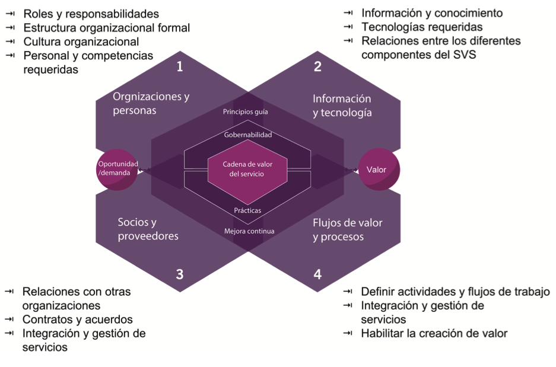
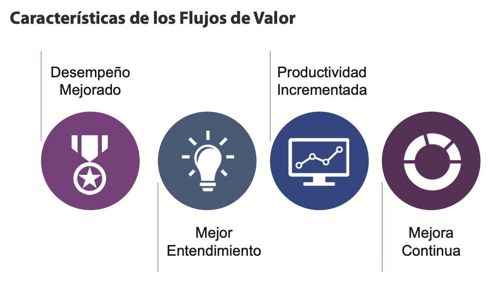

# 🧩 **Semana 8: Flujos de valor y procesos**

**Curso:** Gestión de Tecnologías de la Información  
**Docente:** Dr. Oscar Jimenez Flores  
[CTI Vitae Concytec](https://www.google.com/url?sa=t&source=web&rct=j&opi=89978449&url=https://ctivitae.concytec.gob.pe/appDirectorioCTI/VerDatosInvestigador.do%3Fid_investigador%3D33398&ved=2ahUKEwi7_KSu8s2MAxWwIbkGHfcFN3EQFnoECA0QAQ&usg=AOvVaw1VPrJTyH8Dl3P6q-qEHKEY)  
[LinkedIn](https://www.linkedin.com/in/oscar-jimenez-flores/)

---

#### **Las Cuatro Dimensiones y Sistema de Valor del Servicio (SVS)**
Las cuatro dimensiones deben considerarse para el funcionamiento eficiente de todo el SVS. Estas cuatro dimensiones representan perspectivas que son relevantes para todo el Sistema de Valores del Servicio (SVS), incluida la cadena de valor del servicio y todas las prácticas de ITIL.

**1. Organizaciones y Personas:**  
Se relaciona con roles y responsabilidades, estructura organizacional, cultura, personal y competencias requeridas. Estos aspectos son clave para la creación, mejora y entrega de un servicio.

**2. Información y Tecnología:**  
Abarca la información y conocimiento, tecnologías requeridas y relaciones entre componentes del SVS. Incluye sistemas de gestión de flujo de trabajo, bases de conocimiento, sistemas de inventario, comunicación y herramientas analíticas.

**3. Socios y Proveedores:**  
Cubre relaciones con otras organizaciones involucradas en diferentes fases de servicios, contratos y acuerdos. Las relaciones pueden variar desde contratos formales hasta asociaciones flexibles con objetivos compartidos.

**4. Flujos de Valor y Procesos:**  
Define actividades, flujos de trabajo, controles y procedimientos necesarios para alcanzar objetivos. Se centra en cómo las actividades organizacionales se integran para crear valor de manera eficiente.

  

*Basado en el material de ITIL® Foundation (edición ITIL® 4), 2019 de AXELOS. Reproducido bajo licencia de AXELOS Limited. Todos los derechos reservados.*

### 🎯 **Ejemplo**
> Caso: Una empresa de telecomunicaciones usa las 4 dimensiones para lanzar un nuevo servicio de cloud:
> - **Organizaciones y Personas:** Define roles (Ej: 📞 *Service Desk* para soporte).  
> - **Información y Tecnología:** Implementa un 🛠️ *Sistema de Gestión de Conocimiento (ITSM)*.  
> - **Socios y Proveedores:** Firman un 🤝 *contrato con AWS* para infraestructura.  
> - **Flujos de Valor:** Diseña un 🔄 *proceso de onboarding de clientes*.

---

## 👥 DIMENSIÓN 4. FLUJOS DE VALOR Y PROCESOS

La dimensión Flujos de Valor y Procesos se centra en la integración y coordinación tanto del SVS en general como de los productos y servicios específicos. Define las actividades,
flujos de trabajo, controles y procedimientos necesarios para lograr los objetivos acordados

En otras palabras, la dimensión se centra en la organización eficiente de las diversas actividades para entregar valor a las partes interesadas. Por tanto, existe la necesidad de un modelo operativo que organice eficientemente las actividades clave para administrar productos y servicios

ITIL proporciona a los proveedores de servicios un modelo conocido como la cadena de valor del servicio de ITIL. Este modelo puede seguir diferentes patrones, y los patrones dentro de la operación de la cadena de valor se denominan flujos de valor.

### 🔍 **Sección 1: Flujos de Valor**
### 📖 **Definición**
> _"Un flujo de valor es una serie de pasos que una organización
utiliza para crear y entregar productos y servicios a los
consumidores. Un flujo de valor es una combinación de las
actividades de la cadena de valor de la organización."_  
> **Fuente:** ITIL® Foundation (edición ITIL® 4), 2019.

  

La siguiente información explica brevemente las características anteriores:

- Desempeño mejorado: Los flujos de valor ayudan a mejorar
el desempeño general de una organización. Por lo tanto, es
esencial identificar y comprender los diversos flujos de valor de
la organización.

- Mejor comprensión: Las organizaciones deben estructurar
sus portafolios de productos y servicios en función de los fl ujos
de valor, ya que ofrecen dos beneficios principales. Primero,
permite tener una comprensión clara de qué valor ofrece una
organización y cómo. En segundo lugar, ayuda a hacer mejoras
continuas del servicio.

- Mayor productividad: Los flujos de valor ayudan a las
organizaciones a analizar cómo realizan su trabajo. El análisis
les permite encontrar desperdicios en su flujo de trabajo
actual, como obstáculos y actividades que no agregan valor, y
aumentan las actividades que agregan valor.

- Mejora continua: En la era actual de demandas cambiantes, los
flujos de valor deben mejorarse o perfeccionarse continuamente
para cumplir con la estrategia organizacional y el objetivo de
una manera óptima.

### 🎯 **Características**
| Característica          | Descripción                                                                 | Ejemplo                                                                 |
|-------------------------|-----------------------------------------------------------------------------|--------------------------------------------------------------------------|
| **Desempeño mejorado**  | Identificar flujos de valor optimiza el rendimiento organizacional.         | Toyota usa flujos de valor para reducir desperdicios en producción (Lean Manufacturing). |
| **Mejor comprensión**   | Clarifica el valor ofrecido y facilita mejoras continuas.                    | Amazon estructura sus servicios logísticos en flujos de valor para eficiencia. |
| **Mayor productividad** | Elimina obstáculos y actividades sin valor agregado.                        | Spotify automatiza flujos de entrega de música para reducir tiempos.    |
| **Mejora continua**     | Adaptación constante a demandas cambiantes.                                 | Netflix ajusta sus flujos de contenido basado en datos de usuarios.     |

---

### 🔄 **Sección 2: Procesos**
### 📖 **Definición**
> _"Un proceso es un conjunto de actividades interrelacionadas o
interactivas que transforman entradas en salidas. Los procesos definen
la secuencia de acciones y sus dependencias. Un proceso toma una
o más entradas definidas y las convierte en salidas específicas. Los
procesos generalmente se detallan en procedimientos, que describen
quiénes están involucrados en el proceso, e instrucciones de trabajo,
que explican cómo se llevan a cabo."_  
> **Fuente:** ITIL® Foundation (edición ITIL® 4), 2019.

Los procesos describen lo que se debe hacer para lograr el objetivo de la organización y mejorar la productividad al interior y entre las organizaciones. Estos procesos indican el procedimiento detallado, incluidas las instrucciones de trabajo y las personas que participarán.

### **Estructura de Servicios**
Las organizaciones deben responder:  
1. **Modelo de entrega**: ¿Cómo funciona el servicio?  
   - Ejemplo: SaaS como Slack usa un modelo de suscripción.  
2. **Flujos de valor involucrados**: Pasos para entregar resultados.  
   - Ejemplo: Flujo de soporte técnico de Microsoft Azure.  
3. **Actores**: ¿Quién ejecuta las acciones?  
   - Ejemplo: Equipos DevOps en AWS.
